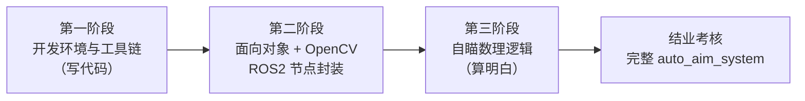
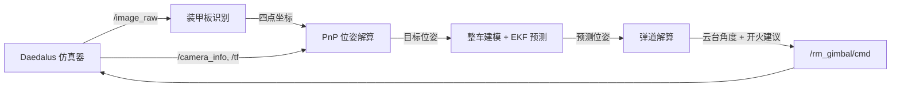

# SPR 2027 算法组培训计划

面向零基础的 RoboMaster 视觉算法入门培训。围绕「**写代码 → 看懂图 → 算明白**」这条主线分三个阶段推进，最后在仿真环境里交付一个完整可跑的 `auto_aim_system`。

## 目录

- [SPR 2027 算法组培训计划](#spr-2027-算法组培训计划)
  - [目录](#目录)
  - [培训总览](#培训总览)
  - [学习路线](#学习路线)
  - [第一阶段：开发环境与工具链](#第一阶段开发环境与工具链)
    - [知识模块](#知识模块)
    - [作业](#作业)
    - [教案与实例](#教案与实例)
  - [第二阶段：面向对象与视觉算法](#第二阶段面向对象与视觉算法)
    - [知识模块](#知识模块-1)
    - [作业](#作业-1)
    - [教案与实例](#教案与实例-1)
  - [第三阶段：自瞄的数理逻辑与坐标系转换](#第三阶段自瞄的数理逻辑与坐标系转换)
    - [知识模块](#知识模块-2)
    - [作业](#作业-2)
    - [教案](#教案)
  - [结业考核 Final Examination](#结业考核-final-examination)
    - [题目](#题目)
    - [数据流](#数据流)
    - [考核环境](#考核环境)
    - [验收要求](#验收要求)
    - [提交要求](#提交要求)
  - [加分项](#加分项)
  - [仓库结构](#仓库结构)
  - [开发环境](#开发环境)
  - [学习约定](#学习约定)

## 培训总览

| 阶段     | 主题                       | 核心能力                                       | 阶段作业                           | 教案                                     |
| -------- | -------------------------- | ---------------------------------------------- | ---------------------------------- | ---------------------------------------- |
| 第一阶段 | 开发环境与工具链           | 能在 Linux 上独立编写、构建、提交一个 C++ 工程 | 实现一个**向量运算库**（6 个接口） | [`tutorial_1`](tutorial_1/tutorial_1.md) |
| 第二阶段 | 面向对象与视觉算法         | 能用类组织代码，用 OpenCV 传统方法识别装甲板   | 实现**装甲板识别 ROS2 节点**       | [`tutorial_2`](tutorial_2/tutotial_2.md) |
| 第三阶段 | 自瞄的数理逻辑与坐标系转换 | 能从像素反推目标位姿，并算出云台指令           | 位姿解算 + 弹道解算                | [`tutorial_3`](tutorial_3/tutorial_3.md) |
| 结业考核 | 完整自瞄系统               | 串联全链路，在仿真环境跑通闭环                 | `auto_aim_system`                  | Daedalus 仿真器                          |

## 学习路线



三个阶段是**层层递进**的：第一阶段的 git 与 CMake 是后面所有作业的提交和构建方式；第二阶段写好的识别类会被第三阶段直接调用；第三阶段算出的云台指令，正是结业考核要发布出去的东西。

---

## 第一阶段：开发环境与工具链

**培训目标**：理解从源码到可执行文件中间发生了什么，并能用 git 与 CMake 独立管理一个工程。

### 知识模块

| 模块           | 内容                                                                                    |
| -------------- | --------------------------------------------------------------------------------------- |
| Linux 初识     | 发行版、终端、文件系统、路径、权限、`apt` 包管理                                        |
| Git 版本管理   | 工作区/暂存区/本地仓库、`clone` `add` `commit` `push`、分支、`.gitignore`、提交信息规范 |
| g++ 与编译流程 | 预处理 → 编译 → 汇编 → 链接；编译错误与链接错误的区别                                   |
| CMake / Make   | `add_library` / `add_executable` / `target_link_libraries`；`PUBLIC` 与 `PRIVATE`       |
| C/C++ 项目框架 | 头文件放声明、源文件放实现、库的划分与复用                                              |

### 作业

> 实现一个**n维向量运算库**：距离（欧式距离）、模长、点乘、缩放、单位化、夹角，含边界检测。

完整题目、要求见 [`tutorial_1/homework_1.md`](tutorial_1/homework_1.md)。

### 教案与实例

- 教案：[`tutorial_1/tutorial_1.md`](tutorial_1/tutorial_1.md)
- 配套实例：[`tutorial_1/example/`](tutorial_1/example/)
  - `gpp/` —— 手写 g++ 命令：单文件看编译四步产物，多文件看头文件与链接
  - `cmake/` —— CMake 最小构建：配置 → 构建 → 运行 → 增量编译

---

## 第二阶段：面向对象与视觉算法

**培训目标**：学会用类把「数据 + 行为」封装成可复用的组件，用 OpenCV 传统图像处理从图像里稳定找出装甲板，并把它封装成能跑视频流、也能直接接仿真的 ROS2 节点。

### 知识模块

| 模块                    | 内容                                                                           |
| ----------------------- | ------------------------------------------------------------------------------ |
| OOP 编程范式            | 类与对象、封装、构造函数与析构函数、继承与多态、抽象基类与工厂                 |
| OpenCV 图像处理         | `cv::Mat`、灰度 / 二值化 / 形态学 / 轮廓、常用 API 与坐标系约定                |
| 传统视觉识别            | 灯条筛选（长宽比、宽高）→ 灯条配对（几何约束）→ 装甲板四点                     |
| ROS2 通讯机制与系统架构 | 节点 / 话题 / 服务 / 参数；功能包结构（`ament_cmake` + `rosidl`）；`cv_bridge` |

### 作业

> 把装甲板识别做成一个 ROS2 节点：订阅 `/image_raw` → 传统方法识别 → 输出装甲板的**四个角点**（左上 / 右上 / 右下 / 左下）。用**视频流**测试，话题与消息类型和 Daedalus 模拟器对齐，随时能切到仿真。

完整题目、要求、验收清单与答辩问题见 [`tutorial_2/homework_2.md`](tutorial_2/homework_2.md)。

### 教案与实例

- 教案：[`tutorial_2/tutotial_2.md`](tutorial_2/tutotial_2.md)
- 配套实例：[`tutorial_2/example/`](tutorial_2/example/)
  - `oop/` —— 抽象基类 + 多态 + 工厂：两种相机用同一段代码取图
  - `opencv/` —— 装甲板四点识别，附带演示图与调参实验

---

## 第三阶段：自瞄的数理逻辑与坐标系转换

**培训目标**：打通「像素 → 角度」这条链路——能从图像中的四点反推目标的三维位姿，并算出云台该转到哪里、什么时候开火。

### 知识模块

| 模块                | 内容                                                            |
| ------------------- | --------------------------------------------------------------- |
| 坐标系转换          | 像素坐标 → 相机坐标 → 云台坐标 → 世界坐标；内参、外参、手眼关系 |
| PnP 解算距离        | `solvePnP` / IPPE，重投影误差评估，距离估计                     |
| Solver 重构目标位姿 | 整车建模：从装甲板四点反推车体中心；旋转矩阵、四元数、欧拉角    |
| EKF 预测            | 状态量与运动模型、观测模型、预测与更新的权衡                    |
| 弹道解算            | 重力补偿、飞行时间迭代、弹速标定                                |
| 火控系统            | 开火决策；MPC 轨迹规划                                          |

### 作业

> 在识别结果的基础上完成**目标位姿解算与弹道解算**，输出可直接驱动云台的指令。

完整要求见 [`tutorial_3/homework_3.md`](tutorial_3/homework_3.md)（教案施工中，作业要求待细化）。

### 教案

- [`tutorial_3/tutorial_3.md`](tutorial_3/tutorial_3.md)（施工中，目前只有整体数据流图）

---

## 结业考核 Final Examination

### 题目

> **Design a simple `auto_aim_system` based on the existing code framework.**

在已有框架上，把三个阶段的内容串成一条完整链路：**看 → 算 → 打**。

### 数据流



### 考核环境

使用 **Daedalus** 仿真器搭建考核环境：[`Blackjack200/bevy_robomaster_simulator`](https://github.com/Blackjack200/bevy_robomaster_simulator)

| 项目     | 内容                                                        |
| -------- | ----------------------------------------------------------- |
| 定位     | RoboMaster 视觉算法验证模拟器，让自瞄在上场前先经历真实考验 |
| 技术栈   | Rust · Bevy · ROS2(r2r) · Talos IPC                         |
| 仿真内容 | 能量机关（大/小）、前哨站、大/小装甲模块、步兵与英雄机器人  |
| 开源协议 | AGPL v3                                                     |

**ROS2 接口**

| 方向       | 话题                                                                                                                   |
| ---------- | ---------------------------------------------------------------------------------------------------------------------- |
| 模拟器发布 | `/image_raw`、`/image_compressed`、`/camera_info`、`/tf`、`/gimbal_pose`、`/odom_pose`、`/muzzle_pose`、`/camera_pose` |
| 模拟器订阅 | `/rm_gimbal/cmd`（云台控制命令，含开火建议）                                                                           |

> 也就是说：**你的系统订阅 `/image_raw` 等话题，发布 `/rm_gimbal/cmd`**。这正好是第二阶段「装甲板识别节点」与第三阶段「弹道解算」的组合。
>
> 模拟器 README 里写的 `/armor_solver/cmd_gimbal` 是**旧名字**，以代码为准（`src/ros2/topic.rs` 里是 `/rm_gimbal/cmd`，QoS `sensor_data`）。接口包是模拟器自带的 `rm_interfaces`（16 个 msg + 2 个 srv），第二、三阶段的消息都定义在里面。

**常用快捷键**

| 按键  | 功能                                   |
| ----- | -------------------------------------- |
| `F2`  | 截图                                   |
| `F3`  | 切换视角（自由 / 第一人称 / 第三人称） |
| `F4`  | 调试信息开关                           |
| `F5`  | 自瞄订阅开关                           |
| `Tab` | 切换当前控制的假人                     |

### 验收要求

不设权重、不打分，**下列每一条必须逐条通过**。

**功能闭环**

- [ ] 在仿真器里跑通「识别 → 解算 → 云台跟瞄 → 开火」完整链路
- [ ] 订阅 `/image_raw`（含 `/camera_info` / `/tf`），发布 `/rm_gimbal/cmd`
- [ ] 不同距离、角度、遮挡下都能稳定框出装甲板
- [ ] 弹道解算考虑飞行时间，对移动目标有提前量

**工程**

- [ ] 代码仓库可完整构建，`git clone` 后按 README 的命令就能跑起来
- [ ] 模块划分清晰（识别 / 解算 / 控制分开），数据流能画出来
- [ ] 关键参数可配置，不写死在代码里

**答辩**

- [ ] 能说明参数取值的依据
- [ ] 能复现遇到的问题与解决方式

### 提交要求

- 代码仓库（含完整可构建的工程）
- 一段跑通的演示录像或截图
- 一份简短说明：数据流图 + 关键参数取值理由 + 遇到的问题与解决方式

---

## 加分项

> **实现对于能量机关的识别与击打**

能量机关（Power Rune）的扇叶会转动、灯条会闪烁，识别上需要额外处理时序与状态判断，是传统视觉里综合性最强的一个目标。

Daedalus 仿真器已经包含**大/小能量机关的完整仿真**（激活流程与视觉状态），可以直接在上面验证。

要点提示：

- 能量机关的灯条是**非装甲板结构**，不能直接套用装甲板的配对约束
- 需要考虑旋转带来的**时序信息**：单帧无法确定转速，必须用多帧估计
- 击打需要配合**弹道飞行时间**做提前量

---

## 仓库结构

```
SPR_Vision_Tutorial_27/
├── Readme.md                    本文件：培训计划总览
├── tutorial_1/                  第一阶段：开发环境与工具链
│   ├── tutorial_1.md            教案
│   ├── homework_1.md            阶段作业：二维向量运算库
│   └── example/                 配套实例
│       ├── gpp/                 g++ 编译示例（单文件 / 多文件）
│       └── cmake/               CMake 最小构建示例
├── tutorial_2/                  第二阶段：面向对象与视觉算法
│   ├── tutotial_2.md            教案
│   ├── homework_2.md            阶段作业：装甲板识别 ROS2 节点
│   └── example/
│       ├── oop/                 面向对象：相机类
│       └── opencv/              装甲板四点识别
└── tutorial_3/                  第三阶段：自瞄数理逻辑与坐标系转换
    ├── tutorial_3.md            教案（施工中）
    └── homework_3.md            阶段作业：位姿解算与弹道解算（草案）
```

---

## 开发环境

```bash
# Ubuntu 22.04 LTS
sudo apt update
sudo apt install -y build-essential cmake git pkg-config libopencv-dev

# ROS2 Humble（第二阶段起就需要）
sudo apt install -y ros-humble-desktop ros-humble-cv-bridge \
                    ros-humble-vision-opencv python3-colcon-common-extensions
```

| 工具    | 版本要求  | 用途                                       |
| ------- | --------- | ------------------------------------------ |
| Ubuntu  | 22.04 LTS | 统一环境，ROS2 Humble 官方支持             |
| g++     | 11        | C++17                                      |
| CMake   | ≥ 3.16    | 构建                                       |
| OpenCV  | 4.x       | 图像处理                                   |
| ROS2    | Humble    | 通讯与系统架构（第二阶段起就要用）         |
| VS Code | 最新      | 编辑器，建议装 C/C++、CMake Tools、GitLens |

---

## 学习约定

1. **提交信息规范**：`<type>(<scope>): <subject>`，类型用 `feat` / `fix` / `docs` / `refactor` / `test` / `build` / `chore`。
2. **可以适当参考 AI**：但要注意信息甄别，**不要让 AI 全程替你完成项目**。验收时会要求你讲解原理。
3. **先跑通，再优化**：任何新模块先把「最小可运行版本」跑通，再谈准确率与性能。


