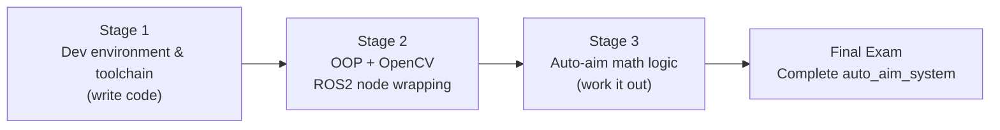
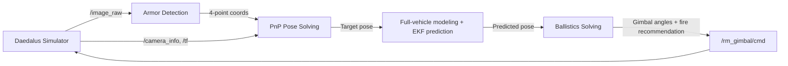

# SPR 2027 Algorithm Group Training Program

An entry-level RoboMaster vision algorithm training program for people starting from zero. Structured around the throughline "**write code → understand images → work out the math**," it proceeds through three stages, culminating in delivering a complete, runnable `auto_aim_system` in a simulation environment.

## Table of Contents

- [SPR 2027 Algorithm Group Training Program](#spr-2027-algorithm-group-training-program)
  - [Table of Contents](#table-of-contents)
  - [Program Overview](#program-overview)
  - [Learning Path](#learning-path)
  - [Stage 1: Development Environment and Toolchain](#stage-1-development-environment-and-toolchain)
    - [Knowledge Modules](#knowledge-modules)
    - [Assignment](#assignment)
    - [Curriculum and Examples](#curriculum-and-examples)
  - [Stage 2: Object-Oriented Programming and Vision Algorithms](#stage-2-object-oriented-programming-and-vision-algorithms)
    - [Knowledge Modules](#knowledge-modules-1)
    - [Assignment](#assignment-1)
    - [Curriculum and Examples](#curriculum-and-examples-1)
  - [Stage 3: Auto-Aim Mathematical Logic and Coordinate Transformations](#stage-3-auto-aim-mathematical-logic-and-coordinate-transformations)
    - [Knowledge Modules](#knowledge-modules-2)
    - [Assignment](#assignment-2)
    - [Curriculum](#curriculum)
  - [Final Examination](#final-examination)
    - [Task](#task)
    - [Data Flow](#data-flow)
    - [Assessment Environment](#assessment-environment)
    - [Acceptance Criteria](#acceptance-criteria)
    - [Submission Requirements](#submission-requirements)
  - [Bonus Item](#bonus-item)
  - [Repository Structure](#repository-structure)
  - [Development Environment](#development-environment)
  - [Learning Conventions](#learning-conventions)

## Program Overview

| Stage    | Theme                                            | Core Skill                                                              | Stage Assignment                             | Curriculum                               |
| -------- | ------------------------------------------------- | ------------------------------------------------------------------------ | --------------------------------------------- | ----------------------------------------- |
| Stage 1  | Development environment and toolchain            | Independently write, build, and commit a C++ project on Linux          | Implement a **vector math library** (6 interfaces) | [`tutorial_1`](tutorial_1/tutorial_1.md) |
| Stage 2  | Object-oriented programming and vision algorithms | Organize code with classes; use classic OpenCV methods to detect armor plates | Implement an **armor-plate-detection ROS2 node** | [`tutorial_2`](tutorial_2/tutotial_2.md) |
| Stage 3  | Auto-aim mathematical logic and coordinate transforms | Derive target pose from pixels and compute gimbal commands              | Pose solving + ballistics solving              | [`tutorial_3`](tutorial_3/tutorial_3.md) |
| Final Exam | Complete auto-aim system                        | Chain the full pipeline together and close the loop in simulation        | `auto_aim_system`                              | Daedalus simulator                        |

## Learning Path



The three stages build on each other in layers: the git and CMake skills from Stage 1 are how every later assignment gets submitted and built; the detection class written in Stage 2 is called directly by Stage 3; and the gimbal commands computed in Stage 3 are exactly what the final exam needs to publish.

---

## Stage 1: Development Environment and Toolchain

**Training goal**: Understand what happens between source code and an executable, and be able to independently manage a project with git and CMake.

### Knowledge Modules

| Module                     | Content                                                                                     |
| -------------------------- | --------------------------------------------------------------------------------------------- |
| Linux basics               | Distributions, terminal, filesystem, paths, permissions, `apt` package management            |
| Git version control        | Working directory / staging area / local repository; `clone` `add` `commit` `push`; branches; `.gitignore`; commit message conventions |
| g++ and the compilation pipeline | Preprocessing → compiling → assembling → linking; the difference between compile errors and link errors |
| CMake / Make               | `add_library` / `add_executable` / `target_link_libraries`; `PUBLIC` vs `PRIVATE`             |
| C/C++ project structure    | Declarations in header files, implementations in source files, library organization and reuse |

### Assignment

> Implement a **2D vector math library**: distance (Euclidean), magnitude, dot product, scaling, normalization, and angle between vectors, with boundary checks.

Full task and requirements: [`tutorial_1/homework_1.md`](tutorial_1/homework_1.md).

### Curriculum and Examples

- Curriculum: [`tutorial_1/tutorial_1.md`](tutorial_1/tutorial_1.md)
- Accompanying examples: [`tutorial_1/example/`](tutorial_1/example/)
  - `gpp/` — hand-written g++ commands: single-file view of the four compilation steps; multi-file view of headers and linking
  - `cmake/` — minimal CMake build: configure → build → run → incremental build

---

## Stage 2: Object-Oriented Programming and Vision Algorithms

**Training goal**: Learn to encapsulate "data + behavior" into reusable components using classes, use classic OpenCV image processing to reliably find armor plates in images, and wrap that into a ROS2 node that can run on video streams as well as connect directly to the simulator.

### Knowledge Modules

| Module                              | Content                                                                                  |
| ------------------------------------ | ------------------------------------------------------------------------------------------ |
| OOP paradigm                        | Classes and objects, encapsulation, constructors and destructors, inheritance and polymorphism, abstract base classes and factories |
| OpenCV image processing             | `cv::Mat`, grayscale / binarization / morphology / contours, common APIs and coordinate conventions |
| Classical vision detection          | Light-bar filtering (aspect ratio, dimensions) → light-bar pairing (geometric constraints) → armor-plate four points |
| ROS2 communication and system architecture | Nodes / topics / services / parameters; package structure (`ament_cmake` + `rosidl`); `cv_bridge` |

### Assignment

> Turn armor-plate detection into a ROS2 node: subscribe to `/image_raw` → detect with classical methods → output the armor plate's **four corner points** (top-left / top-right / bottom-right / bottom-left). Test with a **video stream**; align topics and message types with the Daedalus simulator so it can switch to simulation at any time.

Full task, requirements, acceptance checklist, and defense questions: [`tutorial_2/homework_2.md`](tutorial_2/homework_2.md).

### Curriculum and Examples

- Curriculum: [`tutorial_2/tutotial_2.md`](tutorial_2/tutotial_2.md)
- Accompanying examples: [`tutorial_2/example/`](tutorial_2/example/)
  - `oop/` — abstract base class + polymorphism + factory: two cameras captured with the same code
  - `opencv/` — armor-plate four-point detection, with demo images and tuning experiments

---

## Stage 3: Auto-Aim Mathematical Logic and Coordinate Transformations

**Training goal**: Connect the "pixel → angle" pipeline — be able to derive the target's 3D pose from four image points, and compute where the gimbal should turn and when to fire.

### Knowledge Modules

| Module                       | Content                                                                    |
| ------------------------------ | ----------------------------------------------------------------------------- |
| Coordinate transforms        | Pixel coordinates → camera coordinates → gimbal coordinates → world coordinates; intrinsics, extrinsics, hand-eye relationships |
| PnP distance solving          | `solvePnP` / IPPE, reprojection error evaluation, distance estimation       |
| Solver: reconstructing target pose | Full-vehicle modeling: deriving vehicle-body center from armor-plate four points; rotation matrices, quaternions, Euler angles |
| EKF prediction                | State variables and motion model, observation model, trade-offs between prediction and update |
| Ballistics solving            | Gravity compensation, iterative flight-time solving, muzzle velocity calibration |
| Fire control system           | Fire decision-making; MPC trajectory planning                              |

### Assignment

> Building on the detection results, complete **target pose solving and ballistics solving**, and output commands that can directly drive the gimbal.

Full requirements: [`tutorial_3/homework_3.md`](tutorial_3/homework_3.md) (curriculum under construction; assignment requirements still being refined).

### Curriculum

- [`tutorial_3/tutorial_3.md`](tutorial_3/tutorial_3.md) (under construction; currently only has the overall data-flow diagram)

---

## Final Examination

### Task

> **Design a simple `auto_aim_system` based on the existing code framework.**

Building on the existing framework, chain the content of the three stages into one complete pipeline: **see → compute → shoot**.

### Data Flow



### Assessment Environment

The assessment environment uses the **Daedalus** simulator: [`Blackjack200/bevy_robomaster_simulator`](https://github.com/Blackjack200/bevy_robomaster_simulator)

| Item          | Content                                                                    |
| ------------- | ----------------------------------------------------------------------------- |
| Purpose       | A RoboMaster vision-algorithm validation simulator, so auto-aim faces a real test before deployment |
| Tech stack    | Rust · Bevy · ROS2 (r2r) · Talos IPC                                       |
| Simulated content | Power rune (large/small), outpost, large/small armor modules, infantry and hero robots |
| License       | AGPL v3                                                                    |

**ROS2 interfaces**

| Direction         | Topics                                                                                                                   |
| ------------------ | ---------------------------------------------------------------------------------------------------------------------- |
| Published by simulator | `/image_raw`, `/image_compressed`, `/camera_info`, `/tf`, `/gimbal_pose`, `/odom_pose`, `/muzzle_pose`, `/camera_pose` |
| Subscribed by simulator | `/rm_gimbal/cmd` (gimbal control command, including fire recommendation)                                              |

> In other words: **your system subscribes to `/image_raw` and other topics, and publishes `/rm_gimbal/cmd`.** This is exactly the combination of Stage 2's "armor-plate detection node" and Stage 3's "ballistics solving."
>
> The `/armor_solver/cmd_gimbal` topic mentioned in the simulator's README is the **old name**; go by the code (`src/ros2/topic.rs` has `/rm_gimbal/cmd`, QoS `sensor_data`). The interface package is the simulator's own `rm_interfaces` (16 msgs + 2 srvs); the Stage 2 and Stage 3 messages are all defined in it.

**Common shortcuts**

| Key   | Function                                              |
| ----- | ------------------------------------------------------ |
| `F2`  | Screenshot                                             |
| `F3`  | Switch view (free / first-person / third-person)       |
| `F4`  | Toggle debug info                                      |
| `F5`  | Toggle auto-aim subscription                           |
| `Tab` | Switch which dummy character is currently controlled   |

### Acceptance Criteria

Not weighted or scored — **every item below must pass individually**.

**Functional closed loop**

- [ ] Runs the full pipeline "detection → solving → gimbal tracking → firing" in the simulator
- [ ] Subscribes to `/image_raw` (including `/camera_info` / `/tf`), publishes `/rm_gimbal/cmd`
- [ ] Reliably frames the armor plate at different distances, angles, and under occlusion
- [ ] Ballistics solving accounts for flight time and leads moving targets

**Engineering**

- [ ] The code repository builds completely; after `git clone`, following the README's commands makes it run
- [ ] Modules are cleanly separated (detection / solving / control), and the data flow can be diagrammed
- [ ] Key parameters are configurable, not hardcoded

**Defense**

- [ ] Can explain the basis for chosen parameter values
- [ ] Can reproduce problems encountered and how they were solved

### Submission Requirements

- Code repository (a complete, buildable project)
- A demo recording or screenshots of it running
- A short write-up: data-flow diagram + rationale for key parameter values + problems encountered and how they were solved

---

## Bonus Item

> **Implement detection and engagement of the power rune**

The power rune's blades rotate and its light bars flash, so detection requires extra handling of timing and state — it's the most comprehensive target in classical vision.

The Daedalus simulator already includes a **full simulation of the large/small power rune** (activation sequence and visual states), so it can be validated directly there.

Key points:

- The power rune's light bars are a **non-armor-plate structure**, so the armor-plate pairing constraints can't be applied directly
- Rotation introduces **temporal information** that needs handling: a single frame can't determine rotation speed, so multiple frames must be used for estimation
- Engagement needs to account for **ballistic flight time** to lead the target

---

## Repository Structure

```
SPR_Vision_Tutorial_27/
├── Readme.md                    This file: training program overview
├── tutorial_1/                  Stage 1: development environment and toolchain
│   ├── tutorial_1.md            Curriculum
│   ├── homework_1.md            Stage assignment: 2D vector math library
│   └── example/                 Accompanying examples
│       ├── gpp/                 g++ compilation examples (single-file / multi-file)
│       └── cmake/                Minimal CMake build example
├── tutorial_2/                  Stage 2: object-oriented programming and vision algorithms
│   ├── tutotial_2.md            Curriculum
│   ├── homework_2.md            Stage assignment: armor-plate-detection ROS2 node
│   └── example/
│       ├── oop/                 Object-oriented: camera classes
│       └── opencv/               Armor-plate four-point detection
└── tutorial_3/                  Stage 3: auto-aim math logic and coordinate transforms
    ├── tutorial_3.md            Curriculum (under construction)
    └── homework_3.md            Stage assignment: pose solving and ballistics solving (draft)
```

---

## Development Environment

```bash
# Ubuntu 22.04 LTS
sudo apt update
sudo apt install -y build-essential cmake git pkg-config libopencv-dev

# ROS2 Humble (needed starting from Stage 2)
sudo apt install -y ros-humble-desktop ros-humble-cv-bridge \
                    ros-humble-vision-opencv python3-colcon-common-extensions
```

| Tool    | Required version | Purpose                                              |
| ------- | ----------------- | ------------------------------------------------------ |
| Ubuntu  | 22.04 LTS         | Unified environment, officially supported by ROS2 Humble |
| g++     | 11                | C++17                                                 |
| CMake   | ≥ 3.16            | Build system                                          |
| OpenCV  | 4.x               | Image processing                                      |
| ROS2    | Humble            | Communication and system architecture (needed from Stage 2) |
| VS Code | Latest            | Editor; recommended extensions: C/C++, CMake Tools, GitLens |

---

## Learning Conventions

1. **Commit message convention**: `<type>(<scope>): <subject>`, using types `feat` / `fix` / `docs` / `refactor` / `test` / `build` / `chore`.
2. **Appropriate use of AI as a reference is fine**: but be discerning about the information, and **don't let AI complete the entire project for you**. You'll be asked to explain the underlying principles during assessment.
3. **Get it working first, optimize later**: for any new module, get the "minimum viable version" running before discussing accuracy or performance.
