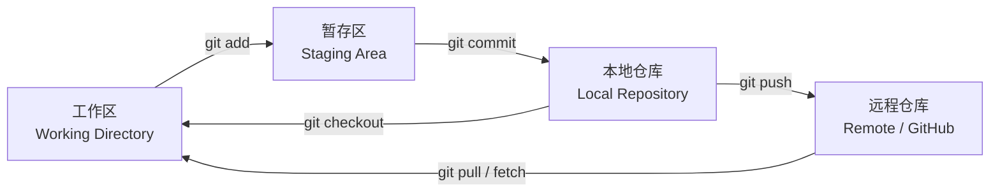
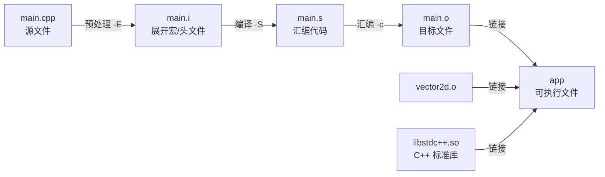

# 第一阶段培训教案：开发环境与工具链

| 项目     | 内容                                                                                          |
| -------- | --------------------------------------------------------------------------------------------- |
| 教学目标 | 能独立在 Ubuntu 上搭建工具链、用 git 管理代码、用 g++/CMake 编译多文件 C++ 工程               |
| 教学重点 | 编译四步（预处理→编译→汇编→链接）、CMake 的三个核心函数、git 提交规范                         |
| 教学难点 | 头文件/源文件/链接的关系；CMake 中「目标（target）」的传播概念                                |
| 考核方式 | 提交「二维向量运算库」小工程：clone → 编写 CMakeLists.txt → 编译通过 → commit/push → 讲解原理 |

**核心词速览（原提纲）**

> 开发环境及相关工具
>
> Linux 初识　linux 发行版，终端，
> git 版本管理
> g++ 进行简单的编译（c++/c 的基本编程了解）
> cmake 作用原理以及最小实例
>
> 第一阶段作业　写一个简单的向量运算的库，计算二维向量距离、模长、点乘、缩放。

下面按「核心词 → 概念 → 最小实例 → 常见坑」逐项展开。

---

## 配套实例

`tutotial_1/example/` 下只有两个例子，是这个阶段全部的可运行代码：

| 示例           | 目录             | 对应教案                      | 上课怎么跑                                                                                                           |
| -------------- | ---------------- | ----------------------------- | -------------------------------------------------------------------------------------------------------------------- |
| g++ 编译       | `example/gpp/`   | 三、g++ 与 C/C++ 编译流程     | `g++ -std=c++17 -Wall -Wextra hello.cpp -o hello`<br>`g++ -std=c++17 -Iinclude src/main.cpp src/vector2d.cpp -o app` |
| CMake 最小构建 | `example/cmake/` | 四、CMake：作用原理与最小实例 | `cmake -S . -B build && cmake --build build`                                                                         |

两个例子里是同一份向量库代码，区别只在**编译方式**——这样学员能直观看到「CMake 到底帮我做了什么」。完整命令、预期输出和几个反面演示见 `example/README.md`。

---

## 一、Linux 初识

### 1.1 发行版（Distribution）

**概念**：Linux 只是内核（kernel）。「发行版」= 内核 + 包管理器 + 一堆预装工具与桌面环境。

| 发行版           | 包管理器       | 特点                                 | 我们的用法           |
| ---------------- | -------------- | ------------------------------------ | -------------------- |
| Ubuntu 22.04 LTS | `apt` / `dpkg` | 文档多、生态好，ROS2 Humble 官方支持 | ✅ 本培训统一使用     |
| Debian           | `apt`          | 更保守稳定                           | 了解                 |
| Fedora           | `dnf`          | 软件版本新                           | 了解                 |
| Arch             | `pacman`       | 滚动更新，自己组装                   | 了解，不建议新手先碰 |

**LTS** = Long Term Support（长期支持版），22.04 支持到 2027 年，所以不要用非 LTS 版本，否则 ROS2 会装不上。

**最小实例**：确认自己的系统与版本。

```bash
lsb_release -a          # 输出 Distributor ID / Release
cat /etc/os-release     # 更详细的版本信息
uname -r                # 内核版本
```

输出示例：

```
Distributor ID: Ubuntu
Description:    Ubuntu 22.04.4 LTS
Release:        22.04
Codename:       jammy          # 22.04 的代号，装三方源时要用到
```

### 1.2 终端（Terminal）

**概念澄清**（常被混用）：

- **TTY/控制台**：物理或虚拟的字符设备。
- **终端模拟器**：Ubuntu 里的 `GNOME Terminal`、VS Code 内置终端 —— 只是个「窗口」，用来显示。
- **Shell**：真正解析命令的程序，最常用的是 `bash`，macOS 默认是 `zsh`。

**读懂提示符**：

```
kyoko@ubuntu:~/rm/vec2_demo$
  │      │        │        └─ $ 表示普通用户；# 表示 root
  │      │        └─ 当前所在目录（~ 代表 /home/kyoko）
  │      └─ 主机名
  └─ 用户名
```

**最小实例：10 分钟熟悉文件系统**

```bash
pwd                              # 我在哪 → /home/kyoko
ls -al                           # 列出全部文件（含隐藏文件 . 开头）
mkdir -p ~/rm/vec2_demo/src      # -p 递归创建，父目录不存在也自动建
cd ~/rm/vec2_demo                # 进入目录
cd -                             # 回到上一个目录（来回切换很实用）
touch README.md                  # 创建空文件
echo "# vec2 demo" > README.md   # > 覆盖写入，>> 追加写入
cat README.md                    # 查看内容
cp README.md README.bak          # 复制
mv README.bak docs.md            # 重命名 / 移动
rm docs.md                       # 删除文件（不进回收站！）
rm -r build                      # 删除目录需加 -r
```

**路径三兄弟**：`/` 根目录、`~` 家目录、`.` 当前目录 / `..` 上级目录。绝对路径以 `/` 开头，相对路径不以 `/` 开头。

**权限与 sudo**：

```bash
ls -al
# -rw-r--r-- 1 kyoko kyoko 1024  ...
#  │└┬┘└┬┘└┬┘   所有者   所属组
#  │ │   │  └─ 其他人权限 (r--)
#  │ │   └──── 同组权限   (r--)
#  │ └──────── 所有者权限 (rw-)
#  └────────── 类型：- 普通文件，d 目录，l 软链接
chmod +x build.sh                # 加可执行权限
sudo apt update                  # sudo 临时提权执行
```

**apt 包管理（安装工具链）**：

```bash
sudo apt update                              # 刷新软件源索引（不是升级！）
sudo apt install -y build-essential cmake git curl
sudo apt install -y git
dpkg -l | grep cmake                         # 查已装版本
cmake --version && g++ --version             # 验证
```

> **提示**
> `apt update` 刷新索引，`apt upgrade` 才是升级已装软件。装完工具一定要用 `--version` 验证，这是本阶段的验收习惯。

**常见坑**

- `rm -rf` 没有回收站，且 `rm -rf /` 或 `rm -rf ~` 会毁掉系统/家目录，永远先 `ls` 确认再删。
- `Permission denied` ≠ 一定要 `sudo`，很多时候是自己文件权限不对，先用 `ls -al` 看。
- apt 报 `Could not get lock` 说明另一个 apt 在跑（或上次被强杀），等它结束或删掉锁文件。
- 不要用中文/空格命名源码目录，交叉编译和脚本容易翻车。

---

## 二、Git 版本管理

### 2.1 概念：为什么要用 git

- **不丢代码**：任何一次提交都是可回溯的快照。
- **可协作**：多人并行开发，最后合并。
- **可追溯**：出 bug 能查「哪次提交改坏的」。
- **可审查**：评审人看 diff 就能理解改动。

**三个区域**：



**四个常用命令的关系**：`git status`（现在什么状态）→ `git add`（挑要提交的）→ `git commit`（存快照）→ `git push`（同步到远程）。

### 2.2 最小实例 A：本地仓库从零到提交

```bash
mkdir -p ~/rm/vec2_demo && cd ~/rm/vec2_demo
git init                                   # 生成隐藏目录 .git
git config --global user.name  "你的名字"
git config --global user.email "you@example.com"

mkdir -p include src
touch README.md include/vector2d.hpp src/vector2d.cpp src/main.cpp

git status                                 # 看：全是 Untracked
git add .                                  # 全部加入暂存区
git status                                 # 看：全是 Changes to be committed
git commit -m "feat: 初始化二维向量库骨架"
git log --oneline --graph --all            # 查看提交历史
```

### 2.3 最小实例 B：克隆 + 推送（考核要求）

```bash
# 1. 先在 GitHub 网页上 Fork 或创建仓库，然后：
git clone git@github.com:你的用户名/vec2_demo.git
cd vec2_demo

# 2. 改代码 → 提交
git add include/vector2d.hpp src/vector2d.cpp
git commit -m "feat: 实现模长、距离、点乘、缩放"

# 3. 推送到远程
git push origin main

# 4.（可选）关联上游，方便同步作业模板的更新
git remote add upstream git@github.com:组织/vec2_demo.git
git fetch upstream
git pull upstream main
```

> **提示**
> `git remote -v` 可查看当前配置的远程地址；`git status` 说 `Your branch is ahead of 'origin/main' by 1 commit` 就说明还没 push。

### 2.4 分支与合并（了解即可，第三阶段会大量用）

```bash
git switch -c feature/dot-product    # 新建并切换分支
# ...改代码...
git commit -am "feat: 增加点乘"
git switch main
git merge feature/dot-product
git branch -d feature/dot-product
```

**冲突**：两个分支改了同一行，merge 时会报 `CONFLICT`，手动编辑文件里的 `<<<<<<<` / `=======` / `>>>>>>>` 标记后再 `git add` + `git commit`。

### 2.5 `.gitignore`：别把编译产物传上去

```gitignore
/build/
*.o
*.so
*.a
.vscode/
.DS_Store
```

### 2.6 提交规范（Conventional Commits，考核项）

格式：`<type>(<scope>): <subject>`

| type       | 含义                                        |
| ---------- | ------------------------------------------- |
| `feat`     | 新增功能                                    |
| `fix`      | 修复 bug                                    |
| `docs`     | 只改文档                                    |
| `style`    | 格式调整、不影响逻辑                        |
| `refactor` | 重构，不改外部行为                          |
| `test`     | 增删测试                                    |
| `build`    | 构建系统 / 依赖变更（改 CMakeLists 用这个） |
| `chore`    | 杂活                                        |

✅ `feat(vec2): 实现二维向量点乘`
✅ `build(cmake): 将 vec2 库改为静态库并链接到 demo`
❌ `update`、`修改`、`123`、`asdfgh`

**常见坑**

- 忘记先 `git pull` 就 push，导致被拒（`non-fast-forward`）。
- `git add .` 把 `build/` 几万个文件一起提交 —— 先写 `.gitignore`。
- 提交信息写「改了下」，三个月后自己都看不懂。
- 在错误的分支上开发，`git switch` 前先 `git status` 确认干净。


---


## 三、g++ 与 C/C++ 编译流程

> **配套实例**：`example/gpp/` —— `hello.cpp`（单文件）、`multi/`（多文件与链接）

### 3.1 概念：从 .cpp 到可执行文件要经过四步



| 步骤   | 干什么                                   | 常见错误发生在                                |
| ------ | ---------------------------------------- | --------------------------------------------- |
| 预处理 | `#include` 展开、`#define` 替换、去注释  | 头文件找不到 → `No such file or directory`    |
| 编译   | C++ → 汇编，做语法/类型检查              | 语法错、类型不匹配                            |
| 汇编   | 汇编 → 机器码目标文件（`.o`）            | 一般不会出错                                  |
| 链接   | 把多个 `.o` 和库拼成可执行文件，解析符号 | **符号未定义** → `undefined reference to ...` |

> 教学要点：**「编译错误」和「链接错误」是两类完全不同的问题。**
> 「找不到声明」看头文件路径（`-I`），「找不到实现」看是否把对应 `.cpp`/库加进去（`-L`/`-l`）。

### 3.2 最小实例 A：单文件

```cpp
// hello.cpp
#include <iostream>

int main() {
    std::cout << "Hello, SPR Vision!\n";
    return 0;
}
```

```bash
g++ hello.cpp -o hello        # 一步到位（内部帮你走完四步）
./hello                       # 输出 Hello, SPR Vision!
```

手动分步，直观看到四个产物：

```bash
g++ -E hello.cpp -o hello.i   # 预处理
g++ -S hello.i   -o hello.s   # 编译
g++ -c hello.s   -o hello.o   # 汇编
g++ hello.o      -o hello     # 链接
ls -lh hello.i hello.s hello.o hello   # 观察体积变化
```

### 3.3 最小实例 B：多文件（本阶段重点）

**头文件：只放声明**（相当于「接口说明书」）

```cpp
// include/vector2d.hpp
#pragma once                  // 防止同一个头文件被重复展开

namespace rm {

struct Vec2 {
    double x = 0.0;
    double y = 0.0;
};

// 只用声明，不写函数体
double length(const Vec2& v);              // 模长
double distance(const Vec2& a, const Vec2& b);  // 两点距离
double dot(const Vec2& a, const Vec2& b);       // 点乘
Vec2   scale(const Vec2& v, double k);          // 缩放

}  // namespace rm
```

**源文件：放实现**

```cpp
// src/vector2d.cpp
#include "vector2d.hpp"
#include <cmath>

namespace rm {

double length(const Vec2& v) {
    return std::sqrt(v.x * v.x + v.y * v.y);
}

double distance(const Vec2& a, const Vec2& b) {
    return length(Vec2{a.x - b.x, a.y - b.y});
}

double dot(const Vec2& a, const Vec2& b) {
    return a.x * b.x + a.y * b.y;
}

Vec2 scale(const Vec2& v, double k) {
    return Vec2{v.x * k, v.y * k};
}

}  // namespace rm
```

**调用方**

```cpp
// src/main.cpp
#include <iostream>
#include "vector2d.hpp"

int main() {
    const rm::Vec2 a{3.0, 4.0};
    const rm::Vec2 b{0.0, 0.0};

    std::cout << "|a|        = " << rm::length(a) << '\n';       // 5
    std::cout << "dist(a,b)  = " << rm::distance(a, b) << '\n';  // 5
    std::cout << "a·b        = " << rm::dot(a, b) << '\n';       // 0

    const rm::Vec2 c = rm::scale(a, 2.0);
    std::cout << "2a         = (" << c.x << ", " << c.y << ")\n"; // (6, 8)
    return 0;
}
```

```bash
# 一次编两个源文件，-Iinclude 告诉编译器去哪找头文件
g++ -std=c++17 -Wall -Iinclude src/main.cpp src/vector2d.cpp -o build/app
./build/app
```

**教室演示：故意制造两种错误**

```bash
# ① 编译错误：忘记 #include "vector2d.hpp" → 'rm' has not been declared
# ② 链接错误：忘记把 vector2d.cpp 加进来
g++ -std=c++17 -Iinclude src/main.cpp -o build/app
#   undefined reference to `rm::length(rm::Vec2 const&)'
```

### 3.4 常用参数速查

| 参数            | 作用                                |
| --------------- | ----------------------------------- |
| `-o out`        | 指定输出文件名                      |
| `-c`            | 只编译成 `.o`，不链接               |
| `-I<dir>`       | 头文件搜索路径（大写 i）            |
| `-L<dir>`       | 库文件搜索路径                      |
| `-l<name>`      | 链接 `lib<name>.so` / `lib<name>.a` |
| `-Wall -Wextra` | 打开警告（**必须养成习惯**）        |
| `-std=c++17`    | 指定 C++ 标准                       |
| `-g`            | 生成调试信息（gdb 用）              |
| `-O2`           | 优化等级                            |

### 3.5 静态库 vs 动态库

```bash
# 静态库 libvec2.a：代码被复制进可执行文件，体积大、部署省心
g++ -c -Iinclude src/vector2d.cpp -o vector2d.o
ar rcs libvec2.a vector2d.o
g++ -std=c++17 -Iinclude src/main.cpp -L. -lvec2 -o app_static

# 动态库 libvec2.so：运行时加载，体积小、多程序共享
g++ -fPIC -shared -Iinclude src/vector2d.cpp -o libvec2.so
g++ -std=c++17 -Iinclude src/main.cpp -L. -lvec2 -o app_shared
ldd app_shared      # 查看依赖了哪些动态库
```

**常见坑**

- `undefined reference`：99% 是漏了 `.cpp` 或漏了 `-l`，且**库参数要放在源文件参数后面**。
- 头文件里写函数体又没加 `inline`，多文件包含时会 `multiple definition`。
- 只写 `#include <vector2d.hpp>` 而不用 `-I`，编译器找不到自己的头文件。
- 不使用 `#pragma once` / include guard，重复展开导致重定义。


## 四、CMake：作用原理与最小实例

> **配套实例**：`example/cmake/` —— `CMakeLists.txt` + `include/` + `src/`

### 4.1 为什么需要 CMake

手写 `g++` 的问题：源文件一多，命令长得没法维护；换个平台又要重写。

CMake = **用一句描述「这个项目由什么组成」，让它去生成对应平台的构建文件**。


- **CMake**：构建系统生成器（跨平台），生成上面那类文件。
- **make**：真正执行编译的构建工具，一次只编**改动过**的文件（增量编译）。所以第二次构建会快很多。

### 4.2 最小实例 A：Hello CMake

```
vec2_demo/
├── CMakeLists.txt
├── include/
│   └── vector2d.hpp
└── src/
    ├── main.cpp
    └── vector2d.cpp
```

```cmake
# CMakeLists.txt
cmake_minimum_required(VERSION 3.16)      # ① 声明 CMake 最低版本
project(vec2_demo LANGUAGES CXX)          # ② 项目名 + 语言

set(CMAKE_CXX_STANDARD 17)                # ③ 用 C++17
set(CMAKE_CXX_STANDARD_REQUIRED ON)
set(CMAKE_EXPORT_COMPILE_COMMANDS ON)     # 生成 compile_commands.json，给 VS Code 补全用

# ④ 把 vector2d.cpp 编译成一个静态库目标 vec2
add_library(vec2 STATIC src/vector2d.cpp)
target_include_directories(vec2 PUBLIC ${CMAKE_CURRENT_SOURCE_DIR}/include)

# ⑤ 把 main.cpp 编译成可执行文件目标，并链接上面那个库
add_executable(vec2_demo src/main.cpp)
target_link_libraries(vec2_demo PRIVATE vec2)
```

**构建三步（务必用外部构建，不要污染源码目录）**：

```bash
cmake -S . -B build          # 配置：读取 CMakeLists.txt，在 build/ 生成 Makefile
cmake --build build          # 构建：调用 make 编译
./build/vec2_demo            # 运行
```

等价的老写法：`mkdir build && cd build && cmake .. && make`。

想加警告，直接在 CMake 里配置，避免每次手打：

```cmake
target_compile_options(vec2 PRIVATE -Wall -Wextra)
```

### 4.3 三个核心函数（考核必问）

| 函数                                           | 作用           | 记住这句话                     |
| ---------------------------------------------- | -------------- | ------------------------------ |
| `add_executable(名字 源文件...)`               | 生成可执行文件 | 「我要一个能被运行的产物」     |
| `add_library(名字 [STATIC\|SHARED] 源文件...)` | 生成库         | 「我要一段能被别人复用的代码」 |
| `target_link_libraries(目标 PRIVATE 库...)`    | 把库链到目标上 | 「A 要用 B」                   |

**关键概念：PUBLIC / PRIVATE / INTERFACE**

`target_include_directories(vec2 PUBLIC include)` 里的 `PUBLIC` 表示：**include 目录既要给 vec2 自己能编过，也要传递给链接 vec2 的 vec2_demo**。所以我们不用在 `vec2_demo` 上再写一遍 `target_include_directories`。如果写 `PRIVATE`，`main.cpp` 里的 `#include "vector2d.hpp"` 就会找不到。

**变量与指令对照（和手写 g++ 的映射）**

| CMake                                           | 等价的 g++            |
| ----------------------------------------------- | --------------------- |
| `add_executable(vec2_demo src/main.cpp)`        | `g++ -c src/main.cpp` |
| `target_include_directories(... include)`       | `-Iinclude`           |
| `target_link_libraries(vec2_demo PRIVATE vec2)` | `-L... -lvec2`        |
| `target_compile_options(... -Wall)`             | `-Wall`               |
| `set(CMAKE_CXX_STANDARD 17)`                    | `-std=c++17`          |

### 4.4 最小实例 B：改造项目（第 6 晚练习）

在原例基础上做三件事：① 给项目加版本号、给库加编译警告；② 增加一个自测可执行目标；③ 体会「新增目标后必须重新配置」。

```cmake
cmake_minimum_required(VERSION 3.16)
project(vec2_demo VERSION 0.1.0 LANGUAGES CXX)

set(CMAKE_CXX_STANDARD 17)
set(CMAKE_CXX_STANDARD_REQUIRED ON)
set(CMAKE_EXPORT_COMPILE_COMMANDS ON)

add_library(vec2 STATIC src/vector2d.cpp)
target_include_directories(vec2 PUBLIC include)
target_compile_options(vec2 PRIVATE -Wall -Wextra)

add_executable(vec2_demo src/main.cpp)
target_link_libraries(vec2_demo PRIVATE vec2)

# 额外：编译一个只跑断言的自测程序
add_executable(vec2_test test/test_vector2d.cpp)
target_link_libraries(vec2_test PRIVATE vec2)
```

```bash
cd build
cmake ..                 # 新增了 add_executable，要重新配置
cmake --build . -j 8     # -j 并行编译加速
ctest                    # 若写了 add_test 则在此运行
```

```
// test/test_vector2d.cpp
// 自己写个最简单的断言，不引入第三方框架
#include <cmath>
#include <iostream>
#include "vector2d.hpp"

#define CHECK(expr)                                                        \
    do {                                                                   \
        if (!(expr)) {                                                     \
            std::cerr << "FAIL: " #expr " (line " << __LINE__ << ")\n";    \
            return 1;                                                      \
        }                                                                  \
    } while (0)

int main() {
    CHECK(std::abs(rm::length(rm::Vec2{3.0, 4.0}) - 5.0) < 1e-9);
    CHECK(std::abs(rm::distance(rm::Vec2{3.0, 4.0}, rm::Vec2{0.0, 0.0}) - 5.0) < 1e-9);
    CHECK(std::abs(rm::dot(rm::Vec2{1.0, 2.0}, rm::Vec2{2.0, -1.0}) - 0.0) < 1e-9);
    std::cout << "all checks passed\n";
    return 0;
}
```

**常见坑**

- **在源码目录里 cmake**：会产生一堆中间文件，永远用 `build/` 子目录。
- 改了 CMakeLists.txt 后忘记重新 `cmake ..`，只 `make` —— 新目标不会出现。
- 改了 `target_link_libraries` 后没重新配置，链接错误依旧。
- 头文件里有中文或路径含空格，跨平台会挂。
- `undefined reference` 在 CMake 工程里出现，八成是忘了 `target_link_libraries`。
- 把 `build/` 提交进 git —— 记得写 `.gitignore`。

---

## 五、第一阶段作业

### 5.1 题目

> 写一个简单的**二维向量运算库**，支持：计算二维向量距离、模长、点乘、缩放。

### 5.2 要求

1. **git**：完成 `clone`、`commit`、`push`；提交信息符合 Conventional Commits。
2. **CMake**：自己编写 `CMakeLists.txt`，用 `add_library` 把运算部分做成库，`add_executable` 做调用示例，用 `target_link_libraries` 链接。
3. **功能**：四个接口全部正确，含边界情况（零向量、负向量、小数）。
4. **规范**：头文件用 `#pragma once`；声明与实现分离；能通过 `-Wall -Wextra` 无警告编译。

### 5.3 验收：评分表（满分 100）

| 维度           | 分值 | 评分要点                                                                                  |
| -------------- | ---- | ----------------------------------------------------------------------------------------- |
| git 使用       | 20   | clone/push 成功；提交粒度合理（一个功能一次提交）；提交信息规范                           |
| CMakeLists.txt | 25   | 结构清晰；正确使用 `add_library` / `add_executable` / `target_link_libraries`；构建出产物 |
| 功能正确性     | 35   | 模长 / 距离 / 点乘 / 缩放结果正确，边界情况处理正确                                       |
| 代码规范       | 10   | 命名统一、有无用代码、无警告编译                                                          |
| 原理讲解       | 10   | 能讲清编译流程、链接的作用、CMake 各函数职责                                              |

### 5.4 课堂演示的验收脚本

```bash
# 1. 克隆
git clone <仓库地址> && cd vec2_demo

# 2. 构建
cmake -S . -B build && cmake --build build

# 3. 运行并核对预期输出
./build/vec2_demo
# 预期：
# |a|       = 5
# dist(a,b) = 5
# a·b       = 0
# 2a        = (6, 8)

# 4. 检查提交历史
git log --oneline
```

### 5.5 验收时会被问到的问题（提前准备）

1. `g++ main.cpp` 为什么报 `undefined reference`？怎么排查？
2. 头文件和源文件分别放什么？为什么不能把函数体都写在头文件里？
3. `add_library` 和 `add_executable` 有什么区别？为什么要把运算逻辑做成库？
4. `target_include_directories` 里的 `PUBLIC` 换成 `PRIVATE` 会发生什么？
5. 改了代码后第二次编译为什么比第一次快？
6. 静态库和动态库的区别？各自适用场景？

---

## 六、参考资料

**C++**
- 菜鸟教程：https://www.runoob.com/cplusplus/cpp-tutorial.html

**CMake**
- 同济大学培训视频：https://www.bilibili.com/video/BV1QHJdz5Efv
- 静态/动态链接科普：https://www.bilibili.com/video/BV1Bw1qB1EwU/
- 菜鸟教程：https://www.runoob.com/cmake/cmake-tutorial.html

**Git**
- 菜鸟教程：https://www.runoob.com/git/git-tutorial.html
- 廖雪峰教程：https://liaoxuefeng.com/books/git/introduction/index.html

**Ubuntu 基础**
- Linux 常用命令（B 站·全 31 集）：https://www.snm0516.aisee.tv/video/BV1NwkLBxELC/
- Ubuntu 零基础通关（B 站·70 全集）：https://www.snm0516.aisee.tv/video/BV1LM2pBuEg1/

> 注：也可以适当参考 AI 进行学习，但要注意信息甄别，而且不要只让 AI 全程完成项目。


