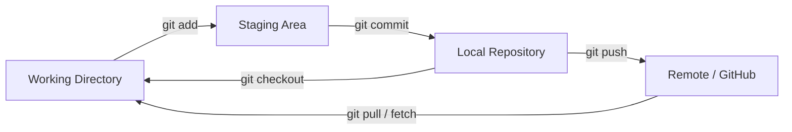
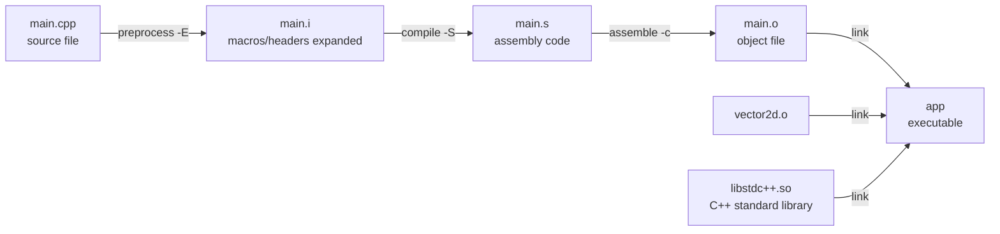
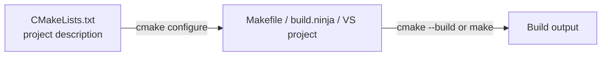

# Stage 1 Curriculum: Development Environment and Toolchain

| Item                | Content                                                                                                    |
| --------------------- | -------------------------------------------------------------------------------------------------------------- |
| Teaching goal        | Be able to independently set up a toolchain on Ubuntu, manage code with git, and compile a multi-file C++ project with g++/CMake |
| Teaching focus       | The four compilation steps (preprocessing → compiling → assembling → linking), CMake's three core functions, git commit conventions |
| Teaching difficulty  | The relationship between headers/source files/linking; the "target" propagation concept in CMake              |
| Assessment method    | Submit a small "2D vector math library" project: clone → write CMakeLists.txt → compiles successfully → commit/push → explain the principles |

**Key terms at a glance (original outline)**

> Development environment and related tools
>
> Linux basics — Linux distributions, terminal
> Git version control
> Simple compilation with g++ (basic understanding of C++/C programming)
> How CMake works and a minimal example
>
> Stage 1 assignment: write a simple vector math library that computes 2D vector distance, magnitude, dot product, and scaling.

Below, each item is expanded in the order "key term → concept → minimal example → common pitfalls."

---

## Accompanying Examples

`tutotial_1/example/` has only two examples, which are all the runnable code for this stage:

| Example                | Directory         | Corresponding curriculum section              | How to run it in class                                                                                            |
| ------------------------ | ------------------- | ------------------------------------------------ | ---------------------------------------------------------------------------------------------------------------- |
| g++ compilation         | `example/gpp/`     | 3. g++ and the C/C++ compilation pipeline       | `g++ -std=c++17 -Wall -Wextra hello.cpp -o hello`<br>`g++ -std=c++17 -Iinclude src/main.cpp src/vector2d.cpp -o app` |
| Minimal CMake build     | `example/cmake/`   | 4. CMake: how it works and a minimal example    | `cmake -S . -B build && cmake --build build`                                                                      |

Both examples contain the same vector library code — the only difference is **how it's compiled** — so learners can directly see "what CMake actually does for me." Full commands, expected output, and a few negative demos are in `example/README.md`.

---

## I. Linux Basics

### 1.1 Distributions

**Concept**: Linux is just the kernel. A "distribution" = kernel + package manager + a bunch of preinstalled tools and a desktop environment.

| Distribution      | Package manager | Characteristics                                    | Our usage                          |
| -------------------- | ----------------- | ----------------------------------------------------- | ------------------------------------- |
| Ubuntu 22.04 LTS    | `apt` / `dpkg`    | Lots of documentation, good ecosystem, officially supported by ROS2 Humble | ✅ Used uniformly throughout this training |
| Debian              | `apt`             | More conservative and stable                          | Good to know                          |
| Fedora              | `dnf`             | Newer software versions                                | Good to know                          |
| Arch                | `pacman`          | Rolling release, assemble it yourself                  | Good to know, not recommended for beginners |

**LTS** = Long Term Support. 22.04 is supported until 2027, so don't use a non-LTS release — otherwise ROS2 won't install.

**Minimal example**: check your own system and version.

```bash
lsb_release -a          # Prints Distributor ID / Release
cat /etc/os-release     # More detailed version info
uname -r                # Kernel version
```

Example output:

```
Distributor ID: Ubuntu
Description:    Ubuntu 22.04.4 LTS
Release:        22.04
Codename:       jammy          # Codename for 22.04, needed when adding third-party repos
```

### 1.2 Terminal

**Terminology clarification** (often confused):

- **TTY / console**: a physical or virtual character device.
- **Terminal emulator**: `GNOME Terminal` on Ubuntu, VS Code's built-in terminal — just a "window" used for display.
- **Shell**: the program that actually parses commands; the most common is `bash`, while macOS defaults to `zsh`.

**Reading the prompt**:

```
kyoko@ubuntu:~/rm/vec2_demo$
  │      │        │        └─ $ means a regular user; # means root
  │      │        └─ current directory (~ represents /home/kyoko)
  │      └─ hostname
  └─ username
```

**Minimal example: 10 minutes to get familiar with the filesystem**

```bash
pwd                              # Where am I → /home/kyoko
ls -al                           # List all files (including hidden files starting with .)
mkdir -p ~/rm/vec2_demo/src      # -p creates recursively, even if parent dirs don't exist
cd ~/rm/vec2_demo                # Enter the directory
cd -                             # Go back to the previous directory (handy for switching back and forth)
touch README.md                  # Create an empty file
echo "# vec2 demo" > README.md   # > overwrites, >> appends
cat README.md                    # View the content
cp README.md README.bak          # Copy
mv README.bak docs.md            # Rename / move
rm docs.md                       # Delete a file (no recycle bin!)
rm -r build                      # Deleting a directory needs -r
```

**The three path siblings**: `/` root directory, `~` home directory, `.` current directory / `..` parent directory. Absolute paths start with `/`; relative paths don't.

**Permissions and sudo**:

```bash
ls -al
# -rw-r--r-- 1 kyoko kyoko 1024  ...
#  │└┬┘└┬┘└┬┘   owner    group
#  │ │   │  └─ others' permissions (r--)
#  │ │   └──── group permissions   (r--)
#  │ └──────── owner permissions   (rw-)
#  └────────── type: - regular file, d directory, l symlink
chmod +x build.sh                # Add executable permission
sudo apt update                  # sudo temporarily elevates privileges to run a command
```

**apt package management (installing the toolchain)**:

```bash
sudo apt update                              # Refresh package index (not an upgrade!)
sudo apt install -y build-essential cmake git curl
sudo apt install -y git
dpkg -l | grep cmake                         # Check installed version
cmake --version && g++ --version             # Verify
```

> **Tip**
> `apt update` refreshes the index; `apt upgrade` is what actually upgrades installed software. After installing tools, always verify with `--version` — this is a habit expected during this stage's assessment.

**Common pitfalls**

- `rm -rf` has no recycle bin, and `rm -rf /` or `rm -rf ~` will wreck your system/home directory — always `ls` to confirm before deleting.
- `Permission denied` doesn't necessarily mean you need `sudo` — often it's just wrong file permissions; check with `ls -al` first.
- If apt reports `Could not get lock`, another apt process is running (or was force-killed last time) — wait for it to finish or remove the lock file.
- Don't name source directories with Chinese characters or spaces — cross-compilation and scripts tend to break.

---

## II. Git Version Control

### 2.1 Concept: why use git

- **Never lose code**: every commit is a traceable snapshot.
- **Enables collaboration**: multiple people can develop in parallel and merge later.
- **Traceable**: when a bug appears, you can find "which commit broke it."
- **Reviewable**: reviewers can understand a change just by looking at the diff.

**Three areas**:



**How the four common commands relate**: `git status` (what's the current state) → `git add` (pick what to commit) → `git commit` (save a snapshot) → `git push` (sync to remote).

### 2.2 Minimal Example A: local repository from scratch to a commit

```bash
mkdir -p ~/rm/vec2_demo && cd ~/rm/vec2_demo
git init                                   # Creates the hidden .git directory
git config --global user.name  "Your Name"
git config --global user.email "you@example.com"

mkdir -p include src
touch README.md include/vector2d.hpp src/vector2d.cpp src/main.cpp

git status                                 # See: everything is Untracked
git add .                                  # Add everything to staging
git status                                 # See: everything is Changes to be committed
git commit -m "feat: initialize 2D vector library skeleton"
git log --oneline --graph --all            # View commit history
```

### 2.3 Minimal Example B: clone → create a branch → push (assessment requirement)

**Workflow conventions (memorize these three first)**

1. The repository is a **shared template repository**; the `main` branch is maintained by the instructor — **no one should ever commit directly to `main`**
2. Everyone does their assignment on **their own branch**, named uniformly as `feat/<your-name>`
3. **Before pushing, sync the latest content from `main` into your own branch** (the instructor will update the template)

> **`main` must stay clean**: don't push to `main`, and don't click Merge on GitHub. All of your commits should only ever appear on your own branch.
> (Instructor side: it's recommended to add branch protection to `main` under Settings → Branches, to prevent accidental pushes at the source.)

**Step 1: Set up SSH (recommended)**

```bash
ssh-keygen   # Press enter through the prompts; saved by default to ~/.ssh/id_ed25519
cat ~/.ssh/id_rsa.pub                    # Copy this whole line
```

Paste it into GitHub → Settings → SSH and GPG keys → New SSH key, then verify:

```bash
ssh -T git@github.com                        # Seeing "Hi <username>!" means it worked
```

> HTTPS also works for pulling, but you'll have to enter a token on every push, which is annoying.

**Step 2: Clone**

```bash
git clone git@github.com:SPR-Algorithm/SPR_Vision_Tutorial_27.git
cd SPR_Vision_Tutorial_27

git remote -v                                # Confirm origin points to this repository
```

**Step 3: Create your own working branch (key step)**

```bash
git switch -c feat/your-name
git branch                                   # Confirm the branch marked with * is your own
```

> ⚠️ **Don't change code directly on `main`**. `main` is everyone's shared baseline.

**Step 4: Change code → commit**

```bash
git add include/vector2d.hpp src/vector2d.cpp
git commit -m "feat(vec2): implement magnitude, distance, dot product, scaling"
```

**Step 5: Before pushing, sync the latest content from `main`**

```bash
git switch main
git pull origin main                # Pull main's latest commits
git switch feat/your-name
git rebase main                     # "Move" your commits to sit after the latest main
```

**Step 6: Push your own branch**

```bash
git push -u origin feat/your-name    # -u links the remote branch, so plain `git push` works afterward
```

**Step 7: Submit the assignment**

After pushing your branch, tell us the **branch name** (e.g. `feat/zhangsan`) and we'll check out your branch to grade it.


**Quick reference for the whole flow**

```bash
git clone git@github.com:SPR-Algorithm/SPR_Vision_Tutorial_27.git   # Clone
git switch -c feat/your-name                                          # Create branch

# ...change code...

git add ... && git commit -m "feat(vec2): ..."                       # Commit

git switch main && git pull origin main                              # Sync main
git switch feat/your-name && git rebase main                          # Rebase onto latest main
git push -u origin feat/your-name                                     # Push your own branch
```

> The above is only the **skeleton of the workflow**. The branch names and file names in the actual commands should be your own — **don't copy verbatim**.

**Common pitfalls**

- **Committing directly to `main`**: pollutes everyone's shared baseline. Before starting, check `git branch` to confirm the branch marked with `*` is your own; `main` has branch protection enabled, so an accidental push will be rejected.
- **Clicking the merge button on GitHub**: whether via a PR or a direct merge, this merges content into `main`. Never touch the merge button on the repository page.
- **Forgetting to sync `main` before pushing**: if `main` has changed the same file, your branch will conflict with it, and rebase will report a conflict directly.
- **Push rejected after rebasing**: rebase rewrites commit history, so you'll need `git push --force-with-lease`. **Only use this on your own branch, never on `main`.**
- **Committing `build/`, `.vscode/` along with everything else**: write a `.gitignore` first, and glance at `git status` before committing.
- **Writing "made some changes" as a commit message**: `git log` will be checked during assessment.

### 2.4 Syncing main: rebase or merge (good to know)

From the moment your branch is created, it starts falling behind `main`, so you need to periodically merge in `main`'s new content. There are two ways:

```bash
git switch main && git pull origin main
git switch feat/your-name

git rebase main     # Method A: "move" your commits to after main's latest commit; history is a straight line
# or
git merge main      # Method B: creates an extra "merge commit"; history branches
```

|                       | `git rebase`                           | `git merge`               |
| ----------------------- | ----------------------------------------- | ---------------------------- |
| Commit history         | A straight line, clean                   | Has branches + merge commits |
| Rewrites history?      | **Yes**, commit hashes change            | No                            |
| Use case               | A branch only you are using               | A branch shared by multiple people |

> Conclusion: **use rebase on your own assignment branch, use merge on the shared branch (`main`)**. Doing it the other way around is disastrous — rebasing on `main` will invalidate everyone else's local branches.

**Conflicts**: both methods can report `CONFLICT`. After manually editing the `<<<<<<<` / `=======` / `>>>>>>>` markers in the file:

- During rebase: `git add <file>` → `git rebase --continue`
- During merge: `git add <file>` → `git commit`

To abandon midway: `git rebase --abort` / `git merge --abort` will return you to the state before the operation.

### 2.5 `.gitignore`: don't push build artifacts

```gitignore
/build/
*.o
*.so
*.a
.vscode/
.DS_Store
```

### 2.6 Commit Conventions (Conventional Commits, an assessment item)

Format: `<type>(<scope>): <subject>`

| type       | Meaning                                          |
| ---------- | --------------------------------------------------- |
| `feat`     | New feature                                        |
| `fix`      | Bug fix                                            |
| `docs`     | Documentation only                                 |
| `style`    | Formatting change, no logic impact                 |
| `refactor` | Refactor, no change in external behavior            |
| `test`     | Adding/removing tests                              |
| `build`    | Build system / dependency changes (use this for CMakeLists changes) |
| `chore`    | Miscellaneous chores                                |

✅ `feat(vec2): implement 2D vector dot product`
✅ `build(cmake): change the vec2 library to a static library and link it into the demo`
❌ `update`, `修改` ("made changes"), `123`, `asdfgh`

**Common pitfalls**

- Pushing without first `git pull`, causing a rejection (`non-fast-forward`).
- `git add .` committing tens of thousands of `build/` files at once — write `.gitignore` first.
- Writing "made some changes" as a commit message — you won't understand it yourself three months later.
- Developing on the wrong branch — run `git status` before `git switch` to confirm it's clean.


---


## III. g++ and the C/C++ Compilation Pipeline

> **Accompanying example**: `example/gpp/` — `hello.cpp` (single file), `multi/` (multi-file and linking)

### 3.1 Concept: four steps from .cpp to an executable



| Step         | What it does                                             | Common errors happen at                            |
| -------------- | ------------------------------------------------------------ | ------------------------------------------------------ |
| Preprocessing  | `#include` expansion, `#define` substitution, comment removal | Header not found → `No such file or directory`         |
| Compiling      | C++ → assembly, syntax/type checking                        | Syntax errors, type mismatches                          |
| Assembling     | Assembly → machine-code object file (`.o`)                  | Generally doesn't error out                              |
| Linking        | Combines multiple `.o` files and libraries into an executable, resolves symbols | **Undefined symbol** → `undefined reference to ...`     |

> Teaching point: **"compile errors" and "link errors" are two completely different kinds of problems.**
> "Can't find the declaration" → check the header search path (`-I`); "can't find the implementation" → check whether the corresponding `.cpp`/library was included (`-L`/`-l`).

### 3.2 Minimal Example A: single file

```cpp
// hello.cpp
#include <iostream>

int main() {
    std::cout << "Hello, SPR Vision!\n";
    return 0;
}
```

```bash
g++ hello.cpp -o hello        # One step (internally runs through all four steps for you)
./hello                       # Output: Hello, SPR Vision!
```

Doing it step by step manually, to see the four intermediate outputs directly:

```bash
g++ -E hello.cpp -o hello.i   # Preprocessing
g++ -S hello.i   -o hello.s   # Compiling
g++ -c hello.s   -o hello.o   # Assembling
g++ hello.o      -o hello     # Linking
ls -lh hello.i hello.s hello.o hello   # Observe the change in file sizes
```

### 3.3 Minimal Example B: multi-file (the focus of this stage)

**Header file: declarations only** (like an "interface spec sheet")

```cpp
// include/vector2d.hpp
#pragma once                  // Prevents the same header from being expanded more than once

namespace rm {

struct Vec2 {
    double x = 0.0;
    double y = 0.0;
};

// Declarations only, no function bodies
double length(const Vec2& v);              // Magnitude
double distance(const Vec2& a, const Vec2& b);  // Distance between two points
double dot(const Vec2& a, const Vec2& b);       // Dot product
Vec2   scale(const Vec2& v, double k);          // Scaling

}  // namespace rm
```

**Source file: the implementation**

```cpp
// src/vector2d.cpp
#include "vector2d.hpp"
#include <cmath>

namespace rm {

double length(const Vec2& v) {
    return std::sqrt(v.x * v.x + v.y * v.y);
}

double distance(const Vec2& a, const Vec2& b) {
    return length(Vec2{a.x - b.x, a.y - b.y});
}

double dot(const Vec2& a, const Vec2& b) {
    return a.x * b.x + a.y * b.y;
}

Vec2 scale(const Vec2& v, double k) {
    return Vec2{v.x * k, v.y * k};
}

}  // namespace rm
```

**The caller**

```cpp
// src/main.cpp
#include <iostream>
#include "vector2d.hpp"

int main() {
    const rm::Vec2 a{3.0, 4.0};
    const rm::Vec2 b{0.0, 0.0};

    std::cout << "|a|        = " << rm::length(a) << '\n';       // 5
    std::cout << "dist(a,b)  = " << rm::distance(a, b) << '\n';  // 5
    std::cout << "a·b        = " << rm::dot(a, b) << '\n';       // 0

    const rm::Vec2 c = rm::scale(a, 2.0);
    std::cout << "2a         = (" << c.x << ", " << c.y << ")\n"; // (6, 8)
    return 0;
}
```

```bash
# Compile both source files at once; -Iinclude tells the compiler where to find headers
g++ -std=c++17 -Wall -Iinclude src/main.cpp src/vector2d.cpp -o build/app
./build/app
```

**Classroom demo: deliberately produce two kinds of errors**

```bash
# ① Compile error: forget #include "vector2d.hpp" → 'rm' has not been declared
# ② Link error: forget to include vector2d.cpp
g++ -std=c++17 -Iinclude src/main.cpp -o build/app
#   undefined reference to `rm::length(rm::Vec2 const&)'
```

### 3.4 Common Flags Quick Reference

| Flag              | Purpose                                        |
| ------------------- | -------------------------------------------------- |
| `-o out`          | Specify the output filename                        |
| `-c`              | Compile to `.o` only, don't link                   |
| `-I<dir>`         | Header search path (capital I)                     |
| `-L<dir>`         | Library search path                                |
| `-l<name>`        | Link against `lib<name>.so` / `lib<name>.a`        |
| `-Wall -Wextra`   | Enable warnings (**a habit you must build**)       |
| `-std=c++17`      | Specify the C++ standard                            |
| `-g`              | Generate debug info (for gdb)                       |
| `-O2`             | Optimization level                                  |

### 3.5 Static Libraries vs Dynamic Libraries

```bash
# Static library libvec2.a: code is copied into the executable — larger size, simpler deployment
g++ -c -Iinclude src/vector2d.cpp -o vector2d.o
ar rcs libvec2.a vector2d.o
g++ -std=c++17 -Iinclude src/main.cpp -L. -lvec2 -o app_static

# Dynamic library libvec2.so: loaded at runtime — smaller size, shared across programs
g++ -fPIC -shared -Iinclude src/vector2d.cpp -o libvec2.so
g++ -std=c++17 -Iinclude src/main.cpp -L. -lvec2 -o app_shared
ldd app_shared      # See which dynamic libraries it depends on
```

**Common pitfalls**

- `undefined reference`: 99% of the time you're missing a `.cpp` or a `-l`, and **library flags must come after the source file arguments**.
- Writing a function body in a header without marking it `inline` causes `multiple definition` errors when included in multiple files.
- Writing only `#include <vector2d.hpp>` without `-I` — the compiler can't find your own header.
- Not using `#pragma once` / an include guard — repeated expansion causes redefinition.


## IV. CMake: How It Works and a Minimal Example

> **Accompanying example**: `example/cmake/` — `CMakeLists.txt` + `include/` + `src/`

### 4.1 Why We Need CMake

The problem with hand-writing `g++` commands: once there are many source files, the command becomes unmaintainably long; and switching platforms means rewriting it.

CMake = **describe "what this project is made of" in a script, and have it generate the build files for the target platform**.



- **CMake**: a build system generator (cross-platform) that produces files like the above.
- **make**: the actual build tool that performs the compilation, compiling only files that have **changed** each time (incremental builds). So the second build is much faster.

### 4.2 Minimal Example A: Hello CMake

```
vec2_demo/
├── CMakeLists.txt
├── include/
│   └── vector2d.hpp
└── src/
    ├── main.cpp
    └── vector2d.cpp
```

```cmake
# CMakeLists.txt
cmake_minimum_required(VERSION 3.16)      # ① Declare the minimum CMake version
project(vec2_demo LANGUAGES CXX)          # ② Project name + language

set(CMAKE_CXX_STANDARD 17)                # ③ Use C++17
set(CMAKE_CXX_STANDARD_REQUIRED ON)
set(CMAKE_EXPORT_COMPILE_COMMANDS ON)     # Generates compile_commands.json, for VS Code autocomplete

# ④ Compile vector2d.cpp into a static library target named vec2
add_library(vec2 STATIC src/vector2d.cpp)
target_include_directories(vec2 PUBLIC ${CMAKE_CURRENT_SOURCE_DIR}/include)

# ⑤ Compile main.cpp into an executable target, and link the library above
add_executable(vec2_demo src/main.cpp)
target_link_libraries(vec2_demo PRIVATE vec2)
```

**Three-step build (always build out-of-tree — never pollute the source directory)**:

```bash
cmake -S . -B build          # Configure: read CMakeLists.txt, generate a Makefile in build/
cmake --build build          # Build: invoke make to compile
./build/vec2_demo            # Run
```

The equivalent old-style syntax: `mkdir build && cd build && cmake .. && make`.

To add warnings, configure it directly in CMake, instead of typing it every time:

```cmake
target_compile_options(vec2 PRIVATE -Wall -Wextra)
```

### 4.3 Three Core Functions (must-know for assessment)

| Function                                          | Purpose                       | Remember it as               |
| ---------------------------------------------------- | ---------------------------------- | -------------------------------- |
| `add_executable(name source-files...)`             | Produces an executable            | "I want something that can be run" |
| `add_library(name [STATIC\|SHARED] source-files...)` | Produces a library                | "I want code that others can reuse" |
| `target_link_libraries(target PRIVATE libs...)`    | Links a library onto a target     | "A needs to use B"                |

**Key concept: PUBLIC / PRIVATE / INTERFACE**

The `PUBLIC` in `target_include_directories(vec2 PUBLIC include)` means: **the include directory must both let `vec2` itself compile, and be propagated to `vec2_demo`, which links `vec2`.** So we don't need to write `target_include_directories` again on `vec2_demo`. If it were written as `PRIVATE`, the `#include "vector2d.hpp"` in `main.cpp` would fail to find it.

**Variable/directive comparison (mapping to hand-written g++)**

| CMake                                              | Equivalent g++          |
| ----------------------------------------------------- | -------------------------- |
| `add_executable(vec2_demo src/main.cpp)`             | `g++ -c src/main.cpp`     |
| `target_include_directories(... include)`            | `-Iinclude`                |
| `target_link_libraries(vec2_demo PRIVATE vec2)`      | `-L... -lvec2`             |
| `target_compile_options(... -Wall)`                  | `-Wall`                    |
| `set(CMAKE_CXX_STANDARD 17)`                          | `-std=c++17`               |

### 4.4 Minimal Example B: Extending the Project (Night 6 exercise)

Building on the original example, do three things: ① add a version number to the project and enable compiler warnings for the library; ② add a self-test executable target; ③ get a feel for "adding a new target requires reconfiguring."

```cmake
cmake_minimum_required(VERSION 3.16)
project(vec2_demo VERSION 0.1.0 LANGUAGES CXX)

set(CMAKE_CXX_STANDARD 17)
set(CMAKE_CXX_STANDARD_REQUIRED ON)
set(CMAKE_EXPORT_COMPILE_COMMANDS ON)

add_library(vec2 STATIC src/vector2d.cpp)
target_include_directories(vec2 PUBLIC include)
target_compile_options(vec2 PRIVATE -Wall -Wextra)

add_executable(vec2_demo src/main.cpp)
target_link_libraries(vec2_demo PRIVATE vec2)

# Extra: compile a self-test program that only runs assertions
add_executable(vec2_test test/test_vector2d.cpp)
target_link_libraries(vec2_test PRIVATE vec2)
```

```bash
cd build
cmake ..                 # A new add_executable was added, so reconfigure
cmake --build . -j 8     # -j parallelizes the build for speed
ctest                    # If add_test was used, this runs it here
```

```
// test/test_vector2d.cpp
// A minimal, self-written assertion test — no third-party framework
#include <cmath>
#include <iostream>
#include "vector2d.hpp"

#define CHECK(expr)                                                        \
    do {                                                                   \
        if (!(expr)) {                                                     \
            std::cerr << "FAIL: " #expr " (line " << __LINE__ << ")\n";    \
            return 1;                                                      \
        }                                                                  \
    } while (0)

int main() {
    CHECK(std::abs(rm::length(rm::Vec2{3.0, 4.0}) - 5.0) < 1e-9);
    CHECK(std::abs(rm::distance(rm::Vec2{3.0, 4.0}, rm::Vec2{0.0, 0.0}) - 5.0) < 1e-9);
    CHECK(std::abs(rm::dot(rm::Vec2{1.0, 2.0}, rm::Vec2{2.0, -1.0}) - 0.0) < 1e-9);
    std::cout << "all checks passed\n";
    return 0;
}
```

**Common pitfalls**

- **Running cmake inside the source directory**: this generates a pile of intermediate files — always use a `build/` subdirectory.
- Changing CMakeLists.txt and forgetting to re-run `cmake ..`, only running `make` — the new target won't appear.
- Changing `target_link_libraries` without reconfiguring — the link error persists.
- Headers containing Chinese characters or paths with spaces — this will break cross-platform.
- `undefined reference` appearing in a CMake project is, 80% of the time, a forgotten `target_link_libraries`.
- Committing `build/` into git — remember to write a `.gitignore`.

---

## V. Stage 1 Assignment

> For the full task, requirements, acceptance checklist, grading scripts, and defense questions, see [`homework_1.md`](homework_1.md).

---

## VI. References

**C++**
- Runoob tutorial: https://www.runoob.com/cplusplus/cpp-tutorial.html

**CMake**
- Tongji University training video: https://www.bilibili.com/video/BV1QHJdz5Efv
- Static/dynamic linking primer: https://www.bilibili.com/video/BV1Bw1qB1EwU/
- Runoob tutorial: https://www.runoob.com/cmake/cmake-tutorial.html

**Git**
- Runoob tutorial: https://www.runoob.com/git/git-tutorial.html
- Liao Xuefeng's tutorial: https://liaoxuefeng.com/books/git/introduction/index.html

**Ubuntu Basics**
- Common Linux commands (Bilibili, all 31 episodes): https://www.snm0516.aisee.tv/video/BV1NwkLBxELC/
- Ubuntu from zero (Bilibili, all 70 episodes): https://www.snm0516.aisee.tv/video/BV1LM2pBuEg1/

> Note: it's fine to appropriately use AI as a learning reference, but be discerning about the information, and don't let AI complete the entire project for you.
