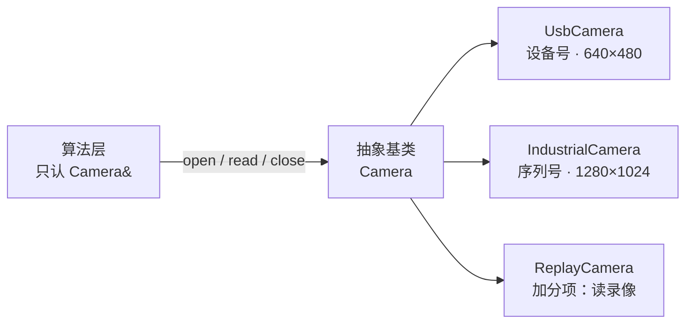

# 第二阶段作业：相机类的封装与派生

对应教案：[`tutotial_2.md`](tutotial_2.md)（二、C++ 面向对象 · 2.5 基于相机类的开发）

> 验收不设权重、不打分，**下列每一条必须逐条通过**。

---

## 1. 题目

写一个**相机类体系**：抽象基类 + 两个派生类 + 一个工厂，让「取一帧图」这件事和「具体是哪台相机」完全解耦。



要交的四样东西：

| #   | 内容                      | 说明                                                                       |
| --- | ------------------------- | -------------------------------------------------------------------------- |
| 1   | 抽象基类 `Camera`         | 规定「相机应该会做什么」：`open()` / `read(Frame&)` / `close()` / `name()` |
| 2   | 派生类 `UsbCamera`        | USB 相机：构造参数是设备号，出图 640×480                                   |
| 3   | 派生类 `IndustrialCamera` | 工业相机：构造参数是序列号，出图 1280×1024                                 |
| 4   | 工厂 `makeCamera()`       | 把配置里的字符串（`"usb"` / `"industrial"`）翻译成具体对象                 |

**本作业不要求真的接到相机**：`read()` 里造数据即可（照着示例那样按帧号生成灰度值）。
重点是**类的结构**和**调用方式**——验收看的是这两样，不是画面。

**验收方式**：`cmake -S . -B build && cmake --build build && ./build/camera`，
输出里要能看出「两种相机走了同一个函数」，且程序结束时每个相机的 `close()` 都被调到。

## 2. 要求

### 2.1 类的结构

1. **抽象基类**：`Camera` 的四个接口全是**纯虚函数**（`= 0`），`Camera cam;` 必须编译不过。
2. **虚析构**：`virtual ~Camera() = default;`。验收时会用 `std::unique_ptr<Camera>` 持有派生对象，看派生类的 `close()` 有没有被调到。
3. **两个派生类**：构造参数不同（设备号 / 序列号），出图分辨率也不同（640×480 / 1280×1024），`name()` 返回能区分出型号和编号的字符串。
4. **RAII**：`close()` 写在派生类析构里，保证「对象没了 → 资源就释放」。基类析构漏了 `virtual`，派生类的析构就不会执行。
5. **工厂**：`makeCamera(const std::string& type, int id)` 返回 `std::unique_ptr<Camera>`；未知类型打印错误并返回 `nullptr`，不要抛异常、也不要 `exit()`。

### 2.2 调用方（本作业重点：学会只依赖基类接口去调用）

6. **多态调用**：`main` 里把所有相机装进 `std::vector<std::unique_ptr<Camera>>`，用**同一个函数**（例如 `runOnce(Camera&)`）依次处理。
7. **函数形参必须写成 `Camera&`**（或 `Camera*`），并且这个函数的函数体里**不允许出现 `UsbCamera` / `IndustrialCamera` 这两个类名**。
8. **不许按类型分支**：调用方不许出现 `if (type == "usb")`、`dynamic_cast`、`typeid`——「是哪台相机」只能由工厂函数知道，出了工厂就只剩 `Camera&`。
9. **不许裸 `new` / `delete`**：一律 `std::make_unique` + `std::unique_ptr`。
10. **三种调用场景都要演示**，每次都打印 `name()` 与出图尺寸：
    - 工厂造 USB 相机 + 工业相机，同一个 `runOnce` 依次取图；
    - 直接构造一个 `UsbCamera` 并用引用调用，**没 `open()` 就 `read()`**：必须返回 `false`，不崩、不出垃圾数据；
    - `open()` 之后再取图，正常返回一帧。

## 3. 验收清单

- [ ] `Camera cam;` 编译报错（抽象类不能被实例化）
- [ ] `unique_ptr<Camera>` 析构时，派生类的 `close()` 被调到
- [ ] 未 `open()` 就 `read()` 返回 `false`
- [ ] `makeCamera` 传未知类型返回 `nullptr` 且打印错误，程序不崩
- [ ] 全工程搜索不到裸 `new`（`make_unique` 除外）与 `delete`
- [ ] `runOnce` 函数体内搜不到 `UsbCamera` / `IndustrialCamera` / `dynamic_cast`
- [ ] 同一段代码喂 USB 相机和工业相机都能取到图，尺寸随相机不同
- [ ] `-Wall -Wextra` 无警告，`cmake -S . -B build && cmake --build build` 通过

## 4. 加分项：录像回放相机（选做）

再加一个派生类 `ReplayCamera`，读一段「录像」（模拟放 N 帧后结束），用来做离线回归测试：

- 在 `makeCamera` 里加它只需要一行，**调用方一行都不用改**——能说明这一点，就说明抽象做对了；
- 放完后 `read()` 返回 `false`，调用方要能正常处理（不能当成崩溃）。

## 5. 参考文件结构

```
camera/
├── CMakeLists.txt
├── include/camera.hpp        Camera / UsbCamera / IndustrialCamera / makeCamera
├── src/
│   ├── camera.cpp            实现
│   └── main.cpp              调用方：用 Camera& 统一处理所有相机
└── README.md                 （可选）怎么编译、运行、预期输出
```

> 头文件放**声明**、源文件放**实现**，这是第一阶段就学过的习惯，后面每个阶段都这么用。
> 每个头文件都要有 `#pragma once`。

