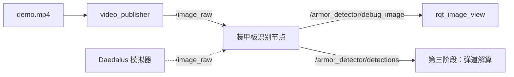

# 第二阶段作业：装甲板识别 ROS2 节点

对应教案：[`tutotial_2.md`](tutotial_2.md)　·　算法规格参考：[`example/opencv/armor_detect.cpp`](example/opencv/armor_detect.cpp)

> 验收不设权重、不打分，**下列每一条必须逐条通过**。

---

## 1. 题目

把装甲板四点识别做成一个能跑的 **ROS2 功能包**，用**视频流**驱动，而不是单张图片。

两个节点：

- `video_publisher` —— 读 `demo.mp4`，逐帧发布到 `/image_raw`
- `armor_detector` —— 订阅 `/image_raw`，用 OpenCV 传统方法找出装甲板的**四个角点**
  （P0 左上 → P1 右上 → P2 右下 → P3 左下），把结果画在图上发布出去



**素材**：`example/opencv/demo/demo.mp4`（544 × 960，30 fps，约 173 s）

**验收方式**：两个节点同时启动，`ros2 topic hz` 能看到稳定频率，`rqt_image_view` 里
装甲板外框和 P0~P3 随视频推进逐帧更新。

> **本阶段只负责「识别 + 发布」。** 从四点反推位姿（解算）在第三阶段——那边把 solver
> 建起来之后直接订阅 `/armor_detector/detections`，这里的代码不用再动。

## 2. 要求

### 2.1 功能包

两个 `ament_cmake` 包。其中 `rm_interfaces` **直接用模拟器的那个**（见 §3），本作业只往里加两个消息：

```
ros2_ws/src/
├── rm_interfaces/                 # 模拟器自带的接口包
│   ├── package.xml
│   ├── CMakeLists.txt
│   └── msg/
│       ├── Armor.msg              # 原有的 16 个，不要改
│       ├── Point2d.msg
│       ├── GimbalCmd.msg
│       ├── ...
│       ├── ArmorDetection.msg     # ← 本作业新增
│       └── ArmorDetections.msg    # ← 本作业新增
└── armor_detector/                # 两个节点
    ├── package.xml
    ├── CMakeLists.txt
    ├── include/armor_detector/armor_detector.hpp
    └── src/
        ├── armor_detector_node.cpp
        └── video_publisher_node.cpp
```

### 2.2 消息定义

```msg
# rm_interfaces/msg/ArmorDetection.msg

# 四个角点，顺序固定：P0 左上 → P1 右上 → P2 右下 → P3 左下
# 复用本包已有的 Point2d，和 RuneTarget.msg 的 pts 写法一致
Point2d[4] pts

# "small" / "big"，字段名和 Armor.msg 对齐
string type

# 装甲板中心到画面中心的像素距离，字段名和 Armor.msg 对齐
float32 distance_to_image_center

# 灯条配对得分，越大越可信，用来调参
float32 score
```

```msg
# rm_interfaces/msg/ArmorDetections.msg

std_msgs/Header header
ArmorDetection[] detections
```

### 2.3 话题接口

| 节点              | 方向 | 话题                          | 类型                                |
| ----------------- | ---- | ----------------------------- | ----------------------------------- |
| `video_publisher` | 发布 | `/image_raw`                  | `sensor_msgs/msg/Image`             |
| `armor_detector`  | 订阅 | `/image_raw`                  | `sensor_msgs/msg/Image`             |
| `armor_detector`  | 发布 | `/armor_detector/debug_image` | `sensor_msgs/msg/Image`             |
| `armor_detector`  | 发布 | `/armor_detector/detections`  | `rm_interfaces/msg/ArmorDetections` |

话题名和消息类型要对得上——**这是唯一的对接契约**，第三阶段的弹道解算会直接订阅
`/armor_detector/detections`。

`/image_raw` 的名字和类型和模拟器保持一致，这样 `video_publisher` 才能被模拟器直接替掉。

### 2.4 逐条要求

1. **算法与节点分离**：识别逻辑封装成 `ArmorDetector` 类，对外只暴露一个 `detect(const cv::Mat&)`。节点回调里只做「图像转换 → 调用 `detect` → 组装消息 + 画图 → 发布」，**不许把算法写进回调**。
2. **传统方法**：灰度 → 二值化 → 形态学 → 轮廓 → 灯条筛选 → 灯条配对 → 四点输出。不允许用神经网络。
3. **参数集中**：阈值、长宽比范围这些写在 `ArmorDetector::Params` 结构体里，不要散落在函数中间。
4. **图像转换**：用 `cv_bridge` 在 `sensor_msgs::msg::Image` 和 `cv::Mat` 之间转。用 `toCvCopy` 而不是 `toCvShare` —— 后面要二值化、画线，共享视图会直接把消息里的数据改掉。转换失败要捕获 `cv_bridge::Exception`，不能让节点挂掉。
5. **空检测**：没识别到装甲板时，**照常发布**一个 `detections` 为空的 `ArmorDetections`，`debug_image` 也照常发布（画原图，不画框）。不许不发布、不许崩、不许画出 `NaN` 坐标。
6. **字段填对**：`pts` 填**像素坐标**（不是归一化的）；`type` 填 `"small"` / `"big"`，判据自己定（长宽比最直接；这组素材里应该都是小装甲板）；`distance_to_image_center` 填装甲板中心到画面中心的像素距离。
7. **时间戳**：发布的消息 `header.stamp` 填当前 ROS 时间（`this->now()`），别留 0。
8. **视频发布**：`video_publisher` 用 `cv::VideoCapture` 读 mp4，用定时器按目标帧率发布。视频路径通过 ROS2 参数传入（`declare_parameter`），不要写死在代码里。
9. **终端输出**：把每个检测结果的四个角点坐标打印出来，方便对着 `rqt_image_view` 的画面核对。30 Hz 全打印太吵的话，可以每 N 帧打一次，或只在结果变化时打。
10. **鲁棒性**：白色数字、线束、背景高光都不能产生误检；角点顺序在抖动帧里也不能乱——P0 必须**始终**是左上。
---

## 3. 与 Daedalus 模拟器对接

第二阶段的产物是**同一份代码既能跑视频、又能接仿真**。靠的是两件事：

1. `video_publisher` 和模拟器**发布同一个话题**：`/image_raw`，类型 `sensor_msgs/msg/Image`。所以把 `video_publisher` 换掉、直接启动模拟器，`armor_detector` 一行都不用改。
2. 接口包直接用模拟器的 **`rm_interfaces`**，而不是自己另起个包名——消息类型对不上，两边就互认不了。

### 模拟器的 ROS2 接口

| 方向       | 话题                                                            | 类型                                  |
| ---------- | --------------------------------------------------------------- | ------------------------------------- |
| 模拟器发布 | `/image_raw`                                                    | `sensor_msgs/msg/Image`               |
| 模拟器发布 | `/image_compressed`                                             | `sensor_msgs/msg/CompressedImage`     |
| 模拟器发布 | `/camera_info`                                                  | `sensor_msgs/msg/CameraInfo`          |
| 模拟器发布 | `/tf`                                                           | `tf2_msgs/msg/TFMessage`              |
| 模拟器发布 | `/gimbal_pose`、`/odom_pose`、`/muzzle_pose`、`/camera_pose`    | `geometry_msgs/msg/PoseStamped`       |
| 模拟器发布 | `/livox/lidar`、`/simulator/marker`、`/simulator/tech_core/state` | `sensor_msgs` / `visualization_msgs`  |
| 模拟器订阅 | `/rm_gimbal/cmd`                                                | `rm_interfaces/msg/GimbalCmd`         |

> 模拟器订阅的是 **`/rm_gimbal/cmd`**，QoS 为 `sensor_data`。它 README 里写的
> `/armor_solver/cmd_gimbal` 是旧名字，以代码（`src/ros2/topic.rs`）为准。
>
> 那是第三阶段的输出，第二阶段只要保证 `/image_raw` 这一条对得上就够了。

### rm_interfaces 里有什么

模拟器自带的接口包，16 个 msg + 2 个 srv，依赖只有 `std_msgs` 和 `geometry_msgs`。
跟装甲板相关的几个：

| 消息             | 内容                                                                       | 用途               |
| ---------------- | -------------------------------------------------------------------------- | ------------------ |
| `Armor.msg`      | `number` / `type` / `distance_to_image_center` / `geometry_msgs/Pose pose`  | PnP 之后的结果     |
| `Armors.msg`     | `Header` + `Armor[]`                                                       | 同上，数组         |
| `Measurement.msg`| `x1 y1 z1 yaw1` + `x2 y2 z2 yaw2`                                          | 解算器输入（两组 3D 解） |
| `RuneTarget.msg` | `Header` + `Point2d[5] pts` + `is_lost` + `is_big_rune`                    | 能量机关           |
| `Point2d.msg`    | `float32 x` + `float32 y`                                                  | 基础类型           |
| `GimbalCmd.msg`  | `pitch` / `yaw` / `yaw_diff` / `pitch_diff` / `distance`                    | 云台指令           |

**里面没有装「装甲板四个像素角点」的消息。** `Armors` 里的 `Armor` 装的是 3D `Pose`，
那是解算之后的产物；`Measurement` 是解算器的输入，也是 3D 的。所以本作业要在
`rm_interfaces` 里新增 `ArmorDetection` / `ArmorDetections` 两个消息，字段名尽量照着
现有的抄（`type`、`distance_to_image_center` 都来自 `Armor.msg`，`Point2d[4] pts` 的写法
照着 `RuneTarget.msg`）。

### 验收时怎么切到仿真

```bash
# 1. 只跑 detector，不启 video_publisher
ros2 run armor_detector armor_detector_node

# 2. 启模拟器，它自己会往 /image_raw 发图
#    （模拟器里按 F5 开关自瞄订阅）
```

能正常出框就说明对接成功。

