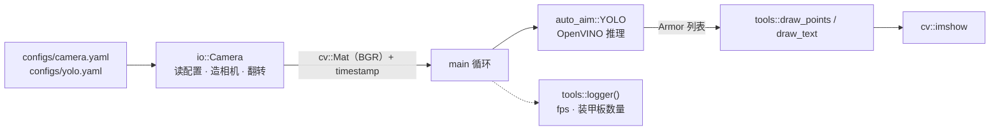

# 第二阶段作业：相机类体系与装甲板识别流水线

对应教案：[`tutotial_2.md`](tutotial_2.md)（一、OpenCV · 1.4 装甲板识别 ＋ 二、C++ 面向对象 · 2.5 基于相机类的开发）

> 验收不设权重、不打分，**下列每一条必须逐条通过**。

---

## 1. 题目
先读两个已经写好的文件，再动手改造：

- `io/example.cpp` —— **面向过程**的海康相机取图：一个 `main` 从枚举设备一路写到销毁句柄，换台相机就得整段重写；
- `main.cpp` —— **识别流水线**骨架，里面有三处 `// TODO`：初始化相机和 yolo 类、调用 yolo 识别装甲板、显示图像。

要交的五样东西：

| #   | 内容                                     | 说明                                                         |
| --- | ---------------------------------------- | ------------------------------------------------------------ |
| 1   | `io/my_camera.hpp` / `.cpp`              | 抽象基类 `CameraBase` + 派生类 `HikCamera` + 外观类 `Camera` |
| 2   | 派生类 `UsbCamera`                       | 自己加：用 `cv::VideoCapture` 读 USB 摄像头                  |
| 3   | `configs/camera.yaml` + `tools/yaml.hpp` | 相机参数走配置文件，不许硬编码                               |
| 4   | `main.cpp`                               | 取图 → `YOLO` 识别 → 画框 → 显示，跑通整条流水线             |
| 5   | CMake 依赖                               | 把缺的链接补上，`main` 和 `example` 两个目标都要能链接通过   |

**验收方式**

```bash
cmake -S . -B build && cmake --build build
./build/main                                               # 默认读 configs/ 下的两个 yaml
./build/main -c configs/camera.yaml -y configs/yolo.yaml   # 也可以显式指定
```

跑起来后画面上要能看到装甲板的四个角点，日志里持续打印 fps 和识别到的装甲板数量。

### 流水线（先建立全局认识，再写代码）


```mermaid
flowchart LR
    CFG["configs/camera.yaml<br/>configs/yolo.yaml"] --> CAM["io::Camera<br/>读配置 · 造相机 · 翻转"]
    CAM -->|"cv::Mat（BGR）+ timestamp"| MAIN["main 循环"]
    MAIN --> DET["auto_aim::YOLO<br/>OpenVINO 推理"]
    DET -->|"Armor 列表"| DRAW["tools::draw_points / draw_text"]
    DRAW --> SHOW["cv::imshow"]
    MAIN -.-> LOG["tools::logger()<br/>fps · 装甲板数量"]
```

一句话：**相机只负责给出一张 BGR 的 `cv::Mat`，识别只负责给出一串 `Armor`，两边都不知道对方是谁。**
这也正是第三阶段自瞄工程的分层方式：`io` 管硬件、`tasks` 管算法、`tools` 管通用工具、`main` 只做流水线编排。


## 2. 要求

### 2.1 配置与工具

1. **用 `tools/yaml.hpp` 读配置**：`tools::load(path)` 负责加载（读文件失败会用 `logger()->error` 报错），`tools::read<T>(yaml, key)` / `read<T>(yaml, key, default)` 负责取值（缺 key 时分别报错 / 取默认值）。**业务代码里不许直接写 `YAML::LoadFile`。**
2. **读懂 `configs/camera.yaml` 的字段**：`camera_name`、`exposure_ms`、`gain`、`vid_pid`、`flip_code`，全部用 `tools::read` 取出来，**不要硬编码**。

### 2.2 构建

3. `cmake -S . -B build && cmake --build build` **无错误**，`main` 与 `example` 两个目标都要链接成功。
4. 依赖已经给了一部分：`find_package(OpenCV / fmt / Eigen3 / yaml-cpp / OpenVINO)`、海康 SDK 的 `MvCameraControl` + `usb-1.0` 都在骨架里配好了。**你要补齐的是「谁用了什么」这条链**——比如 `tools` 是 `OBJECT` 库、`logger.cpp` 用了 fmt，那么链接报 `undefined reference to fmt::v9::...` 时，就顺着这条链找该给哪个目标链接什么。

## 3. 加分项（选做）

1. **`ReplayCamera`**：再加一个派生类，用 `cv::VideoCapture` 读一段**录像文件**，放完 N 帧后 `read()` 给出空 `img` 表示结束，用来做离线回归测试。它和 `UsbCamera` 的代码几乎一样——这正好说明抽象的价值。
2. **隔离 SDK**：把 `MvCameraControl.h` 从 `my_camera.hpp` 里挪走（前置声明成员指针 / PIMPL），让 `tasks` 层完全不依赖海康 SDK。
3. **把 fps 统计抽成工具**：在 `tools` 里加一个滑窗平均帧率的小类，`main` 里只调一行。

## 4. 参考文件结构

```
homework_2/
├── CMakeLists.txt              两个可执行目标：main / example
├── main.cpp                    ← 流水线编排
├── configs/
│   ├── camera.yaml             ← 写：相机参数
│   └── yolo.yaml               已给
├── assets/yolov5.xml           已给（OpenVINO IR）
├── io/
│   ├── CMakeLists.txt          已给：io 库 + 海康 SDK 配置
│   ├── example.cpp             已给：裸 SDK 取图参考
│   ├── my_camera.hpp           ← 写：CameraBase / HikCamera / Camera / UsbCamera
│   ├── my_camera.cpp           ← 写：实现
│   └── hikrobot/               已给：SDK 头文件与库
├── tasks/                      已给：YOLO / YOLOV5 / Armor
└── tools/
    ├── logger.hpp / .cpp       已给
    ├── img_tools.hpp / .cpp    已给
    └── yaml.hpp                已给
```

> 一句话总结这次要练的：**把一段面向过程的硬件代码封成类，再用基类引用把它和识别算法串成一条流水线。**
> 头文件放**声明**、源文件放**实现**，每个头文件都要有 `#pragma once`——第一阶段就学过的习惯，后面每个阶段都这么用。

