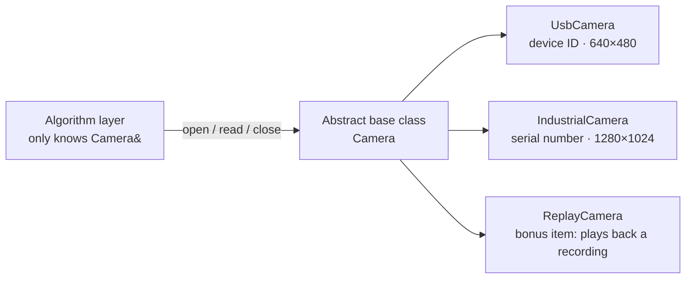

# Stage 2 Assignment: Camera Class Wrapping (封装, fēngzhuāng) and Derivation (派生, pàishēng)

Corresponding lesson: [`tutorial_2.md`](tutorial_2.md) (Section 二 (èr), C++ Object-Oriented Programming · 2.5 Development Based on the Camera Class)

> Grading has no weights and no scores — **every item below must pass individually.**

---

## 1. The Task

Write a **camera class hierarchy**: an abstract base class (抽象基类, chōuxiàng jīlèi) + two derived classes (派生类, pàishēnglèi) + a factory (工厂, gōngchǎng), so that "grab one frame" is completely decoupled from "which specific camera it is."



Four things to submit:

| #   | Content                   | Description                                                                             |
| --- | -------------------------- | ----------------------------------------------------------------------------------------- |
| 1   | Abstract base class `Camera` | Defines "what a camera should be able to do": `open()` / `read(Frame&)` / `close()` / `name()` |
| 2   | Derived class `UsbCamera`        | USB camera: constructor parameter is a device ID, outputs 640×480                          |
| 3   | Derived class `IndustrialCamera` | Industrial camera: constructor parameter is a serial number, outputs 1280×1024             |
| 4   | Factory `makeCamera()`           | Translates a config string (`"usb"` / `"industrial"`) into a concrete object                |

**This assignment does not require an actual camera to be connected**: inside `read()` it is fine to just fabricate data (generate grayscale values by frame number, as in the example).
The focus is the **class structure** and the **calling convention** — that's what grading looks at, not the picture itself.

**How it will be graded**: `cmake -S . -B build && cmake --build build && ./build/camera`.
The output must make it clear that "both kinds of cameras went through the same function," and that every camera's `close()` gets called by the time the program ends.

## 2. Requirements

### 2.1 Class Structure

1. **Abstract base class**: all four interfaces of `Camera` must be **pure virtual functions** (纯虚函数, chúnxū hánshù, `= 0`). `Camera cam;` must fail to compile.
2. **Virtual destructor** (虚析构, xū xīgòu): `virtual ~Camera() = default;`. During grading, a `std::unique_ptr<Camera>` will hold a derived-class object, to check whether the derived class's `close()` gets invoked.
3. **Two derived classes**: different constructor parameters (device ID / serial number), different output resolutions (640×480 / 1280×1024); `name()` must return a string that distinguishes the model and the ID.
4. **RAII**: write `close()` inside the derived class's destructor, to guarantee "when the object is gone → the resource is released." If the base class's destructor is missing `virtual`, the derived class's destructor will not run.
5. **Factory**: `makeCamera(const std::string& type, int id)` returns `std::unique_ptr<Camera>`; for an unknown type it should print an error and return `nullptr` — do not throw an exception and do not call `exit()`.

### 2.2 The Caller's Side (the main focus of this assignment: learn to call through the base-class interface only)

6. **Polymorphic call** (多态调用, duōtài diàoyòng): in `main`, put all cameras into `std::vector<std::unique_ptr<Camera>>`, and process them one by one with **the same function** (e.g. `runOnce(Camera&)`).
7. **The function parameter must be written as `Camera&`** (or `Camera*`), and the body of this function **must not contain the class names `UsbCamera` / `IndustrialCamera`.**
8. **No branching by type**: the caller must not contain `if (type == "usb")`, `dynamic_cast`, or `typeid` — "which camera it is" is knowledge that only the factory function is allowed to have; once outside the factory, only `Camera&` remains.
9. **No raw `new` / `delete`** (裸指针, luǒ zhǐzhēn / bare pointers): use `std::make_unique` + `std::unique_ptr` (智能指针, zhìnéng zhǐzhēn — smart pointer) exclusively.
10. **All three calling scenarios must be demonstrated**, printing both `name()` and the output frame size each time:
    - The factory builds a USB camera + an industrial camera, and the same `runOnce` grabs a frame from each in turn;
    - Directly construct a `UsbCamera` and call it through a reference, **calling `read()` without calling `open()` first**: it must return `false`, without crashing and without producing garbage data;
    - Call `open()` and then grab a frame: it should return a normal frame.

## 3. Acceptance Checklist

- [ ] `Camera cam;` fails to compile (an abstract class cannot be instantiated)
- [ ] When a `unique_ptr<Camera>` is destructed, the derived class's `close()` gets called
- [ ] Calling `read()` without `open()` first returns `false`
- [ ] Passing an unknown type to `makeCamera` returns `nullptr`, prints an error, and the program does not crash
- [ ] A project-wide search finds no raw `new` (other than inside `make_unique`) and no `delete`
- [ ] Searching inside the `runOnce` function body finds no `UsbCamera` / `IndustrialCamera` / `dynamic_cast`
- [ ] The same block of code can grab a frame from both the USB camera and the industrial camera, with the frame size varying by camera
- [ ] `-Wall -Wextra` produces no warnings; `cmake -S . -B build && cmake --build build` succeeds

## 4. Bonus: Playback Camera (optional)

Add one more derived class, `ReplayCamera`, that reads a "recording" (simulating playback of N frames before ending), for use in offline regression testing:

- Adding it to `makeCamera` should take only one line, and **the caller should not need to change at all** — being able to show this proves the abstraction (抽象, chōuxiàng) was done correctly;
- Once playback finishes, `read()` should return `false`, and the caller must handle this gracefully (it must not be treated as a crash).

## 5. Reference File Layout

```
camera/
├── CMakeLists.txt
├── include/camera.hpp        Camera / UsbCamera / IndustrialCamera / makeCamera
├── src/
│   ├── camera.cpp            Implementation
│   └── main.cpp              Caller: handles all cameras uniformly via Camera&
└── README.md                 (optional) how to build, run, and expected output
```

> Declarations go in the header file, implementation goes in the source file — a habit you already learned in Stage 1, and one you'll keep using in every stage from here on.
> Every header file needs `#pragma once`.