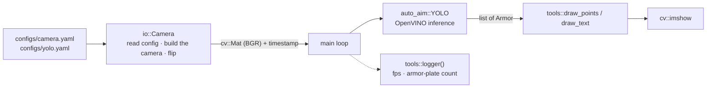

# Stage 2 Assignment: Camera Class Hierarchy and the Armor-Plate Detection Pipeline

Corresponding lesson: [`tutorial_2.md`](tutorial_2.md) (Part 1, OpenCV · 1.4 Armor-Plate Detection + Part 2, C++ Object-Oriented Programming · 2.6 Development Based on the Camera Class)

> Grading has no weights and no scores — **every item below must pass individually.**

---

## 1. The Task

First read two files that are already written, then start modifying:

- `io/example.cpp` — a **procedural-style** (面向过程, miànxiàng guòchéng) Hikvision (海康, hǎikāng) camera frame-grabber: a single `main` that goes all the way from enumerating devices (枚举设备, méijǔ shèbèi) to destroying the handle (句柄, jùbǐng); swapping to a different camera means rewriting the whole block;
- `main.cpp` — the skeleton of the **detection pipeline** (流水线, liúshuǐxiàn), containing three `// TODO` markers: initialize the camera and the YOLO class, call YOLO to detect the armor plate (装甲板, zhuāngjiǎbǎn), and display the image.

Five things to submit:

| #   | Content                                   | Description                                                                     |
| --- | ------------------------------------------ | ---------------------------------------------------------------------------------- |
| 1   | `io/my_camera.hpp` / `.cpp`                | Abstract base class (抽象基类, chōuxiàng jīlèi) `CameraBase` + derived class (派生类, pàishēnglèi) `HikCamera` + facade class (外观类, wàiguān lèi) `Camera` |
| 2   | Derived class `UsbCamera`                  | Add it yourself: read a USB camera using `cv::VideoCapture`                       |
| 3   | `configs/camera.yaml` + `tools/yaml.hpp`   | Camera parameters must come from a config file — hardcoding (硬编码, yìng biānmǎ) is not allowed |
| 4   | `main.cpp`                                 | Grab frame → `YOLO` detection → draw the box → display, making the whole pipeline run end to end |
| 5   | CMake dependencies                         | Fill in whatever linking is missing; both the `main` and `example` targets must link successfully |

**How it will be graded**

```bash
cmake -S . -B build && cmake --build build
./build/main                                               # by default reads the two yaml files under configs/
./build/main -c configs/camera.yaml -y configs/yolo.yaml   # can also be specified explicitly
```

Once it's running, the four corner points of the armor plate should be visible on screen, and the log should continuously print the fps and the number of armor plates detected.

### The Pipeline (get the big picture first, then start coding)


```mermaid
flowchart LR
    CFG["configs/camera.yaml<br/>configs/yolo.yaml"] --> CAM["io::Camera<br/>read config · build the camera · flip"]
    CAM -->|"cv::Mat (BGR) + timestamp"| MAIN["main loop"]
    MAIN --> DET["auto_aim::YOLO<br/>OpenVINO inference"]
    DET -->|"list of Armor"| DRAW["tools::draw_points / draw_text"]
    DRAW --> SHOW["cv::imshow"]
    MAIN -.-> LOG["tools::logger()<br/>fps · armor-plate count"]
```

In one sentence: **the camera's only job is to hand over one BGR `cv::Mat`; detection's only job is to hand over a list of `Armor`; neither side knows who the other one is.**
This is exactly the layering used in the Stage 3 auto-aim project: `io` handles hardware, `tasks` handles the algorithms, `tools` handles general-purpose utilities, and `main` only does pipeline orchestration.


## 2. Requirements

### 2.1 Configuration and Tools

1. **Read configuration through `tools/yaml.hpp`**: `tools::load(path)` handles loading (if the file fails to load, it reports the error via `logger()->error`), and `tools::read<T>(yaml, key)` / `read<T>(yaml, key, default)` handle retrieving values (respectively erroring out, or falling back to the default, when the key is missing). **Business code must never call `YAML::LoadFile` directly.**
2. **Understand the fields in `configs/camera.yaml`**: `camera_name`, `exposure_ms`, `gain`, `vid_pid`, `flip_code` — all of these must be read out via `tools::read`, **do not hardcode them.**

### 2.2 Build

3. `cmake -S . -B build && cmake --build build` must produce **no errors**; both the `main` and `example` targets must link successfully.
4. Some of the dependencies are already provided: `find_package(OpenCV / fmt / Eigen3 / yaml-cpp / OpenVINO)`, and the Hikvision SDK's `MvCameraControl` + `usb-1.0` are already configured in the skeleton. **What you need to fill in is the chain of "who uses what"** — for example, if `tools` is an `OBJECT` library and `logger.cpp` uses fmt, then when the linker reports `undefined reference to fmt::v9::...`, follow that chain to figure out which target needs to link against what.

## 3. Bonus Items (optional)

1. **`ReplayCamera`**: add one more derived class that uses `cv::VideoCapture` to read a **recorded video file**; after playing back N frames, `read()` should return an empty `img` to signal the end, for use in offline regression testing. Its code is almost identical to `UsbCamera`'s — which is exactly what demonstrates the value of the abstraction (抽象, chōuxiàng).
2. **Isolate the SDK**: move `MvCameraControl.h` out of `my_camera.hpp` (forward-declare the member as a pointer / use PIMPL), so that the `tasks` layer has no dependency on the Hikvision SDK at all.
3. **Extract the fps counter into a utility**: add a small sliding-window average-frame-rate class in `tools`, so that `main` only needs to call a single line.

## 4. Reference File Layout

```
homework_2/
├── CMakeLists.txt              two executable targets: main / example
├── main.cpp                    ← pipeline orchestration
├── configs/
│   ├── camera.yaml             ← to write: camera parameters
│   └── yolo.yaml               already provided
├── assets/yolov5.xml           already provided (OpenVINO IR)
├── io/
│   ├── CMakeLists.txt          already provided: io library + Hikvision SDK config
│   ├── example.cpp             already provided: raw-SDK frame-grabbing reference
│   ├── my_camera.hpp           ← to write: CameraBase / HikCamera / Camera / UsbCamera
│   ├── my_camera.cpp           ← to write: implementation
│   └── hikrobot/               already provided: SDK headers and libraries
├── tasks/                      already provided: YOLO / YOLOV5 / Armor
└── tools/
    ├── logger.hpp / .cpp       already provided
    ├── img_tools.hpp / .cpp    already provided
    └── yaml.hpp                already provided
```

> One-sentence summary of what this is meant to practice: **wrap a piece of procedural hardware code into a class, then use a base-class reference to string it together with the detection algorithm into a single pipeline.**
> Declarations go in the header file, implementation goes in the source file, and every header file needs `#pragma once` — a habit you already learned in Stage 1, and one you'll keep using in every stage from here on.
