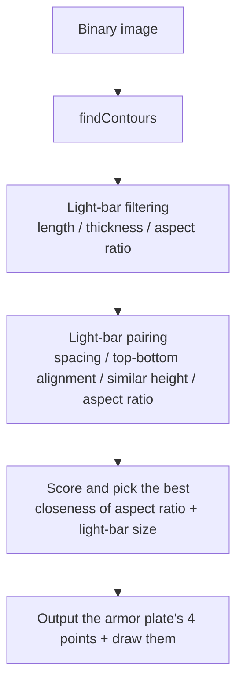
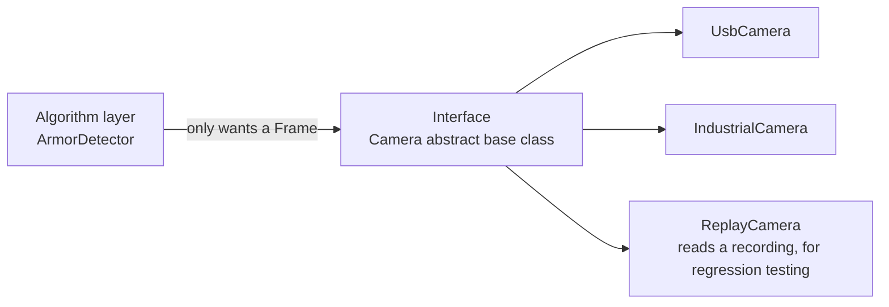

# Stage 2 Training: OpenCV and Object-Oriented Programming (面向对象, miànxiàng duìxiàng)

| Item              | Content                                                                                                                                                  |
| ----------------- | --------------------------------------------------------------------------------------------------------------------------------------------------------- |
| Teaching goal      | Use classic OpenCV methods to detect an armor plate (装甲板, zhuāngjiǎbǎn) in an image and output its four corner points; be able to organize code with classes (类, lèi) and objects (对象, duìxiàng); be able to wrap reusable components using an abstract base class (抽象基类, chōuxiàng jīlèi) + polymorphism (多态, duōtài) + factory (工厂, gōngchǎng) |
| Teaching focus     | `cv::Mat` and the image-processing pipeline; geometric constraints for light-bar (灯条, dēngtiáo) filtering and pairing; classes and objects, encapsulation (封装, fēngzhuāng), constructors/destructors (构造函数/析构函数, gòuzào hánshù / xīgòu hánshù), inheritance (继承, jìchéng) and polymorphism |
| Teaching difficulty | The "light bar → pairing → four points" geometric reasoning and scoring in armor-plate detection; using classes to package "data + behavior" into reusable components |
| Assessment method  | Submit a camera class hierarchy: abstract base class `Camera` + two derived classes `UsbCamera` / `IndustrialCamera` + a factory, calling every camera uniformly through a base-class reference |

---

## Accompanying Examples

Under `tutorial_2/example/`, subfolders are organized by topic; each folder contains the actual code to be shown in class:

| Example                              | Directory                          | Corresponding lesson section | How to run it in class                                                           |
| ------------------------------------- | ----------------------------------- | ----------------------------- | ------------------------------------------------------------------------------------ |
| OpenCV · quick tour of basic APIs     | `example/opencv/opencv_basics.*`    | Part 1, OpenCV (1.1–1.3)      | `cmake --build build && ./build/opencv_basics`  or  `python3 opencv_basics.py`       |
| OpenCV · armor-plate four-point detection | `example/opencv/`               | Part 1, OpenCV (1.4)          | `cmake -S . -B build && cmake --build build && ./build/armor_detect`                 |

Dependency installation, full commands, and expected output are in `example/README.md`.

---

## Part 1: OpenCV

> **Companion reading**: [`example/opencv/opencv_intro.md`](example/opencv/opencv_intro.md) — the "API manual" version of 1.1–1.3 below: filtering / binarization (二值化, èrzhíhuà) / edges / morphology (形态学, xíngtàixué) / contours (轮廓, lúnkuò) and other common functions, with C++ vs. Python side-by-side comparisons, parameter tuning notes, and common pitfalls.
> **Companion runnable code**: [`example/opencv/opencv_basics.cpp`](example/opencv/opencv_basics.cpp) / [`opencv_basics.py`](example/opencv/opencv_basics.py) — runs through 10 groups of APIs in one go and outputs three comparison collages.

### 1.1 What OpenCV Is, and What `cv::Mat` Is

**Concepts**

- OpenCV (Open Source Computer Vision Library) = a cross-platform image/video processing library with a C++ interface, plus Python bindings (`opencv-python`).
- At this stage we only use its **classic (non-deep-learning) image processing** capabilities — we don't touch the deep-learning module.

**`cv::Mat` is the core data structure** — think of it as "a 2D array with metadata attached":

| Member          | Meaning                                                    |
| --------------- | ------------------------------------------------------------ |
| `rows` / `cols` | height / width (note the order: rows = height comes first)   |
| `type()`        | element type, e.g. `CV_8UC3` = 8-bit unsigned, 3 channels     |
| `channels()`    | number of channels: 1 for grayscale, 3 for color (BGR, **not RGB**) |
| `at<T>(y, x)`   | pixel access (y first, then x)                                |
| `clone()`       | makes a deep copy with independent data                       |

**Reference counting** (引用计数, yǐnyòng jìshù): `cv::Mat b = a;` merely shares the same underlying data (a shallow copy) — modifying `b` will affect `a`. For an independent copy, use `a.clone()`.

**Minimal example**

```cpp
#include <opencv2/opencv.hpp>

int main() {
    cv::Mat img = cv::imread("armor.png");          // reads as BGR, 3 channels by default
    if (img.empty()) {                              // always check for a read failure first
        std::cerr << "Failed to read image\n";
        return 1;
    }

    std::cout << "size " << img.cols << "x" << img.rows
              << ", channels " << img.channels() << '\n';

    cv::Mat gray;
    cv::cvtColor(img, gray, cv::COLOR_BGR2GRAY);    // convert to grayscale: step one of the detection pipeline

    cv::imshow("gray", gray);
    cv::waitKey(0);                                 // 0 = wait indefinitely for a keypress
    return 0;
}
```

### 1.2 Environment Setup and a Minimal CMake Project

```bash
# Ubuntu 22.04
sudo apt update
sudo apt install -y libopencv-dev pkg-config

pkg-config --modversion opencv4      # check the version; 4.5.4 ships with 22.04 by default
```

**Minimal `CMakeLists.txt`** (the key addition is just one extra `find_package`):

```cmake
cmake_minimum_required(VERSION 3.16)
project(armor_detect LANGUAGES CXX)

set(CMAKE_CXX_STANDARD 17)
set(CMAKE_CXX_STANDARD_REQUIRED ON)

find_package(OpenCV REQUIRED)                    # ← find OpenCV

add_executable(armor_detect armor_detect.cpp)
target_include_directories(armor_detect PRIVATE ${OpenCV_INCLUDE_DIRS})
target_link_libraries(armor_detect PRIVATE ${OpenCV_LIBS})
```

```bash
cmake -S . -B build && cmake --build build
./build/armor_detect              # run directly; reads demo/bule_armoe.jpg and detects
```

> After it runs, two windows pop up: the left one is a "grayscale / binarized / filtered" three-panel collage, the right one is the detection result;
> at the same time it saves `debug_stages.png` (intermediate steps) and `result.png` (the result).
> On a server/container with no display environment, use `NO_WINDOW=1 ./build/armor_detect` to only save the images without opening a window.

> Hand-writing a `g++` command also works, but writing out the full include/lib paths is a hassle, so OpenCV projects should always use CMake:
> `g++ $(pkg-config --cflags --libs opencv4) armor_detect.cpp -o armor_detect`

### 1.3 The Basic Image-Processing Pipeline

In vision-based auto-aim code, 90% of the classic (non-deep-learning) pipeline is a combination of these five steps:


| Step                | Function                                                                                  | What it does                                             |
| -------------------- | -------------------------------------------------------------------------------------------- | ------------------------------------------------------------ |
| Convert to grayscale  | `cv::cvtColor(src, dst, cv::COLOR_BGR2GRAY)`                                                | 3 channels → 1 channel; subsequent processing is 3x faster |
| Binarize (二值化)     | `cv::threshold(gray, bin, 0, 255, cv::THRESH_BINARY \| cv::THRESH_OTSU)`                    | OTSU finds the threshold automatically, more stable than manually setting 127 |
| Morphology (形态学)   | `cv::morphologyEx(bin, bin, cv::MORPH_OPEN, kernel)`                                        | opening removes small noise specks, closing fills small holes |
| Find contours (轮廓)  | `cv::findContours(bin, contours, hierarchy, cv::RETR_EXTERNAL, cv::CHAIN_APPROX_SIMPLE)`    | `RETR_EXTERNAL` only takes the outermost contours          |
| Fit a shape           | `cv::minAreaRect(contour)` / `cv::boundingRect(contour)`                                    | a rotated rectangle suits a light bar; an axis-aligned rectangle suits quick checks |

**A color pitfall in binarization**: per the task spec, the armor plate is "red/blue colored," but in BGR, **red is `(0,0,255)` and blue is `(255,0,0)`**. To isolate red specifically, you need to work in HSV space:

```cpp
cv::Mat hsv, mask;
cv::cvtColor(img, hsv, cv::COLOR_BGR2HSV);

// red straddles 0 degrees, so it needs to be split into two ranges
cv::Mat m1, m2;
cv::inRange(hsv, cv::Scalar(0,   100, 100), cv::Scalar(10,  255, 255), m1);
cv::inRange(hsv, cv::Scalar(160, 100, 100), cv::Scalar(180, 255, 255), m2);
cv::bitwise_or(m1, m2, mask);
```

### 1.4 Detecting the Armor Plate with Classic Methods

**Overall idea**: an armor plate (装甲板) is formed by **two parallel light bars** (灯条, dēngtiáo), so first find the light bars, then pair them up two at a time, and finally use the endpoints of the successfully paired light bars to form the armor plate's **four corner points**.



**Step one: light-bar filtering**

A light bar's geometric signature is "a thin, elongated, vertical bright strip." All four constraints are written "relative to the overall image size," so changing resolution doesn't require changing the parameters:

```cpp
bool isLightBar(const LightBar &bar, const cv::Size &img) {
    if (bar.height < img.height * 0.05f) return false;  // too short: background noise
    if (bar.height > img.height * 0.60f) return false;  // too long: a light tube / a background edge
    if (bar.width  < 2.0f)               return false;  // too thin: noise
    if (bar.width  > img.width * 0.08f)  return false;  // too thick: e.g. the large white-digit blob on the armor plate

    const float ratio = bar.height / std::max(bar.width, 1.0f);
    return ratio >= 1.5f && ratio <= 15.0f;             // not elongated enough → not a light bar
}
```

> **Why constrain the width**: the white digit printed on the armor plate is brighter than the light bar itself in the grayscale image, and the aspect ratio that `minAreaRect` produces for it can also fall within 1.5–15. But its width is roughly 30% of the image width, far above the 8% cap — a single constraint filters it out. **Filtering by aspect ratio alone is not enough.**

**Step two: light-bar normalization**

Convert the rotated rectangle into a "top endpoint + bottom endpoint" representation, which makes computing spacing and alignment easier later:

```cpp
LightBar makeLightBar(const cv::RotatedRect &rect) {
    cv::Point2f pts[4];
    rect.points(pts);

    // sort the four vertices by y: the two smallest-y points form the top edge, the two largest-y points form the bottom edge
    std::vector<cv::Point2f> p(pts, pts + 4);
    std::sort(p.begin(), p.end(),
              [](const cv::Point2f &a, const cv::Point2f &b) { return a.y < b.y; });

    LightBar bar;
    bar.rect   = rect;
    bar.top    = (p[0] + p[1]) * 0.5f;
    bar.bottom = (p[2] + p[3]) * 0.5f;
    bar.height = static_cast<float>(cv::norm(bar.top - bar.bottom));
    bar.width  = std::min(rect.size.width, rect.size.height);
    return bar;
}
```

**Step three: light-bar pairing**

Five geometric constraints — only if all of them are satisfied might this be an armor plate:

```cpp
std::optional<Armor> tryMatch(const LightBar &a, const LightBar &b, const cv::Size &img) {
    const LightBar &L = (a.top.x < b.top.x) ? a : b;   // convention: left, right
    const LightBar &R = (a.top.x < b.top.x) ? b : a;

    // 1. Reasonable spacing. Upper bound relaxed to 0.95x image width: when shooting close-up, the armor plate can nearly fill the frame
    const float gap = static_cast<float>(cv::norm(L.top - R.top));
    if (gap < 10.0f || gap > img.width * 0.95f) return std::nullopt;

    // 2-3. The top and bottom endpoints should roughly lie on the same horizontal line
    if (std::abs(L.top.y    - R.top.y)    > L.height * 0.6f) return std::nullopt;
    if (std::abs(L.bottom.y - R.bottom.y) > L.height * 0.6f) return std::nullopt;

    // 4. Similar heights (the two light bars on the same armor plate are the same length)
    const float hr = L.height / std::max(R.height, 1.0f);
    if (hr < 0.6f || hr > 1.67f) return std::nullopt;

    // 5. Reasonable aspect ratio (this step filters out most random pairings)
    const float avg_h  = (L.height + R.height) * 0.5f;
    const float aspect = gap / std::max(avg_h, 1.0f);
    if (aspect < 1.0f || aspect > 5.0f) return std::nullopt;

    Armor armor;
    armor.found  = true;
    armor.left   = L;
    armor.right  = R;
    armor.aspect = aspect;
    // score = closeness of the aspect ratio + relative size of the light bars
    armor.score = -std::abs(aspect - kIdealAspect) +
                  kSizeWeight * (avg_h / static_cast<float>(img.height));
    return armor;
}
```

> **Why you can't just compare aspect ratios**: in practice, on this test image the real armor plate's aspect ratio is **2.64**, while a false pairing cobbled together from an edge along the top of the background comes out to **2.37**. If you score by "closer to 2.5 is better," the false pairing actually wins. After adding the term "a bigger light bar is more likely to be a real target," the real target scores 0.520 and the false one scores 0.055 — the gap opens up immediately. Setting `DEBUG_PAIRS=1` at runtime lets you see this comparison directly.

**Step four: output the four corner points**

```cpp
// fixed order: top-left → top-right → bottom-right → bottom-left
const std::vector<cv::Point2f> corners = {armor.left.top, armor.right.top,
                                          armor.right.bottom, armor.left.bottom};
```

These four points are this section's final output; they get fed directly into pose estimation (`solvePnP`) later on.

**Step five: drawing**

```cpp
// scale text and line width with image size, otherwise they're unreadable on a large image
const double scale = std::max(0.6, img.cols / 1200.0);

for (int i = 0; i < 4; ++i) {
    cv::line(img, corners[i], corners[(i + 1) % 4], cv::Scalar(0, 255, 0), 2);
    cv::circle(img, corners[i], 8, cv::Scalar(0, 255, 0), cv::FILLED);
}
```

Full runnable version: `example/opencv/armor_detect.cpp`, verified working against the repo's own `demo/bule_armoe.jpg`.


<!-- constexpr double LIGHTBAR_LENGTH = 56e-3;     // m, light-bar length 56mm
constexpr double BIG_ARMOR_WIDTH = 230e-3;    // m, large armor-plate width
constexpr double SMALL_ARMOR_WIDTH = 135e-3;  // m, small armor-plate width -->

---

## Part 2: C++ Object-Oriented Programming (面向对象, miànxiàng duìxiàng)

### 2.1 From "a Pile of Functions" to "an Object"

In Stage 1 we wrote the vector library like this:

```cpp
struct Vec2 { double x = 0.0; double y = 0.0; };
double length(const Vec2& v);          // data and behavior are kept separate
```

It works, but it has two problems:

1. **The data isn't protected**: nothing stops you from writing `Vec2 v{1e308, 1e308}`, or setting `x` to an invalid value.
2. **One change ripples everywhere**: if "vector" later has to be represented in polar coordinates, every piece of code that touches `v.x` needs to change.

The first thing object-oriented programming does is **bind data and behavior together, and protect the data.**

### 2.2 Classes and Objects

**Concepts**

| Term                          | Meaning                                                       |
| ------------------------------ | ----------------------------------------------------------------- |
| Class (类, lèi)                | A type — the "blueprint"                                          |
| Object (对象, duìxiàng)        | An instance of the class — the "thing built from the blueprint"   |
| Member variable (成员变量)     | The object's state (data)                                         |
| Member function / method (成员函数) | What the object can do (behavior)                            |
| `this`                          | A pointer to "the current object," implicitly available inside member functions |

In C++, `struct` and `class` **differ only in their default access level**: `struct` defaults to `public`, `class` defaults to `private`. So the `struct Vec2` from Stage 1 was already technically a class.

**Minimal example**

```cpp
class Vec2 {
public:
    Vec2(double x, double y) : x_(x), y_(y) {}   // constructor: called automatically when the object is created

    double x() const { return x_; }              // getter: read-only
    double y() const { return y_; }
    double length() const;                       // behavior kept together with the data
    void   scale(double k);                      // modifies the state

private:
    double x_ = 0.0;                             // member variables get a `_` suffix to distinguish them from parameters
    double y_ = 0.0;
};

double Vec2::length() const {
    return std::sqrt(x_ * x_ + y_ * y_);
}

void Vec2::scale(double k) {
    x_ *= k;
    y_ *= k;
}
```

```cpp
Vec2 v{3.0, 4.0};        // create the object on the stack; the constructor is called automatically
std::cout << v.length(); // 5
v.scale(2.0);            // change state through a method
// v.x_ = 999;           // ❌ compile error: private, unreachable from outside
```

> **`const` written after the function signature** means "this function does not modify the object's state." Get in the habit of using it — anyone reading the interface can immediately see which operations have side effects. Only `const` member functions can be called on a `const` object.

### 2.3 Encapsulation (封装, fēngzhuāng): Constructors, Destructors, Access Control

**Three access levels**

| Keyword      | Who can access it        | When to use it                                            |
| ------------- | --------------------------- | -------------------------------------------------------------- |
| `public`      | Everyone                     | The public interface (expose whatever you want people to use)  |
| `protected`   | The class itself and its derived classes | For subclasses to use, but not outsiders                |
| `private`     | Only the class itself        | Internal state — this is the default choice                    |

**Constructors / Destructors** (构造函数 / 析构函数, gòuzào hánshù / xīgòu hánshù)

```cpp
class Camera {
public:
    explicit Camera(int id) : id_(id) {          // constructor: initialization
        std::cout << "Camera#" << id_ << " constructed\n";
    }

    ~Camera() {                                  // destructor: release resources
        close();                                 // guarantees "whoever acquires it, releases it"
        std::cout << "Camera#" << id_ << " destructed\n";
    }

    void close() { opened_ = false; }

private:
    int  id_ = 0;
    bool opened_ = false;
};
```

`explicit` prevents an implicit conversion like `Camera c = 3;` from happening silently — it's recommended for every single-parameter constructor.

**Object lifetime (RAII)**: an object is automatically destructed when its scope ends, so "acquire the resource in the constructor, release it in the destructor" is C++'s most central programming paradigm. You don't need to hand-write `free()`, and you shouldn't forget to release resources either.

### 2.4 Inheritance (继承, jìchéng) and Polymorphism (多态, duōtài)

**Concepts**

- **Inheritance**: `class UsbCamera : public Camera` — "a USB camera **is-a** kind of camera."
- **Polymorphism**: calling through a base-class pointer/reference automatically executes the derived class's implementation at runtime.
- **Virtual function** (虚函数, xū hánshù): the `virtual` keyword marks "this function is allowed to be overridden by derived classes."
- **Pure virtual function** (纯虚函数, chúnxū hánshù): `= 0`, declared but not implemented. A class containing a pure virtual function is called an **abstract base class** and cannot be instantiated.
- **Virtual destructor** (虚析构, xū xīgòu): a base class's destructor must be `virtual`, otherwise deleting through a base-class pointer will not call the derived class's destructor (a resource leak).

**Minimal example**

```cpp
class Camera {
public:
    virtual ~Camera() = default;      // ⚠ the base class destructor must be virtual
    virtual bool open() = 0;          // pure virtual function → Camera cannot be instantiated
    virtual bool read(Frame& out) = 0;
    virtual std::string name() const = 0;
};

class UsbCamera : public Camera {
public:
    bool open() override { /* open /dev/video0 */ return true; }
    bool read(Frame& out) override { /* grab one frame */ return true; }
    std::string name() const override { return "UsbCamera"; }
};

class IndustrialCamera : public Camera {
public:
    bool open() override { /* go through the vendor SDK */ return true; }
    bool read(Frame& out) override { /* grab one frame */ return true; }
    std::string name() const override { return "IndustrialCamera"; }
};
```

```cpp
// Caller: doesn't care at all which concrete camera this is
void runOnce(Camera& cam) {
    Frame frame;
    if (cam.read(frame)) {          // polymorphism: which implementation runs is decided at runtime
        std::cout << cam.name() << " produced a frame\n";
    }
}
```

The `override` keyword isn't strictly required, but it's **strongly recommended**: if you get the function signature wrong, the compiler will flag it directly, instead of silently turning it into "a different, new function."

### 2.5 Development Based on the Camera Class (the focus of this stage)

**Why add a layer of abstraction (抽象, chōuxiàng)**

In the Stage 3 auto-aim project, the `io` layer is exactly `Camera / USBCamera`. The reasoning is very practical:

- The algorithm (armor-plate detection) just wants to say "give me a frame" — it doesn't care whether the frame comes from an industrial camera, a USB camera, or a recorded video file.
- When the hardware changes, only the factory function needs to change — the algorithm code doesn't move a single line.
- During testing you can plug in a "fake camera" without needing to actually connect real hardware.



**Minimal example structure**

```cpp
// 1. Abstract base class: defines "what a camera should be able to do"
class Camera {
public:
    virtual ~Camera() = default;
    virtual bool open() = 0;
    virtual bool read(Frame& out) = 0;
    virtual void close() = 0;
    virtual std::string name() const = 0;
};

// 2. Factory: translates "a config string" into "a concrete object"
std::unique_ptr<Camera> makeCamera(const std::string& type, int id) {
    if (type == "usb")        return std::make_unique<UsbCamera>(id);
    if (type == "industrial") return std::make_unique<IndustrialCamera>(id);
    return nullptr;
}

// 3. Caller: polymorphic invocation
int main() {
    std::vector<std::unique_ptr<Camera>> cameras;
    cameras.push_back(makeCamera("usb", 0));
    cameras.push_back(makeCamera("industrial", 1));

    for (auto& cam : cameras) {          // unique_ptr owns exclusively, no manual delete needed
        if (!cam->open()) continue;
        Frame frame;
        if (cam->read(frame)) {
            std::cout << cam->name() << " produced a frame: "
                      << frame.width << "x" << frame.height << '\n';
        }
        cam->close();
    }
}
```

None of the classes above depend on OpenCV: save this as a single `camera.cpp`, and `g++ -std=c++17 -Wall -Wextra camera.cpp -o camera && ./camera` will build and run it directly.

**Common pitfalls**

- **The base class's destructor isn't virtual**: deleting through a base-class pointer will not run the derived class's destructor. As soon as a class has any `virtual` function, mark the destructor `virtual` too.
- **Object slicing** (对象切片, duìxiàng qiēpiàn): `Camera c = usbCamera;` slices off the derived part, leaving only the base class. Use a **pointer or reference** instead (`Camera&` / `std::unique_ptr<Camera>`).
- **Calling a virtual function inside the constructor doesn't do what you'd expect**: while the base class is being constructed, the derived class hasn't finished initializing yet, so the call falls through to the base-class version.
- **Forgetting `delete` after `new`**: prefer `std::unique_ptr` / `std::make_unique` instead.
- **Overusing inheritance**: an "is-not-a" relationship like `class Armor : public Camera` should be modeled with **composition** (a member variable), not inheritance.
- **When defining a class in a header file**, remember `#pragma once`; and member functions defined inside the class body are implicitly `inline`.

---

## Part 3: Stage 2 Assignment

> Abstract "the camera" into a class hierarchy: an abstract base class + two derived classes (industrial camera / USB camera) + a factory,
> then write calling code that only knows the base-class reference — swapping cameras shouldn't require changing a single line of the algorithm.
>
> For the full task, requirements, acceptance checklist, and defense questions, see [`homework_2.md`](homework_2.md).

---

## Part 4: References

**OpenCV**

- Official OpenCV tutorials (C++): https://docs.opencv.org/4.x/d9/df8/tutorial_root.html
- Official OpenCV docs · image-processing module: https://docs.opencv.org/4.x/d7/dbd/group__imgproc.html
- Reference approaches for classic armor-plate detection (many open-source RoboMaster community implementations are available for comparison)

**C++ Object-Oriented Programming**

- Runoob tutorial · C++ classes and objects: https://www.runoob.com/cplusplus/cpp-classes-objects.html
- Runoob tutorial · C++ polymorphism: https://www.runoob.com/cplusplus/cpp-polymorphism.html
- C++ Core Guidelines (advanced — see the F and C sections): https://isocpp.github.io/CppCoreGuidelines/

**C++ Inheritance, Polymorphism, and Smart Pointers (supplementary)**

- cppreference · virtual functions and virtual destructors: https://en.cppreference.com/w/cpp/language/virtual
- cppreference · `std::unique_ptr`: https://en.cppreference.com/w/cpp/memory/unique_ptr
- C++ Core Guidelines · inheritance and polymorphism (C.35–C.67): https://isocpp.github.io/CppCoreGuidelines/

> Note: it's fine to consult AI as a study aid too, but be careful to evaluate the information critically, and don't let AI complete the whole project for you.