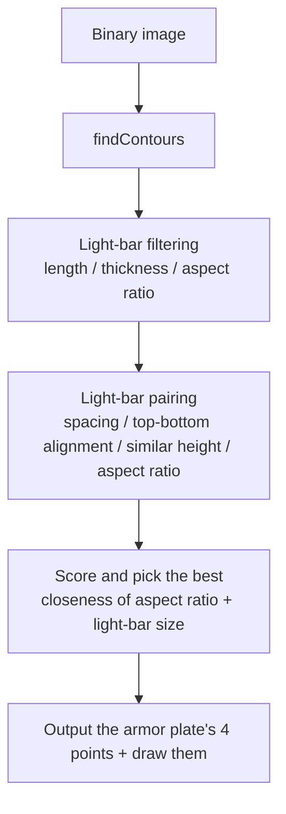
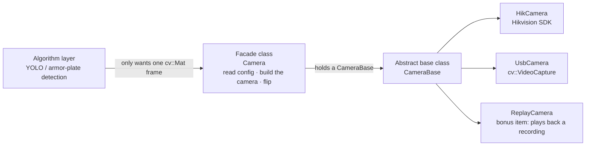
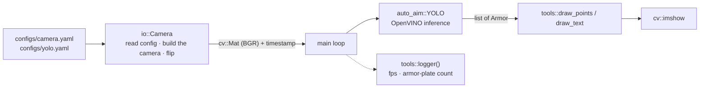

# Stage 2 Training: OpenCV and Object-Oriented Programming (面向对象, miànxiàng duìxiàng)

| Item              | Content                                                                                                                                                                    |
| ----------------- | ------------------------------------------------------------------------------------------------------------------------------------------------------------------------- |
| Teaching goal      | Detect an armor plate (装甲板, zhuāngjiǎbǎn) with classic OpenCV methods and output its four corner points; be able to organize code with classes and objects; be able to wrap reusable components with an abstract base class (抽象基类, chōuxiàng jīlèi) + polymorphism (多态, duōtài), and string them into a pipeline (流水线, liúshuǐxiàn) |
| Teaching focus     | `cv::Mat` and the image-processing pipeline; geometric constraints for light-bar (灯条, dēngtiáo) filtering and pairing; encapsulation (封装, fēngzhuāng), construction/destruction, inheritance (继承, jìchéng) and polymorphism; decoupling hardware from the algorithm with a facade class (外观类, wàiguān lèi) + factory |
| Teaching difficulty | The "light bar → pairing → four points" geometric reasoning and scoring in armor-plate detection; using classes to package "data + behavior" into reusable components   |
| Assessment method  | Wrap a camera class hierarchy and string it into a pipeline: `CameraBase` + `HikCamera` / `UsbCamera` + facade class `Camera`, configuration driven by yaml, CMake dependencies filled in |

---

## Accompanying Examples

Under `tutorial_2/example/`, subfolders are organized by topic; each folder contains the actual code to be shown in class:

| Example                              | Directory                          | Corresponding lesson section | How to run it in class                                                           |
| ------------------------------------- | ----------------------------------- | ----------------------------- | ------------------------------------------------------------------------------------ |
| OpenCV · quick tour of basic APIs     | `example/opencv/opencv_basics.*`    | Part 1, OpenCV (1.1–1.3)      | `cmake --build build && ./build/opencv_basics`  or  `python3 opencv_basics.py`       |
| OpenCV · armor-plate four-point detection | `example/opencv/`               | Part 1, OpenCV (1.4)          | `cmake -S . -B build && cmake --build build && ./build/armor_detect`                 |

Dependency installation, full commands, and expected output are in `example/README.md`.

---

## Part 1: OpenCV

> **Companion reading**: [`example/opencv/opencv_intro.md`](example/opencv/opencv_intro.md) — the "API manual" version of 1.1–1.3 below: filtering / binarization (二值化, èrzhíhuà) / edges / morphology (形态学, xíngtàixué) / contours (轮廓, lúnkuò) and other common functions, with C++ vs. Python side-by-side comparisons, parameter tuning notes, and common pitfalls.
> **Companion runnable code**: [`example/opencv/opencv_basics.cpp`](example/opencv/opencv_basics.cpp) / [`opencv_basics.py`](example/opencv/opencv_basics.py) — runs through 10 groups of APIs in one go and outputs three comparison collages.

### 1.1 What OpenCV Is, and What `cv::Mat` Is

**Concepts**

- OpenCV (Open Source Computer Vision Library) = a cross-platform image/video processing library with a C++ interface, plus Python bindings (`opencv-python`).
- At this stage we only use its **classic (non-deep-learning) image processing** capabilities — we don't touch the deep-learning module.

**`cv::Mat` is the core data structure** — think of it as "a 2D array with metadata attached":

| Member          | Meaning                                                    |
| --------------- | ------------------------------------------------------------ |
| `rows` / `cols` | height / width (note the order: rows = height comes first)   |
| `type()`        | element type, e.g. `CV_8UC3` = 8-bit unsigned, 3 channels     |
| `channels()`    | number of channels: 1 for grayscale, 3 for color (BGR, **not RGB**) |
| `at<T>(y, x)`   | pixel access (y first, then x)                                |
| `clone()`       | makes a deep copy with independent data                       |

**Reference counting** (引用计数, yǐnyòng jìshù): `cv::Mat b = a;` merely shares the same underlying data (a shallow copy) — modifying `b` will affect `a`. For an independent copy, use `a.clone()`.

**Minimal example**

```cpp
#include <opencv2/opencv.hpp>

int main() {
    cv::Mat img = cv::imread("armor.png");          // reads as BGR, 3 channels by default
    if (img.empty()) {                              // always check for a read failure first
        std::cerr << "Failed to read image\n";
        return 1;
    }

    std::cout << "size " << img.cols << "x" << img.rows
              << ", channels " << img.channels() << '\n';

    cv::Mat gray;
    cv::cvtColor(img, gray, cv::COLOR_BGR2GRAY);    // convert to grayscale: step one of the detection pipeline

    cv::imshow("gray", gray);
    cv::waitKey(0);                                 // 0 = wait indefinitely for a keypress
    return 0;
}
```

### 1.2 Environment Setup and a Minimal CMake Project

```bash
# Ubuntu 22.04
sudo apt update
sudo apt install -y libopencv-dev pkg-config

pkg-config --modversion opencv4      # check the version; 4.5.4 ships with 22.04 by default
```

**Minimal `CMakeLists.txt`** (the key addition is just one extra `find_package`):

```cmake
cmake_minimum_required(VERSION 3.16)
project(armor_detect LANGUAGES CXX)

set(CMAKE_CXX_STANDARD 17)
set(CMAKE_CXX_STANDARD_REQUIRED ON)

find_package(OpenCV REQUIRED)                    # ← find OpenCV

add_executable(armor_detect armor_detect.cpp)
target_include_directories(armor_detect PRIVATE ${OpenCV_INCLUDE_DIRS})
target_link_libraries(armor_detect PRIVATE ${OpenCV_LIBS})
```

```bash
cmake -S . -B build && cmake --build build
./build/armor_detect              # run directly; reads demo/bule_armoe.jpg and detects
```

> After it runs, two windows pop up: the left one is a "grayscale / binarized / filtered" three-panel collage, the right one is the detection result;
> at the same time it saves `debug_stages.png` (intermediate steps) and `result.png` (the result).
> On a server/container with no display environment, use `NO_WINDOW=1 ./build/armor_detect` to only save the images without opening a window.

> Hand-writing a `g++` command also works, but writing out the full include/lib paths is a hassle, so OpenCV projects should always use CMake:
> `g++ $(pkg-config --cflags --libs opencv4) armor_detect.cpp -o armor_detect`

### 1.3 The Basic Image-Processing Pipeline

In vision-based auto-aim code, 90% of the classic (non-deep-learning) pipeline is a combination of these five steps:


```mermaid
flowchart LR
    A["Original image, BGR"] -->|cvtColor| B["Grayscale"]
    B -->|threshold| C["Binary image"]
    C -->|morphologyEx| D["Denoised"]
    D -->|findContours| E["Contours"]
    E -->|minAreaRect / filter| F["Target"]
```

| Step                | Function                                                                                  | What it does                                             |
| -------------------- | -------------------------------------------------------------------------------------------- | ------------------------------------------------------------ |
| Convert to grayscale  | `cv::cvtColor(src, dst, cv::COLOR_BGR2GRAY)`                                                | 3 channels → 1 channel; subsequent processing is 3x faster |
| Binarize (二值化)     | `cv::threshold(gray, bin, 0, 255, cv::THRESH_BINARY \| cv::THRESH_OTSU)`                    | OTSU finds the threshold automatically, more stable than manually setting 127 |
| Morphology (形态学)   | `cv::morphologyEx(bin, bin, cv::MORPH_OPEN, kernel)`                                        | opening removes small noise specks, closing fills small holes |
| Find contours (轮廓)  | `cv::findContours(bin, contours, hierarchy, cv::RETR_EXTERNAL, cv::CHAIN_APPROX_SIMPLE)`    | `RETR_EXTERNAL` only takes the outermost contours          |
| Fit a shape           | `cv::minAreaRect(contour)` / `cv::boundingRect(contour)`                                    | a rotated rectangle suits a light bar; an axis-aligned rectangle suits quick checks |

**A color pitfall in binarization**: per the task spec, the armor plate is "red/blue colored," but in BGR, **red is `(0,0,255)` and blue is `(255,0,0)`**. To isolate red specifically, you need to work in HSV space:

```cpp
cv::Mat hsv, mask;
cv::cvtColor(img, hsv, cv::COLOR_BGR2HSV);

// red straddles 0 degrees, so it needs to be split into two ranges
cv::Mat m1, m2;
cv::inRange(hsv, cv::Scalar(0,   100, 100), cv::Scalar(10,  255, 255), m1);
cv::inRange(hsv, cv::Scalar(160, 100, 100), cv::Scalar(180, 255, 255), m2);
cv::bitwise_or(m1, m2, mask);
```

### 1.4 Detecting the Armor Plate with Classic Methods

**Overall idea**: an armor plate (装甲板) is formed by **two parallel light bars** (灯条, dēngtiáo), so first find the light bars, then pair them up two at a time, and finally use the endpoints of the successfully paired light bars to form the armor plate's **four corner points**.


```mermaid
flowchart TD
    A[Binary image] --> B[findContours]
    B --> C["Light-bar filtering<br/>length / thickness / aspect ratio"]
    C --> D["Light-bar pairing<br/>spacing / top-bottom alignment / similar height / aspect ratio"]
    D --> E["Score and pick the best<br/>closeness of aspect ratio + light-bar size"]
    E --> F["Output the armor plate's 4 points + draw them"]
```

**Step one: light-bar filtering**

A light bar's geometric signature is "a thin, elongated, vertical bright strip." All four constraints are written "relative to the overall image size," so changing resolution doesn't require changing the parameters:

```cpp
bool isLightBar(const LightBar &bar, const cv::Size &img) {
    if (bar.height < img.height * 0.05f) return false;  // too short: background noise
    if (bar.height > img.height * 0.60f) return false;  // too long: a light tube / a background edge
    if (bar.width  < 2.0f)               return false;  // too thin: noise
    if (bar.width  > img.width * 0.08f)  return false;  // too thick: e.g. the large white-digit blob on the armor plate

    const float ratio = bar.height / std::max(bar.width, 1.0f);
    return ratio >= 1.5f && ratio <= 15.0f;             // not elongated enough → not a light bar
}
```

> **Why constrain the width**: the white digit printed on the armor plate is brighter than the light bar itself in the grayscale image, and the aspect ratio that `minAreaRect` produces for it can also fall within 1.5–15. But its width is roughly 30% of the image width, far above the 8% cap — a single constraint filters it out. **Filtering by aspect ratio alone is not enough.**

**Step two: light-bar normalization**

Convert the rotated rectangle into a "top endpoint + bottom endpoint" representation, which makes computing spacing and alignment easier later:

```cpp
LightBar makeLightBar(const cv::RotatedRect &rect) {
    cv::Point2f pts[4];
    rect.points(pts);

    // sort the four vertices by y: the two smallest-y points form the top edge, the two largest-y points form the bottom edge
    std::vector<cv::Point2f> p(pts, pts + 4);
    std::sort(p.begin(), p.end(),
              [](const cv::Point2f &a, const cv::Point2f &b) { return a.y < b.y; });

    LightBar bar;
    bar.rect   = rect;
    bar.top    = (p[0] + p[1]) * 0.5f;
    bar.bottom = (p[2] + p[3]) * 0.5f;
    bar.height = static_cast<float>(cv::norm(bar.top - bar.bottom));
    bar.width  = std::min(rect.size.width, rect.size.height);
    return bar;
}
```

**Step three: light-bar pairing**

Five geometric constraints — only if all of them are satisfied might this be an armor plate:

```cpp
std::optional<Armor> tryMatch(const LightBar &a, const LightBar &b, const cv::Size &img) {
    const LightBar &L = (a.top.x < b.top.x) ? a : b;   // convention: left, right
    const LightBar &R = (a.top.x < b.top.x) ? b : a;

    // 1. Reasonable spacing. Upper bound relaxed to 0.95x image width: when shooting close-up, the armor plate can nearly fill the frame
    const float gap = static_cast<float>(cv::norm(L.top - R.top));
    if (gap < 10.0f || gap > img.width * 0.95f) return std::nullopt;

    // 2-3. The top and bottom endpoints should roughly lie on the same horizontal line
    if (std::abs(L.top.y    - R.top.y)    > L.height * 0.6f) return std::nullopt;
    if (std::abs(L.bottom.y - R.bottom.y) > L.height * 0.6f) return std::nullopt;

    // 4. Similar heights (the two light bars on the same armor plate are the same length)
    const float hr = L.height / std::max(R.height, 1.0f);
    if (hr < 0.6f || hr > 1.67f) return std::nullopt;

    // 5. Reasonable aspect ratio (this step filters out most random pairings)
    const float avg_h  = (L.height + R.height) * 0.5f;
    const float aspect = gap / std::max(avg_h, 1.0f);
    if (aspect < 1.0f || aspect > 5.0f) return std::nullopt;

    Armor armor;
    armor.found  = true;
    armor.left   = L;
    armor.right  = R;
    armor.aspect = aspect;
    // score = closeness of the aspect ratio + relative size of the light bars
    armor.score = -std::abs(aspect - kIdealAspect) +
                  kSizeWeight * (avg_h / static_cast<float>(img.height));
    return armor;
}
```

> **Why you can't just compare aspect ratios**: in practice, on this test image the real armor plate's aspect ratio is **2.64**, while a false pairing cobbled together from an edge along the top of the background comes out to **2.37**. If you score by "closer to 2.5 is better," the false pairing actually wins. After adding the term "a bigger light bar is more likely to be a real target," the real target scores 0.520 and the false one scores 0.055 — the gap opens up immediately. Setting `DEBUG_PAIRS=1` at runtime lets you see this comparison directly.

**Step four: output the four corner points**

```cpp
// fixed order: top-left → top-right → bottom-right → bottom-left
const std::vector<cv::Point2f> corners = {armor.left.top, armor.right.top,
                                          armor.right.bottom, armor.left.bottom};
```

These four points are this section's final output; they get fed directly into pose estimation (`solvePnP`) later on.

**Step five: drawing**

```cpp
// scale text and line width with image size, otherwise they're unreadable on a large image
const double scale = std::max(0.6, img.cols / 1200.0);

for (int i = 0; i < 4; ++i) {
    cv::line(img, corners[i], corners[(i + 1) % 4], cv::Scalar(0, 255, 0), 2);
    cv::circle(img, corners[i], 8, cv::Scalar(0, 255, 0), cv::FILLED);
}
```

Full runnable version: `example/opencv/armor_detect.cpp`, verified working against the repo's own `demo/bule_armoe.jpg`.


<!-- constexpr double LIGHTBAR_LENGTH = 56e-3;     // m, light-bar length 56mm
constexpr double BIG_ARMOR_WIDTH = 230e-3;    // m, large armor-plate width
constexpr double SMALL_ARMOR_WIDTH = 135e-3;  // m, small armor-plate width -->

---

## Part 2: C++ Object-Oriented Programming (面向对象, miànxiàng duìxiàng)

### 2.1 From "a Pile of Functions" to "an Object"

In Stage 1 we wrote the vector library like this:

```cpp
struct Vec2 { double x = 0.0; double y = 0.0; };
double length(const Vec2& v);          // data and behavior are kept separate
```

It works, but it has two problems:

1. **The data isn't protected**: nothing stops you from writing `Vec2 v{1e308, 1e308}`, or setting `x` to an invalid value.
2. **One change ripples everywhere**: if "vector" later has to be represented in polar coordinates, every piece of code that touches `v.x` needs to change.

The first thing object-oriented programming does is **bind data and behavior together, and protect the data.**

Swap this over to robots (机器人, jīqìrén) and the problem gets even more glaring — "every robot has an HP value," and a procedural style (面向过程, miànxiàng guòchéng) can only tell them apart by naming convention:

```cpp
int  infantry_hp = 400;        // global variable: anyone can change it, and the compiler won't stop a wrong change
int  hero_hp     = 800;
void infantry_hurt(int damage);
void hero_hurt(int damage);    // every new robot type means another copy of the variable and the function
```

Add a sentry and a drone later, and all of this doubles again. Once it's written as a **class**, this state only lives inside its own **object** (see 2.2).

### 2.2 Classes and Objects

**Concepts**

| Term                          | Meaning                                                       |
| ------------------------------ | ----------------------------------------------------------------- |
| Class (类, lèi)                | A type — the "blueprint"                                          |
| Object (对象, duìxiàng)        | An instance of the class — the "thing built from the blueprint"   |
| Member variable (成员变量)     | The object's state (data)                                         |
| Member function / method (成员函数) | What the object can do (behavior)                            |
| `this`                          | A pointer to "the current object," implicitly available inside member functions |

In C++, `struct` and `class` **differ only in their default access level**: `struct` defaults to `public`, `class` defaults to `private`. So the `struct Vec2` from Stage 1 was already technically a class.

**Minimal example**

```cpp
class Vec2 {
public:
    Vec2(double x, double y) : x_(x), y_(y) {}   // constructor: called automatically when the object is created

    double x() const { return x_; }              // getter: read-only
    double y() const { return y_; }
    double length() const;                       // behavior kept together with the data
    void   scale(double k);                      // modifies the state

private:
    double x_ = 0.0;                             // member variables get a `_` suffix to distinguish them from parameters
    double y_ = 0.0;
};

double Vec2::length() const {
    return std::sqrt(x_ * x_ + y_ * y_);
}

void Vec2::scale(double k) {
    x_ *= k;
    y_ *= k;
}
```

```cpp
Vec2 v{3.0, 4.0};        // create the object on the stack; the constructor is called automatically
std::cout << v.length(); // 5
v.scale(2.0);            // change state through a method
// v.x_ = 999;           // ❌ compile error: private, unreachable from outside
```

> **`const` written after the function signature** means "this function does not modify the object's state." Get in the habit of using it — anyone reading the interface can immediately see which operations have side effects. Only `const` member functions can be called on a `const` object.

**A different example: a robot is an object too**

Move the same style over to a RoboMaster robot — the **data** is its name and HP, the **behavior** is "taking a hit"; the two are bound together in one class, and HP can't be changed from outside:

```cpp
class Robot {
public:
    Robot(std::string name, int hp) : name_(std::move(name)), hp_(hp) {}

    const std::string& name() const { return name_; }   // read-only: outsiders can only look
    bool alive() const { return hp_ > 0; }
    void hurt(int damage);                              // want to change the state? go through a method

private:
    std::string name_;
    int  hp_ = 0;                                       // private: unreachable from outside
};

void Robot::hurt(int damage) {
    hp_ = std::max(0, hp_ - damage);                    // the rule "HP can't go negative" is only maintained here
}
```

```cpp
Robot infantry{"Infantry", 400};
infantry.hurt(600);
std::cout << infantry.name() << " still alive? "
          << (infantry.alive() ? "yes" : "no") << '\n';

// infantry.hp_ -= 100;   // ❌ compile error: HP is not allowed to be changed from outside
```

> When do you actually need to split off subclasses? See 2.4: infantry / hero / sentry / drone each have **different behavior** (different heat limits, different movement), and that's what makes inheritance worthwhile.

### 2.3 Encapsulation (封装, fēngzhuāng): Constructors, Destructors, Access Control

**Three access levels**

| Keyword      | Who can access it        | When to use it                                            |
| ------------- | --------------------------- | -------------------------------------------------------------- |
| `public`      | Everyone                     | The public interface (expose whatever you want people to use)  |
| `protected`   | The class itself and its derived classes | For subclasses to use, but not outsiders                |
| `private`     | Only the class itself        | Internal state — this is the default choice                    |

**Constructors / Destructors** (构造函数 / 析构函数, gòuzào hánshù / xīgòu hánshù)

A drone "taking off" occupies a resource, and "landing" has to give it back. Hand both of these off to the constructor and destructor, and the user **can never forget to land**:

```cpp
class Drone {
public:
    explicit Drone(int id) : id_(id) {
        takeoff();                                   // constructor: acquire the resource
    }

    ~Drone() {
        land();                                      // destructor: release the resource
        std::cout << "Drone#" << id_ << " has landed\n";
    }

private:
    void takeoff() { std::cout << "Drone#" << id_ << " taking off\n"; }
    void land()    { /* stop the propellers, disconnect the link, save the log */ }

    int id_ = 0;
};

void patrol() {
    Drone drone{7};        // enters scope → constructed → takes off
    // ... patrolling ...
}                          // leaves scope → automatically destructed → lands, no need to hand-write land()
```

`explicit` prevents an implicit conversion like `Drone drone = 7;` from happening silently — it's recommended for every single-parameter constructor.

**Object lifetime (RAII)**: an object is automatically destructed when its scope ends, so "acquire the resource in the constructor, release it in the destructor" is C++'s most central programming paradigm — as soon as `drone` in `patrol()` above leaves scope, it lands automatically; you don't need to, and shouldn't, hand-write `land()`.

A sentry auto-patrolling, an industrial camera grabbing a frame, `std::vector` allocating memory... it's all the same pattern: **whoever acquires it releases it, and it happens automatically via the object's lifetime.**

### 2.4 Inheritance (继承, jìchéng) and Polymorphism (多态, duōtài)

**Concepts**

- **Inheritance**: `class Infantry : public Robot` — "an infantry robot **is-a** kind of robot," not "an infantry robot **has-a** robot."
- **Polymorphism**: calling through a base-class pointer/reference automatically executes the derived class's implementation at runtime.
- **Virtual function** (虚函数, xū hánshù): the `virtual` keyword marks "this function is allowed to be overridden by derived classes."
- **Pure virtual function** (纯虚函数, chúnxū hánshù): `= 0`, declared but not implemented. A class containing a pure virtual function is called an **abstract base class** and cannot be instantiated.
- **Virtual destructor** (虚析构, xū xīgòu): a base class's destructor must be `virtual`, otherwise deleting through a base-class pointer will not call the derived class's destructor (a resource leak).

**Minimal example: a robot class hierarchy**

The four unit types on a RoboMaster field map perfectly onto this structure — "all of them are a robot, but their behavior is completely different" — so **what they share goes in the base class, and the differences are left to the derived classes**:

```cpp
class Robot {
public:
    virtual ~Robot() = default;              // ⚠ the base class destructor must be virtual
    virtual void update() = 0;               // pure virtual: each type does its own thing every frame
    virtual int  heat_limit() const = 0;     // pure virtual: heat limits differ per type
    virtual std::string name() const = 0;
};

class Infantry : public Robot {              // infantry
public:
    void update() override { /* follow the gimbal, drive the balance chassis */ }
    int  heat_limit() const override { return 120; }
    std::string name() const override { return "Infantry"; }
};

class Hero : public Robot {                  // hero (heavy)
public:
    void update() override { /* large-caliber projectiles, higher armor */ }
    int  heat_limit() const override { return 200; }
    std::string name() const override { return "Hero"; }
};

class Sentry : public Robot {                // sentry
public:
    void update() override { /* auto-patrol, select targets */ }
    int  heat_limit() const override { return 400; }
    std::string name() const override { return "Sentry"; }
};

class Drone : public Robot {                 // drone
public:
    void update() override { /* flight control, drop payload */ }
    int  heat_limit() const override { return 0; }
    std::string name() const override { return "Drone"; }
};
```

```cpp
// Caller: no matter which robot comes in, the same line of code drives it
void spin(std::vector<std::unique_ptr<Robot>>& robots) {
    for (auto& robot : robots) {              // polymorphism: which implementation runs is decided at runtime
        robot->update();
        std::cout << robot->name() << " heat limit " << robot->heat_limit() << '\n';
    }
}
```

> Notice that `spin()` contains **none** of the names `Infantry` / `Hero` / `Sentry` / `Drone`, and no `if (type == ...)` either — which implementation to call is decided at runtime, and that's exactly the point of 2.5: the caller only ever knows the base class.

The `override` keyword isn't strictly required, but it's **strongly recommended**: if you get the function signature wrong, the compiler will flag it directly, instead of silently turning it into "a different, new function."

How the concepts map onto the example:

| Concept                        | Robot example                             |
| -------------------------------- | -------------------------------------------- |
| Abstract base class              | `Robot`                                      |
| Derived classes                  | `Infantry` / `Hero` / `Sentry` / `Drone`     |
| Pure virtual function            | `update()`, `heat_limit()`                   |
| Container of base-class pointers | `std::vector<std::unique_ptr<Robot>>`        |
| Caller only knows the base class | `spin(Robot&)`                               |

> The same structure shows up everywhere in the assignment: the `io` layer has `CameraBase` (abstract base class) + `Camera` (facade class); `tasks/yolo.hpp` has `YOLOBase` + `YOLO`. Why is the base class called `CameraBase` instead of `Camera`? Because the name `Camera` is reserved for the **facade class** (see 2.5) — the front door responsible for "reading the config, building the camera, flipping the image." The two names have different jobs — don't mix them up.

### 2.5 Using the YOLO Class

YOLO is a very classic single-stage object-detection algorithm. Compared with the traditional OpenCV light-bar-based detection, it's more robust and much less affected by lighting conditions. So it can raise both the detection accuracy and the interference resistance of the detector in the auto-aim framework.

```cpp
// yolo header
#include "tasks/yolo.hpp"
// get the yolo config file path; type deduced with auto
auto yolo_config = cli.get<std::string>("yolo");    // basic_string<char>
// initialize the yolo object
auto_aim::YOLO yolo(yolo_config, true);
// call the yolo detector method to produce armors[]
const std::list<auto_aim::Armor> armors = yolo.detect(img, frame_count++);
```

### 2.6 Development Based on the Camera Class (the assignment)

**Why add a layer of abstraction (抽象, chōuxiàng)**

In the Stage 3 auto-aim project, the `io` layer is exactly `CameraBase / HikCamera / UsbCamera`. The reasoning is very practical:

- The algorithm (armor-plate detection) just wants to say "give me a frame" — it doesn't care whether the frame comes from an industrial camera, a USB camera, or a recorded video file.
- When the hardware changes, only one place needs to change: add one more `else if` in the `Camera` facade class — the algorithm code doesn't move a single line.



```mermaid
flowchart LR
    A["Algorithm layer<br/>YOLO / armor-plate detection"] -->|"only wants one cv::Mat frame"| F["Facade class<br/>Camera<br/>read config · build the camera · flip"]
    F -->|"holds a CameraBase"| I["Abstract base class<br/>CameraBase"]
    I --> H["HikCamera<br/>Hikvision SDK"]
    I --> U["UsbCamera<br/>cv::VideoCapture"]
    I --> R["ReplayCamera<br/>bonus item: plays back a recording"]
```

**The interface does exactly one thing: hand over a frame + a timestamp**

Externally, a camera does exactly one thing — **hand over one BGR `cv::Mat`** (plus a timestamp). When grabbing a frame fails, there's no need to design a whole separate return-value scheme for it: just leave `img` empty, and the caller checks `img.empty()`. Resource operations like `open()` / `close()` aren't visible from outside at all — they're entirely handled by the constructor and destructor.

**The caller only knows the facade class**

```cpp
// Caller: all it has is a Camera; whether underneath it's Hikvision or USB doesn't matter at all
int main() {
    io::Camera camera("configs/camera.yaml");
    auto_aim::YOLO yolo("configs/yolo.yaml", true);

    int frame_count = 0;
    while (true) {
        cv::Mat img;
        std::chrono::steady_clock::time_point timestamp;
        camera.read(img, timestamp);
        if (img.empty()) continue;          // frame grab failed: an empty image is the signal
        const auto armors = yolo.detect(img, frame_count++);
        // draw boxes, log, imshow ... see the assignment's main.cpp
        if (cv::waitKey(1) == 'q') break;
    }
}
```

> The snippet above is a **structural illustration** (it depends on OpenCV / yaml-cpp / fmt); build it against the assignment's CMake project — it isn't meant to run standalone.
> How the camera gets built, how parameters get read, how the image gets flipped — all of that is tucked away inside the `Camera` facade class. That's exactly the `io/my_camera.hpp` / `.cpp` the assignment asks you to write.

**Parameters always go through configuration**

The assignment requires every camera parameter to be read from `configs/camera.yaml`; `YAML::LoadFile` must never appear in business code:

```cpp
auto yaml = tools::load("configs/camera.yaml");
auto camera_name = tools::read<std::string>(yaml, "camera_name");  // missing key → error and exit
auto exposure_ms = tools::read<double>(yaml, "exposure_ms");
auto flip_code   = tools::read<int>(yaml, "flip_code", 2);         // a default is given, so a missing key doesn't error
```

The benefit is immediate: swap to a different camera, or change the exposure — **only the yaml changes, no recompiling needed.** That's exactly how the Stage 3 auto-aim project is written.


---
## Part 4: Modern C++
Being able to read a real project

The auto-aim pipeline
Camera->Image->Detector->Tracker->Aimer->Gimbal

The essence of code: data flowing between modules

Scope:
`A::B` means: go into A's scope and look for B there
`cv::Mat` — the `Mat` inside OpenCV's `cv`
`std::vector` — the `vector` under the std library
`auto_aim::YOLO` — the `YOLO` inside the `auto_aim` module

Which module a given name belongs to —
the reason scopes exist: to tell things apart

Looking things up:
`a.b()`

`p->b()`

`A::b()`

`vector<Armor>` = a group of `Armor` = `Armor[n]`, except a vector can grow
`<T>` — `T` is the type stored in the template

`auto` — automatic type deduction

The compiler determines its type at compile time
```cpp
auto yolo_config = cli.get<std::string>("yolo");    // basic_string<char>
```
`auto` should not be overused

Reference (引用, yǐnyòng)
```cpp
Armor armor_origin;
Armor & a = armor_origin;  // a is a reference to armor_origin; a and armor_origin point to the same memory
```
`a` is merely an alias for `armor_origin` — `a` and `armor_origin` are the same block of memory
```cpp
auto_aim::YOLO yolo(config_path);
auto_aim::Solver solver(config_path);
vector<Armor> armors = yolo.detect(img);
const auto& armor = armors.front();
auto image_points = solver.reproject_armor(armor,...);
```

Objects and data

The manager, and the data it manages

```cpp
std::vector<float> numbers(300);  // a vector of 300 floats
```
the vector object
size, capacity
data pointer
you access the data through a reference to, or pointer to, the object

The difference between `&v` and `v.data()`

```
&v         // the address of v itself
v.data()   // the address of the array the vector manages
```

A simplified Stack / Heap model
```
stack                                                   Heap
int x                                               vector elements
vector<int> v(300)                    -> manages       image pixels
cv::Mat img(480, 640, CV_8UC3)                      dynamic objects
```

stack: small, managed automatically by C++
heap: large

---

## Part 5: Stage 2 Assignment

> Abstract "the camera" into a class hierarchy (abstract base class `CameraBase` + derived classes `HikCamera` / `UsbCamera` + facade class `Camera`),
> with every parameter coming from `configs/camera.yaml`; then string it together with `YOLO` detection into a single pipeline: **grab frame → detect → draw box → display**,
> and finally fill in CMake's linking dependencies.
>
> For the full task, requirements, file layout, and bonus items, see [`homework_2.md`](homework_2.md).

The five things to submit, and the corresponding knowledge point from this lesson:

| #   | Content                                                                | Corresponding knowledge point                              |
| --- | ------------------------------------------------------------------------ | ------------------------------------------------------------ |
| 1   | `io/my_camera.hpp` / `.cpp`: `CameraBase` + `HikCamera` + `Camera`       | 2.2–2.5: encapsulation, inheritance, polymorphism, facade class / factory |
| 2   | Derived class `UsbCamera` (reads a USB camera via `cv::VideoCapture`)    | 2.4–2.5: the same interface — swapping the implementation only means adding one derived class |
| 3   | `configs/camera.yaml` + reading the config via `tools/yaml.hpp`          | 2.5: separating data (config) from code — no recompiling to switch cameras |
| 4   | `main.cpp`: grab frame → `YOLO` detection → draw box → display          | Part 1, OpenCV · 1.4 + orchestrating the pieces into a pipeline |
| 5   | CMake dependencies filled in (both `main` and `example` must link)      | Engineering habit: whoever uses something links against it   |

**How it will be graded**

```bash
cmake -S . -B build && cmake --build build
./build/main                                               # by default reads the two yaml files under configs/
./build/main -c configs/camera.yaml -y configs/yolo.yaml   # can also be specified explicitly
```

Once it's running, the four corner points of the armor plate should be visible on screen, and the log should continuously print the fps and the number of armor plates detected.

### The Pipeline


```mermaid
flowchart LR
    CFG["configs/camera.yaml<br/>configs/yolo.yaml"] --> CAM["io::Camera<br/>read config · build the camera · flip"]
    CAM -->|"cv::Mat (BGR) + timestamp"| MAIN["main loop"]
    MAIN --> DET["auto_aim::YOLO<br/>OpenVINO inference"]
    DET -->|"list of Armor"| DRAW["tools::draw_points / draw_text"]
    DRAW --> SHOW["cv::imshow"]
    MAIN -.-> LOG["tools::logger()<br/>fps · armor-plate count"]
```

In one sentence: **the camera's only job is to hand over one BGR `cv::Mat`; detection's only job is to hand over a list of `Armor`; neither side knows who the other one is.**

> The detection step is already provided in the assignment (`tasks/yolo.hpp`, OpenVINO inference). The classic method hand-written in section 1.4 doesn't need to be ported into the assignment — its purpose was to help you understand "find the target → output four corner points" as a concept in itself; the actual project swaps in the more robust deep-learning approach.

---

## Part 4: References

**OpenCV**

- Official OpenCV tutorials (C++): https://docs.opencv.org/4.x/d9/df8/tutorial_root.html
- Official OpenCV docs · image-processing module: https://docs.opencv.org/4.x/d7/dbd/group__imgproc.html
- Reference approaches for classic armor-plate detection (many open-source RoboMaster community implementations are available for comparison)

**C++ Object-Oriented Programming**

- Runoob tutorial · C++ classes and objects: https://www.runoob.com/cplusplus/cpp-classes-objects.html
- Runoob tutorial · C++ polymorphism: https://www.runoob.com/cplusplus/cpp-polymorphism.html
- C++ Core Guidelines (advanced — see the F and C sections): https://isocpp.github.io/CppCoreGuidelines/

**C++ Inheritance, Polymorphism, and Smart Pointers (supplementary)**

- cppreference · virtual functions and virtual destructors: https://en.cppreference.com/w/cpp/language/virtual
- cppreference · `std::unique_ptr`: https://en.cppreference.com/w/cpp/memory/unique_ptr
- C++ Core Guidelines · inheritance and polymorphism (C.35–C.67): https://isocpp.github.io/CppCoreGuidelines/

> Note: it's fine to consult AI as a study aid too, but be careful to evaluate the information critically, and don't let AI complete the whole project for you.
