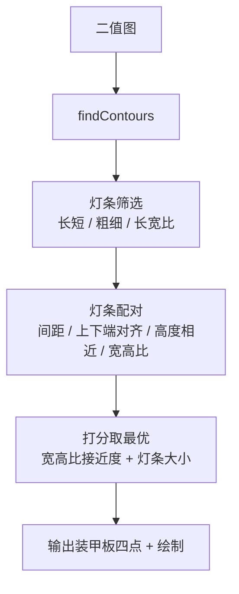
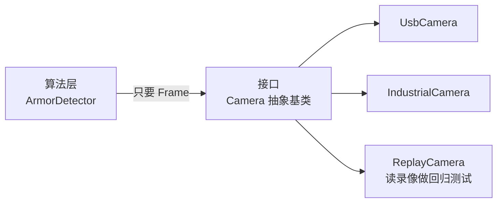

# 第二阶段培训：OpenCV 与面向对象

| 项目     | 内容                                                                                                                     |
| -------- | ------------------------------------------------------------------------------------------------------------------------ |
| 教学目标 | 用 OpenCV 传统方法从图像中识别装甲板并输出四个角点；能用类和对象组织代码；能用抽象基类 + 多态 + 工厂封装出可复用的组件   |
| 教学重点 | `cv::Mat` 与图像处理流水线；灯条筛选与配对的几何约束；类与对象、封装、构造函数/析构函数、继承与多态                      |
| 教学难点 | 装甲板识别中「灯条 → 配对 → 四点」的几何推理与打分；用类把「数据 + 行为」封装成可复用组件                                |
| 考核方式 | 提交一个相机类体系：抽象基类 `Camera` + `UsbCamera` / `IndustrialCamera` 两个派生类 + 工厂，并用基类引用统一调用所有相机 |

---

## 配套实例

`tutorial_2/example/` 下按知识点分目录，目录里就是上课要展示的真实代码：

| 示例                    | 目录              | 对应教案         | 上课怎么跑                                                            |
| ----------------------- | ----------------- | ---------------- | --------------------------------------------------------------------- |
| OpenCV · 装甲板四点识别 | `example/opencv/` | 一、OpenCV       | `cmake -S . -B build && cmake --build build && ./build/armor_detect`  |

依赖安装、完整命令与预期输出见 `example/README.md`。

---

## 一、OpenCV

### 1.1 OpenCV 是什么、`cv::Mat` 是什么

**概念**

- OpenCV（Open Source Computer Vision Library）= 一个跨平台的图像/视频处理库，C++ 接口，另有 Python 绑定（`opencv-python`）。
- 我们这一阶段只用它的**传统图像处理**能力，不碰深度学习模块。

**`cv::Mat` 是核心数据结构**，可以理解为「带元信息的二维数组」：

| 成员            | 含义                                        |
| --------------- | ------------------------------------------- |
| `rows` / `cols` | 高 / 宽（注意顺序：先是行=高）              |
| `type()`        | 元素类型，如 `CV_8UC3` = 8 位无符号、3 通道 |
| `channels()`    | 通道数：灰度 1，彩色 3（BGR，**不是 RGB**） |
| `at<T>(y, x)`   | 访问像素（先 y 后 x）                       |
| `clone()`       | 深拷贝一份独立数据                          |

**引用计数**：`cv::Mat b = a;` 只是共享同一块数据（浅拷贝），改 `b` 会影响 `a`。要独立副本用 `a.clone()`。

**最小实例**

```cpp
#include <opencv2/opencv.hpp>

int main() {
    cv::Mat img = cv::imread("armor.png");          // 默认读成 BGR 三通道
    if (img.empty()) {                              // 读失败一定要先判断
        std::cerr << "图像读取失败\n";
        return 1;
    }

    std::cout << "尺寸 " << img.cols << "x" << img.rows
              << "，通道数 " << img.channels() << '\n';

    cv::Mat gray;
    cv::cvtColor(img, gray, cv::COLOR_BGR2GRAY);    // 转灰度：识别流程的第一步

    cv::imshow("gray", gray);
    cv::waitKey(0);                                 // 0 = 一直等按键
    return 0;
}
```

### 1.2 环境搭建与最小 CMake 工程

```bash
# Ubuntu 22.04
sudo apt update
sudo apt install -y libopencv-dev pkg-config

pkg-config --modversion opencv4      # 看版本，4.5.4 是 22.04 自带的
```

**最小 CMakeLists.txt**（关键就是多一个 `find_package`）：

```cmake
cmake_minimum_required(VERSION 3.16)
project(armor_detect LANGUAGES CXX)

set(CMAKE_CXX_STANDARD 17)
set(CMAKE_CXX_STANDARD_REQUIRED ON)

find_package(OpenCV REQUIRED)                    # ← 找 OpenCV

add_executable(armor_detect armor_detect.cpp)
target_include_directories(armor_detect PRIVATE ${OpenCV_INCLUDE_DIRS})
target_link_libraries(armor_detect PRIVATE ${OpenCV_LIBS})
```

```bash
cmake -S . -B build && cmake --build build
./build/armor_detect              # 直接跑，读 demo/bule_armoe.jpg 并识别
```

> 跑完会弹两个窗口：左边是「灰度 / 二值化 / 滤波」三格拼图，右边是识别结果；
> 同时存下 `debug_stages.png`（中间过程）和 `result.png`（结果）。
> 服务器 / 容器里没有显示环境时，用 `NO_WINDOW=1 ./build/armor_detect` 只存图不开窗。

> 手写 g++ 也可以，但要写全路径太麻烦，所以 OpenCV 工程一律用 CMake：
> `g++ $(pkg-config --cflags --libs opencv4) armor_detect.cpp -o armor_detect`

### 1.3 图像处理基本流程

自瞄里 90% 的传统视觉代码都是这五步的组合：


| 步骤     | 函数                                                                                     | 干什么                               |
| -------- | ---------------------------------------------------------------------------------------- | ------------------------------------ |
| 转灰度   | `cv::cvtColor(src, dst, cv::COLOR_BGR2GRAY)`                                             | 3 通道 → 1 通道，后续处理快 3 倍     |
| 二值化   | `cv::threshold(gray, bin, 0, 255, cv::THRESH_BINARY \| cv::THRESH_OTSU)`                 | OTSU 自动找阈值，比手填 127 稳       |
| 形态学   | `cv::morphologyEx(bin, bin, cv::MORPH_OPEN, kernel)`                                     | 开运算去小噪点，闭运算补空洞         |
| 找轮廓   | `cv::findContours(bin, contours, hierarchy, cv::RETR_EXTERNAL, cv::CHAIN_APPROX_SIMPLE)` | `RETR_EXTERNAL` 只取最外层           |
| 拟合形状 | `cv::minAreaRect(contour)` / `cv::boundingRect(contour)`                                 | 旋转矩形适合灯条，正矩形适合快速判断 |

**二值化的颜色坑**：任务书上的装甲板是「红蓝配色」，但在 BGR 里**红色是 `(0,0,255)`、蓝色是 `(255,0,0)`**。要单独提红色，得用 HSV 空间：

```cpp
cv::Mat hsv, mask;
cv::cvtColor(img, hsv, cv::COLOR_BGR2HSV);

// 红色横跨 0 度，要分两段
cv::Mat m1, m2;
cv::inRange(hsv, cv::Scalar(0,   100, 100), cv::Scalar(10,  255, 255), m1);
cv::inRange(hsv, cv::Scalar(160, 100, 100), cv::Scalar(180, 255, 255), m2);
cv::bitwise_or(m1, m2, mask);
```

### 1.4 用传统方法识别装甲板

**整体思路**：装甲板由**两条平行灯条**构成，所以先找灯条，再把灯条两两配对，最后用配对成功那两条灯条的端点组成装甲板的**四个角点**。



**第一步：灯条筛选**

灯条的几何特征是「细长的竖直亮条」。四个约束全部写成「相对整图尺寸」，换分辨率不用改参数：

```cpp
bool isLightBar(const LightBar &bar, const cv::Size &img) {
    if (bar.height < img.height * 0.05f) return false;  // 太短：背景噪点
    if (bar.height > img.height * 0.60f) return false;  // 太长：灯管 / 背景边缘
    if (bar.width  < 2.0f)               return false;  // 太细：噪点
    if (bar.width  > img.width * 0.08f)  return false;  // 太粗：装甲板上的白色数字等大色块

    const float ratio = bar.height / std::max(bar.width, 1.0f);
    return ratio >= 1.5f && ratio <= 15.0f;             // 不够细长就不是灯条
}
```

> **为什么要卡宽度**：装甲板上那个白色数字在灰度图里比灯条还亮，`minAreaRect` 出来的长宽比也能落进 1.5~15。但它的宽度约占图宽的 30%，远超 8%，一条约束就挡掉了。**只筛长宽比是不够的。**

**第二步：灯条归一化**

把旋转矩形变成「上端点 + 下端点」，后面算间距、算对齐都方便：

```cpp
LightBar makeLightBar(const cv::RotatedRect &rect) {
    cv::Point2f pts[4];
    rect.points(pts);

    // 四个顶点按 y 排序：y 最小的两点构成上边，y 最大的两点构成下边
    std::vector<cv::Point2f> p(pts, pts + 4);
    std::sort(p.begin(), p.end(),
              [](const cv::Point2f &a, const cv::Point2f &b) { return a.y < b.y; });

    LightBar bar;
    bar.rect   = rect;
    bar.top    = (p[0] + p[1]) * 0.5f;
    bar.bottom = (p[2] + p[3]) * 0.5f;
    bar.height = static_cast<float>(cv::norm(bar.top - bar.bottom));
    bar.width  = std::min(rect.size.width, rect.size.height);
    return bar;
}
```

**第三步：灯条配对**

五个几何约束，全部满足才可能是一块装甲板：

```cpp
std::optional<Armor> tryMatch(const LightBar &a, const LightBar &b, const cv::Size &img) {
    const LightBar &L = (a.top.x < b.top.x) ? a : b;   // 约定：左、右
    const LightBar &R = (a.top.x < b.top.x) ? b : a;

    // ① 间距合理。上限放到 0.95 倍图宽：贴脸拍时装甲板几乎占满画面
    const float gap = static_cast<float>(cv::norm(L.top - R.top));
    if (gap < 10.0f || gap > img.width * 0.95f) return std::nullopt;

    // ②③ 上下端点应该大致在同一水平线上
    if (std::abs(L.top.y    - R.top.y)    > L.height * 0.6f) return std::nullopt;
    if (std::abs(L.bottom.y - R.bottom.y) > L.height * 0.6f) return std::nullopt;

    // ④ 高度相近（同一块装甲板上的两根灯条是一样长的）
    const float hr = L.height / std::max(R.height, 1.0f);
    if (hr < 0.6f || hr > 1.67f) return std::nullopt;

    // ⑤ 宽高比合理（这一步挡掉大部分随机配对）
    const float avg_h  = (L.height + R.height) * 0.5f;
    const float aspect = gap / std::max(avg_h, 1.0f);
    if (aspect < 1.0f || aspect > 5.0f) return std::nullopt;

    Armor armor;
    armor.found  = true;
    armor.left   = L;
    armor.right  = R;
    armor.aspect = aspect;
    // 得分 = 宽高比接近程度 + 灯条相对大小
    armor.score = -std::abs(aspect - kIdealAspect) +
                  kSizeWeight * (avg_h / static_cast<float>(img.height));
    return armor;
}
```

> **为什么不能只比宽高比**：实测这张图里，真装甲板的宽高比是 **2.64**，而背景顶部一条边凑出来的假配对是 **2.37**。按「离 2.5 越近越好」打分，假的反倒赢了。加上「灯条越大越可能是真目标」这一项之后，真目标 0.520、假目标 0.055，差距立刻拉开。现场用 `DEBUG_PAIRS=1` 就能看到这几行对比。

**第四步：输出四个角点**

```cpp
// 顺序固定为：左上 → 右上 → 右下 → 左下
const std::vector<cv::Point2f> corners = {armor.left.top, armor.right.top,
                                          armor.right.bottom, armor.left.bottom};
```

这四个点就是本节的最终输出，后面做位姿解算（`solvePnP`）时直接喂进去。

**第五步：绘制**

```cpp
// 文字和线宽随图片尺寸缩放，否则在大图上根本看不清
const double scale = std::max(0.6, img.cols / 1200.0);

for (int i = 0; i < 4; ++i) {
    cv::line(img, corners[i], corners[(i + 1) % 4], cv::Scalar(0, 255, 0), 2);
    cv::circle(img, corners[i], 8, cv::Scalar(0, 255, 0), cv::FILLED);
}
```

完整可运行版本：`example/opencv/armor_detect.cpp`，用仓库自带的 `demo/bule_armoe.jpg` 实测通过。


<!-- constexpr double LIGHTBAR_LENGTH = 56e-3;     // m，灯条长度 56mm
constexpr double BIG_ARMOR_WIDTH = 230e-3;    // m，大装甲板宽度
constexpr double SMALL_ARMOR_WIDTH = 135e-3;  // m，小装甲板宽度 -->

---

## 二、C++ 面向对象

### 2.1 从「一堆函数」到「一个对象」

第一阶段我们是这样写向量库的：

```cpp
struct Vec2 { double x = 0.0; double y = 0.0; };
double length(const Vec2& v);          // 数据和行为是分开的
```

能用，但有两个问题：

1. **数据不被保护**：没人拦得住你写 `Vec2 v{1e308, 1e308}`，或者把 `x` 改成非法值。
2. **改一处要动全身**：如果以后「向量」变成了必须在极坐标下表示，所有调用 `v.x` 的代码都得改。

面向对象要做的第一件事，就是把**数据和行为绑定在一起，并把数据保护起来**。

### 2.2 类与对象

**概念**

| 术语            | 含义                                           |
| --------------- | ---------------------------------------------- |
| 类（class）     | 类型，是「图纸」                               |
| 对象（object）  | 类的实例，是「按图纸造出来的东西」             |
| 成员变量        | 对象的状态（数据）                             |
| 成员函数 / 方法 | 对象能做的事（行为）                           |
| `this`          | 指向「当前这个对象」的指针，成员函数里隐式可用 |

`struct` 和 `class` 在 C++ 里**唯一的区别是默认访问权限**：`struct` 默认 `public`，`class` 默认 `private`。所以第一阶段写的 `struct Vec2` 其实已经是一个类了。

**最小实例**

```cpp
class Vec2 {
public:
    Vec2(double x, double y) : x_(x), y_(y) {}   // 构造函数：造对象时自动调用

    double x() const { return x_; }              // getter：只读
    double y() const { return y_; }
    double length() const;                       // 行为和数据放在一起
    void   scale(double k);                      // 修改状态

private:
    double x_ = 0.0;                             // 成员变量加 _ 后缀，和参数区分
    double y_ = 0.0;
};

double Vec2::length() const {
    return std::sqrt(x_ * x_ + y_ * y_);
}

void Vec2::scale(double k) {
    x_ *= k;
    y_ *= k;
}
```

```cpp
Vec2 v{3.0, 4.0};        // 栈上创建对象，自动调用构造函数
std::cout << v.length(); // 5
v.scale(2.0);            // 通过方法改状态
// v.x_ = 999;           // ❌ 编译错误：private，外部碰不到
```

> **`const` 写在函数后面** = 「这个函数不修改对象状态」。养成习惯，读接口的人一眼就知道哪些操作有副作用。带 `const` 的成员函数才能被 `const` 对象调用。

### 2.3 封装：构造函数、析构函数、访问控制

**三个访问级别**

| 关键字      | 谁能访问     | 什么时候用                           |
| ----------- | ------------ | ------------------------------------ |
| `public`    | 所有人       | 对外接口（想让人怎么用，就暴露什么） |
| `protected` | 自己和派生类 | 想给子类用、但不给外人用             |
| `private`   | 只有自己     | 内部状态，默认都放这儿               |

**构造函数 / 析构函数**

```cpp
class Camera {
public:
    explicit Camera(int id) : id_(id) {          // 构造函数：初始化
        std::cout << "Camera#" << id_ << " 构造\n";
    }

    ~Camera() {                                  // 析构函数：释放资源
        close();                                 // 保证「谁申请、谁释放」
        std::cout << "Camera#" << id_ << " 析构\n";
    }

    void close() { opened_ = false; }

private:
    int  id_ = 0;
    bool opened_ = false;
};
```

`explicit` 防止 `Camera c = 3;` 这种隐式转换悄悄发生——单参数构造函数建议都加上。

**对象生命周期（RAII）**：对象在作用域结束时自动析构，所以「构造函数里拿资源、析构函数里放资源」是 C++ 最核心的编程范式。你不需要手写 `free()`，也不该忘。

### 2.4 继承与多态

**概念**

- **继承**：`class UsbCamera : public Camera` —— 「USB 相机**是**一种相机」。
- **多态**：用基类指针/引用调用，运行期自动执行到派生类的实现。
- **虚函数**：`virtual` 标记「这个函数允许被派生类改写」。
- **纯虚函数**：`= 0`，只声明不实现，含纯虚函数的类叫**抽象基类**，不能实例化。
- **虚析构**：基类的析构函数必须是 `virtual`，否则 `delete` 基类指针时派生类的析构不会被调用（资源泄漏）。

**最小实例**

```cpp
class Camera {
public:
    virtual ~Camera() = default;      // ⚠ 基类析构必须虚
    virtual bool open() = 0;          // 纯虚函数 → Camera 不能被实例化
    virtual bool read(Frame& out) = 0;
    virtual std::string name() const = 0;
};

class UsbCamera : public Camera {
public:
    bool open() override { /* 打开 /dev/video0 */ return true; }
    bool read(Frame& out) override { /* 取一帧 */ return true; }
    std::string name() const override { return "UsbCamera"; }
};

class IndustrialCamera : public Camera {
public:
    bool open() override { /* 走 SDK */ return true; }
    bool read(Frame& out) override { /* 取一帧 */ return true; }
    std::string name() const override { return "IndustrialCamera"; }
};
```

```cpp
// 使用方：完全不关心具体是哪种相机
void runOnce(Camera& cam) {
    Frame frame;
    if (cam.read(frame)) {          // 多态：运行期决定调谁
        std::cout << cam.name() << " 出图\n";
    }
}
```

`override` 关键字不是必须的，但**强烈建议写**：写错函数签名时编译器会直接报错，而不是默默变成「另一个新函数」。

### 2.5 基于相机类的开发（本阶段重点）

**为什么要抽象一层**

第三阶段的自瞄工程里，`io` 层就是 `Camera / USBCamera`。原因很实际：

- 算法（识别装甲板）只想说「给我一帧图」，不关心图是从工业相机、USB 相机还是录像文件来的。
- 换硬件时只改一个工厂函数，算法代码一行不动。
- 测试时可以塞一个「假相机」进去，不用真的插硬件。



**最小实例结构**

```cpp
// 1. 抽象基类：定义「相机应该会做什么」
class Camera {
public:
    virtual ~Camera() = default;
    virtual bool open() = 0;
    virtual bool read(Frame& out) = 0;
    virtual void close() = 0;
    virtual std::string name() const = 0;
};

// 2. 工厂：把「配置里的字符串」翻译成「具体对象」
std::unique_ptr<Camera> makeCamera(const std::string& type, int id) {
    if (type == "usb")        return std::make_unique<UsbCamera>(id);
    if (type == "industrial") return std::make_unique<IndustrialCamera>(id);
    return nullptr;
}

// 3. 使用方：多态调用
int main() {
    std::vector<std::unique_ptr<Camera>> cameras;
    cameras.push_back(makeCamera("usb", 0));
    cameras.push_back(makeCamera("industrial", 1));

    for (auto& cam : cameras) {          // unique_ptr 独占所有权，不需要手动 delete
        if (!cam->open()) continue;
        Frame frame;
        if (cam->read(frame)) {
            std::cout << cam->name() << " 出图："
                      << frame.width << "x" << frame.height << '\n';
        }
        cam->close();
    }
}
```

上面这些类不依赖 OpenCV：存成一个 `camera.cpp`，用 `g++ -std=c++17 -Wall -Wextra camera.cpp -o camera && ./camera` 直接就能编译运行。

**常见坑**

- **基类析构不是虚的**：`delete` 基类指针时派生类的析构不执行。只要类里有 `virtual` 函数，析构函数就写上 `virtual`。
- **对象切片**：`Camera c = usbCamera;` 会把派生部分切掉，只剩基类。要用**指针或引用**（`Camera&` / `std::unique_ptr<Camera>`）。
- **构造函数里调虚函数无效**：构造基类时派生类还没初始化完，此时调用会落到基类版本。
- **`new` 之后忘了 `delete`**：优先用 `std::unique_ptr` / `std::make_unique`。
- **继承滥用**：`class Armor : public Camera` 这种「不是一种」的关系应该用**组合**（成员变量），不是继承。
- **头文件里定义类**时记得 `#pragma once`，且成员函数若写在类内即隐式 `inline`。

---

## 三、第二阶段作业

> 把「相机」抽象成一个类体系：抽象基类 + 工业相机 / USB 相机两个派生类 + 工厂，
> 再写一段只认基类引用的调用代码——换相机时算法一行不用改。
>
> 完整题目、要求、验收清单与答辩问题，见 [`homework_2.md`](homework_2.md)。

---

## 四、参考资料

**OpenCV**

- OpenCV 官方教程（C++）：https://docs.opencv.org/4.x/d9/df8/tutorial_root.html
- OpenCV 官方文档 · 图像处理模块：https://docs.opencv.org/4.x/d7/dbd/group__imgproc.html
- 传统装甲板识别参考思路（RoboMaster 社区大量开源实现可作对照）

**C++ 面向对象**

- 菜鸟教程 · C++ 类与对象：https://www.runoob.com/cplusplus/cpp-classes-objects.html
- 菜鸟教程 · C++ 多态：https://www.runoob.com/cplusplus/cpp-polymorphism.html
- C++ Core Guidelines（进阶，看 F 和 C 章节）：https://isocpp.github.io/CppCoreGuidelines/

**C++ 继承、多态与智能指针（补充）**

- cppreference · 虚函数与虚析构：https://en.cppreference.com/w/cpp/language/virtual
- cppreference · `std::unique_ptr`：https://en.cppreference.com/w/cpp/memory/unique_ptr
- C++ Core Guidelines · 继承与多态（C.35 ~ C.67）：https://isocpp.github.io/CppCoreGuidelines/

> 注：也可以适当参考 AI 进行学习，但要注意信息甄别，而且不要只让 AI 全程完成项目。
