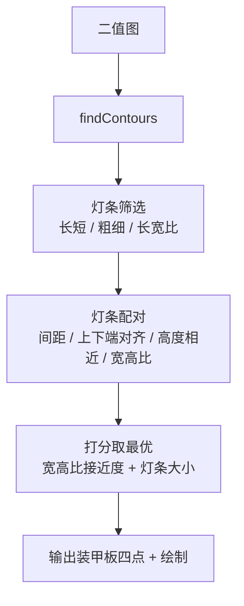
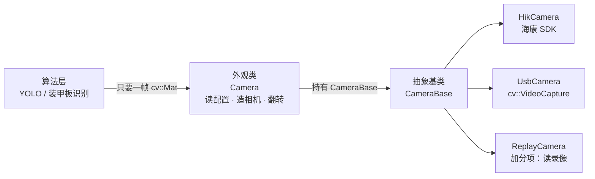
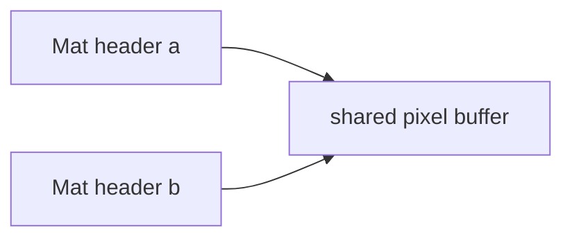
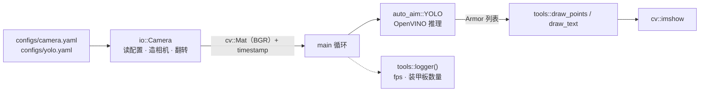

# 第二阶段培训：OpenCV -面向对象-现代C++

| 项目     | 内容                                                                                                                     |
| -------- | ------------------------------------------------------------------------------------------------------------------------ |
| 教学目标 | 用 OpenCV 传统方法识别装甲板并输出四个角点；能用类和对象组织代码； 能用抽象基类 + 多态封装出可复用组件，并串成一条流水线 |
| 教学重点 | `cv::Mat` 与图像处理流水线；灯条筛选与配对的几何约束；封装、构造/析构、继承与多态；外观类 + 工厂解耦硬件与算法           |
| 教学难点 | 装甲板识别中「灯条 → 配对 → 四点」的几何推理与打分；用类把「数据 + 行为」封装成可复用组件                                |
| 考核方式 | 封装相机类体系并串成流水线：`CameraBase` + `HikCamera` / `UsbCamera` + 外观类 `Camera`，配置走 yaml，补齐 CMake 依赖     |

---

## 配套实例

`tutorial_2/example/` 下按知识点分目录，目录里就是上课要展示的真实代码：

| 示例                    | 目录                             | 对应教案              | 上课怎么跑                                                                     |
| ----------------------- | -------------------------------- | --------------------- | ------------------------------------------------------------------------------ |
| OpenCV · 基础 API 速览  | `example/opencv/opencv_basics.*` | 一、OpenCV（1.1~1.3） | `cmake --build build && ./build/opencv_basics`　或　`python3 opencv_basics.py` |
| OpenCV · 装甲板四点识别 | `example/opencv/`                | 一、OpenCV（1.4）     | `cmake -S . -B build && cmake --build build && ./build/armor_detect`           |

依赖安装、完整命令与预期输出见 `example/README.md`。

---

## 一、OpenCV

> **配套阅读**：[`example/opencv/opencv_intro.md`](example/opencv/opencv_intro.md) —— 下面 1.1~1.3 的「API 手册版」：滤波 / 二值化 / 边缘 / 形态学 / 轮廓等常用函数的 C++ 与 Python 对照、参数经验、常见坑。
> **配套可跑**：[`example/opencv/opencv_basics.cpp`](example/opencv/opencv_basics.cpp) / [`opencv_basics.py`](example/opencv/opencv_basics.py) —— 一次跑完 10 组 API，输出三张对比拼图。

### 1.1 OpenCV 是什么、`cv::Mat` 是什么

**概念**

- OpenCV（Open Source Computer Vision Library）= 一个跨平台的图像/视频处理库，C++ 接口，另有 Python 绑定（`opencv-python`）。
- 我们这一阶段只用它的**传统图像处理**能力，不碰深度学习模块。

**`cv::Mat` 是核心数据结构**，可以理解为「带元信息的二维数组」：

| 成员            | 含义                                        |
| --------------- | ------------------------------------------- |
| `rows` / `cols` | 高 / 宽（注意顺序：先是行=高）              |
| `type()`        | 元素类型，如 `CV_8UC3` = 8 位无符号、3 通道 |
| `channels()`    | 通道数：灰度 1，彩色 3（BGR，**不是 RGB**） |
| `at<T>(y, x)`   | 访问像素（先 y 后 x）                       |
| `clone()`       | 深拷贝一份独立数据                          |

**引用计数**：`cv::Mat b = a;` 只是共享同一块数据（浅拷贝），改 `b` 会影响 `a`。要独立副本用 `a.clone()`。

**最小实例**

```cpp
#include <opencv2/opencv.hpp>

int main() {
    cv::Mat img = cv::imread("armor.png");          // 默认读成 BGR 三通道
    if (img.empty()) {                              // 读失败一定要先判断
        std::cerr << "图像读取失败\n";
        return 1;
    }

    std::cout << "尺寸 " << img.cols << "x" << img.rows
              << "，通道数 " << img.channels() << '\n';

    cv::Mat gray;
    cv::cvtColor(img, gray, cv::COLOR_BGR2GRAY);    // 转灰度：识别流程的第一步

    cv::imshow("gray", gray);
    cv::waitKey(0);                                 // 0 = 一直等按键
    return 0;
}
```

### 1.2 环境搭建与最小 CMake 工程

```bash
# Ubuntu 22.04
sudo apt update
sudo apt install -y libopencv-dev pkg-config

pkg-config --modversion opencv4      # 看版本，4.5.4 是 22.04 自带的
```

**最小 CMakeLists.txt**（关键就是多一个 `find_package`）：

```cmake
cmake_minimum_required(VERSION 3.16)
project(armor_detect LANGUAGES CXX)

set(CMAKE_CXX_STANDARD 17)
set(CMAKE_CXX_STANDARD_REQUIRED ON)

find_package(OpenCV REQUIRED)                    # ← 找 OpenCV

add_executable(armor_detect armor_detect.cpp)
target_include_directories(armor_detect PRIVATE ${OpenCV_INCLUDE_DIRS})
target_link_libraries(armor_detect PRIVATE ${OpenCV_LIBS})
```

```bash
cmake -S . -B build && cmake --build build
./build/armor_detect              # 直接跑，读 demo/bule_armoe.jpg 并识别
```

> 跑完会弹两个窗口：左边是「灰度 / 二值化 / 滤波」三格拼图，右边是识别结果；
> 同时存下 `debug_stages.png`（中间过程）和 `result.png`（结果）。
> 服务器 / 容器里没有显示环境时，用 `NO_WINDOW=1 ./build/armor_detect` 只存图不开窗。

> 手写 g++ 也可以，但要写全路径太麻烦，所以 OpenCV 工程一律用 CMake：
> `g++ $(pkg-config --cflags --libs opencv4) armor_detect.cpp -o armor_detect`

### 1.3 图像处理基本流程

自瞄里 90% 的传统视觉代码都是这五步的组合：


```mermaid
flowchart LR
    A["原图 BGR"] -->|cvtColor| B["灰度"]
    B -->|threshold| C["二值图"]
    C -->|morphologyEx| D["去噪"]
    D -->|findContours| E["轮廓"]
    E -->|minAreaRect / 筛选| F["目标"]
```

| 步骤     | 函数                                                                                     | 干什么                               |
| -------- | ---------------------------------------------------------------------------------------- | ------------------------------------ |
| 转灰度   | `cv::cvtColor(src, dst, cv::COLOR_BGR2GRAY)`                                             | 3 通道 → 1 通道，后续处理快 3 倍     |
| 二值化   | `cv::threshold(gray, bin, 0, 255, cv::THRESH_BINARY \| cv::THRESH_OTSU)`                 | OTSU 自动找阈值，比手填 127 稳       |
| 形态学   | `cv::morphologyEx(bin, bin, cv::MORPH_OPEN, kernel)`                                     | 开运算去小噪点，闭运算补空洞         |
| 找轮廓   | `cv::findContours(bin, contours, hierarchy, cv::RETR_EXTERNAL, cv::CHAIN_APPROX_SIMPLE)` | `RETR_EXTERNAL` 只取最外层           |
| 拟合形状 | `cv::minAreaRect(contour)` / `cv::boundingRect(contour)`                                 | 旋转矩形适合灯条，正矩形适合快速判断 |

**二值化的颜色坑**：任务书上的装甲板是「红蓝配色」，但在 BGR 里**红色是 `(0,0,255)`、蓝色是 `(255,0,0)`**。要单独提红色，得用 HSV 空间：

```cpp
cv::Mat hsv, mask;
cv::cvtColor(img, hsv, cv::COLOR_BGR2HSV);

// 红色横跨 0 度，要分两段
cv::Mat m1, m2;
cv::inRange(hsv, cv::Scalar(0,   100, 100), cv::Scalar(10,  255, 255), m1);
cv::inRange(hsv, cv::Scalar(160, 100, 100), cv::Scalar(180, 255, 255), m2);
cv::bitwise_or(m1, m2, mask);
```

### 1.4 用传统方法识别装甲板

**整体思路**：装甲板由**两条平行灯条**构成，所以先找灯条，再把灯条两两配对，最后用配对成功那两条灯条的端点组成装甲板的**四个角点**。


```mermaid
flowchart TD
    A[二值图] --> B[findContours]
    B --> C["灯条筛选<br/>长短 / 粗细 / 长宽比"]
    C --> D["灯条配对<br/>间距 / 上下端对齐 / 高度相近 / 宽高比"]
    D --> E["打分取最优<br/>宽高比接近度 + 灯条大小"]
    E --> F["输出装甲板四点 + 绘制"]
```

**第一步：灯条筛选**

灯条的几何特征是「细长的竖直亮条」。四个约束全部写成「相对整图尺寸」，换分辨率不用改参数：

```cpp
bool isLightBar(const LightBar &bar, const cv::Size &img) {
    if (bar.height < img.height * 0.05f) return false;  // 太短：背景噪点
    if (bar.height > img.height * 0.60f) return false;  // 太长：灯管 / 背景边缘
    if (bar.width  < 2.0f)               return false;  // 太细：噪点
    if (bar.width  > img.width * 0.08f)  return false;  // 太粗：装甲板上的白色数字等大色块

    const float ratio = bar.height / std::max(bar.width, 1.0f);
    return ratio >= 1.5f && ratio <= 15.0f;             // 不够细长就不是灯条
}
```

> **为什么要卡宽度**：装甲板上那个白色数字在灰度图里比灯条还亮，`minAreaRect` 出来的长宽比也能落进 1.5~15。但它的宽度约占图宽的 30%，远超 8%，一条约束就挡掉了。**只筛长宽比是不够的。**

**第二步：灯条归一化**

把旋转矩形变成「上端点 + 下端点」，后面算间距、算对齐都方便：

```cpp
LightBar makeLightBar(const cv::RotatedRect &rect) {
    cv::Point2f pts[4];
    rect.points(pts);

    // 四个顶点按 y 排序：y 最小的两点构成上边，y 最大的两点构成下边
    std::vector<cv::Point2f> p(pts, pts + 4);
    std::sort(p.begin(), p.end(),
              [](const cv::Point2f &a, const cv::Point2f &b) { return a.y < b.y; });

    LightBar bar;
    bar.rect   = rect;
    bar.top    = (p[0] + p[1]) * 0.5f;
    bar.bottom = (p[2] + p[3]) * 0.5f;
    bar.height = static_cast<float>(cv::norm(bar.top - bar.bottom));
    bar.width  = std::min(rect.size.width, rect.size.height);
    return bar;
}
```

**第三步：灯条配对**

五个几何约束，全部满足才可能是一块装甲板：

```cpp
std::optional<Armor> tryMatch(const LightBar &a, const LightBar &b, const cv::Size &img) {
    const LightBar &L = (a.top.x < b.top.x) ? a : b;   // 约定：左、右
    const LightBar &R = (a.top.x < b.top.x) ? b : a;

    // ① 间距合理。上限放到 0.95 倍图宽：贴脸拍时装甲板几乎占满画面
    const float gap = static_cast<float>(cv::norm(L.top - R.top));
    if (gap < 10.0f || gap > img.width * 0.95f) return std::nullopt;

    // ②③ 上下端点应该大致在同一水平线上
    if (std::abs(L.top.y    - R.top.y)    > L.height * 0.6f) return std::nullopt;
    if (std::abs(L.bottom.y - R.bottom.y) > L.height * 0.6f) return std::nullopt;

    // ④ 高度相近（同一块装甲板上的两根灯条是一样长的）
    const float hr = L.height / std::max(R.height, 1.0f);
    if (hr < 0.6f || hr > 1.67f) return std::nullopt;

    // ⑤ 宽高比合理（这一步挡掉大部分随机配对）
    const float avg_h  = (L.height + R.height) * 0.5f;
    const float aspect = gap / std::max(avg_h, 1.0f);
    if (aspect < 1.0f || aspect > 5.0f) return std::nullopt;

    Armor armor;
    armor.found  = true;
    armor.left   = L;
    armor.right  = R;
    armor.aspect = aspect;
    // 得分 = 宽高比接近程度 + 灯条相对大小
    armor.score = -std::abs(aspect - kIdealAspect) +
                  kSizeWeight * (avg_h / static_cast<float>(img.height));
    return armor;
}
```

> **为什么不能只比宽高比**：实测这张图里，真装甲板的宽高比是 **2.64**，而背景顶部一条边凑出来的假配对是 **2.37**。按「离 2.5 越近越好」打分，假的反倒赢了。加上「灯条越大越可能是真目标」这一项之后，真目标 0.520、假目标 0.055，差距立刻拉开。现场用 `DEBUG_PAIRS=1` 就能看到这几行对比。

**第四步：输出四个角点**

```cpp
// 顺序固定为：左上 → 右上 → 右下 → 左下
const std::vector<cv::Point2f> corners = {armor.left.top, armor.right.top,
                                          armor.right.bottom, armor.left.bottom};
```

这四个点就是本节的最终输出，后面做位姿解算（`solvePnP`）时直接喂进去。

**第五步：绘制**

```cpp
// 文字和线宽随图片尺寸缩放，否则在大图上根本看不清
const double scale = std::max(0.6, img.cols / 1200.0);

for (int i = 0; i < 4; ++i) {
    cv::line(img, corners[i], corners[(i + 1) % 4], cv::Scalar(0, 255, 0), 2);
    cv::circle(img, corners[i], 8, cv::Scalar(0, 255, 0), cv::FILLED);
}
```

完整可运行版本：`example/opencv/armor_detect.cpp`，用仓库自带的 `demo/bule_armoe.jpg` 实测通过。


<!-- constexpr double LIGHTBAR_LENGTH = 56e-3;     // m，灯条长度 56mm
constexpr double BIG_ARMOR_WIDTH = 230e-3;    // m，大装甲板宽度
constexpr double SMALL_ARMOR_WIDTH = 135e-3;  // m，小装甲板宽度 -->

---

## 二、C++ 面向对象

### 2.1 从「一堆函数」到「一个对象」

第一阶段我们是这样写向量库的：

```cpp
struct Vec2 { double x = 0.0; double y = 0.0; };
double length(const Vec2& v);          // 数据和行为是分开的
```

能用，但有两个问题：

1. **数据不被保护**：没人拦得住你写 `Vec2 v{1e308, 1e308}`，或者把 `x` 改成非法值。
2. **改一处要动全身**：如果以后「向量」变成了必须在极坐标下表示，所有调用 `v.x` 的代码都得改。

面向对象要做的第一件事，就是把**数据和行为绑定在一起，并把数据保护起来**。

换成机器人，这个问题更刺眼——「每台机器人都有血量」，面向过程只能靠命名去区分：

```cpp
int  infantry_hp = 400;        // 全局变量：谁都能改，改错了编译器也不管
int  hero_hp     = 800;
void infantry_hurt(int damage);
void hero_hurt(int damage);    // 每加一种机器人，变量和函数就得再来一份
```

以后要加哨兵、无人机，这套东西就要再翻一倍。写成**类**以后，这些状态只活在属于自己的**对象**里（见 2.2）。

### 2.2 类与对象

**概念**

| 术语            | 含义                                           |
| --------------- | ---------------------------------------------- |
| 类（class）     | 类型，是「图纸」                               |
| 对象（object）  | 类的实例，是「按图纸造出来的东西」             |
| 成员变量        | 对象的状态（数据）                             |
| 成员函数 / 方法 | 对象能做的事（行为）                           |
| `this`          | 指向「当前这个对象」的指针，成员函数里隐式可用 |

`struct` 和 `class` 在 C++ 里**唯一的区别是默认访问权限**：`struct` 默认 `public`，`class` 默认 `private`。所以第一阶段写的 `struct Vec2` 其实已经是一个类了。

**最小实例**

```cpp
class Vec2 {
public:
    Vec2(double x, double y) : x_(x), y_(y) {}   // 构造函数：造对象时自动调用

    double x() const { return x_; }              // getter：只读
    double y() const { return y_; }
    double length() const;                       // 行为和数据放在一起
    void   scale(double k);                      // 修改状态

private:
    double x_ = 0.0;                             // 成员变量加 _ 后缀，和参数区分
    double y_ = 0.0;
};

double Vec2::length() const {
    return std::sqrt(x_ * x_ + y_ * y_);
}

void Vec2::scale(double k) {
    x_ *= k;
    y_ *= k;
}
```

```cpp
Vec2 v{3.0, 4.0};        // 栈上创建对象，自动调用构造函数
std::cout << v.length(); // 5
v.scale(2.0);            // 通过方法改状态
// v.x_ = 999;           // ❌ 编译错误：private，外部碰不到
```

> **`const` 写在函数后面** = 「这个函数不修改对象状态」。养成习惯，读接口的人一眼就知道哪些操作有副作用。带 `const` 的成员函数才能被 `const` 对象调用。

**换个例子：机器人也是对象**

同一套写法搬到 RoboMaster 的机器人上——**数据**是名字和血量，**行为**是「挨打」，两者绑在一个类里，而血量外面改不了：

```cpp
class Robot {
public:
    Robot(std::string name, int hp) : name_(std::move(name)), hp_(hp) {}

    const std::string& name() const { return name_; }   // 只读：外面只能看
    bool alive() const { return hp_ > 0; }
    void hurt(int damage);                              // 想改状态？走方法

private:
    std::string name_;
    int  hp_ = 0;                                       // private：外面碰不到
};

void Robot::hurt(int damage) {
    hp_ = std::max(0, hp_ - damage);                    // 「血量不为负」这条规则只在这里维护
}
```

```cpp
Robot infantry{"步兵", 400};
infantry.hurt(600);
std::cout << infantry.name() << " 还活着吗？"
          << (infantry.alive() ? "是" : "否") << '\n';

// infantry.hp_ -= 100;   // ❌ 编译错误：血量不许在外面乱改
```

> 什么时候才需要拆出子类？看 2.4：步兵 / 重装 / 哨兵 / 无人机**各自的行为不一样**（热量上限、移动方式都不同），才值得继承。

### 2.3 封装：构造函数、析构函数、访问控制

**三个访问级别**

| 关键字      | 谁能访问     | 什么时候用                           |
| ----------- | ------------ | ------------------------------------ |
| `public`    | 所有人       | 对外接口（想让人怎么用，就暴露什么） |
| `protected` | 自己和派生类 | 想给子类用、但不给外人用             |
| `private`   | 只有自己     | 内部状态，默认都放这儿               |

**构造函数 / 析构函数**

无人机「起飞」要占资源，「降落」要还回去。把这两件事交给构造和析构，用户就**永远没机会忘记降落**：

```cpp
class Drone {
public:
    explicit Drone(int id) : id_(id) {
        takeoff();                                   // 构造：拿资源
    }

    ~Drone() {
        land();                                      // 析构：还资源
        std::cout << "无人机#" << id_ << " 已降落\n";
    }

private:
    void takeoff() { std::cout << "无人机#" << id_ << " 起飞\n"; }
    void land()    { /* 关桨、断链路、保存日志 */ }

    int id_ = 0;
};

void patrol() {
    Drone drone{7};        // 进作用域 → 构造 → 起飞
    // ... 巡逻 ...
}                          // 出作用域 → 自动析构 → 降落，不用手写 land()
```

`explicit` 防止 `Drone drone = 7;` 这种隐式转换悄悄发生——单参数构造函数建议都加上。

**对象生命周期（RAII）**：对象在作用域结束时自动析构，所以「构造函数里拿资源、析构函数里放资源」是 C++ 最核心的编程范式——上面 `patrol()` 里的 `drone` 一出作用域就自动降落，你不需要也不该手写 `land()`。

哨兵自动巡逻、工业相机取图、`std::vector` 申请内存……全是同一个套路：**谁申请、谁释放，而且由对象生命周期自动完成**。

### 2.4 继承与多态

**概念**

- **继承**：`class Infantry : public Robot` —— 「步兵**是**一种机器人」，而不是「步兵**有**一个机器人」。
- **多态**：用基类指针/引用调用，运行期自动执行到派生类的实现。
- **虚函数**：`virtual` 标记「这个函数允许被派生类改写」。
- **纯虚函数**：`= 0`，只声明不实现，含纯虚函数的类叫**抽象基类**，不能实例化。
- **虚析构**：基类的析构函数必须是 `virtual`，否则 `delete` 基类指针时派生类的析构不会被调用（资源泄漏）。

**最小实例：机器人等级体系**

RoboMaster 场上四种兵种正好对上这个结构——「都是一台机器人，但行为完全不同」，于是**共同点放进基类，差异留给派生类**：

```cpp
class Robot {
public:
    virtual ~Robot() = default;              // ⚠ 基类析构必须虚
    virtual void update() = 0;               // 纯虚：每帧各做各的事
    virtual int  heat_limit() const = 0;     // 纯虚：热量上限各不一样
    virtual std::string name() const = 0;
};

class Infantry : public Robot {              // 步兵
public:
    void update() override { /* 跟云台、走平衡底盘 */ }
    int  heat_limit() const override { return 120; }
    std::string name() const override { return "Infantry"; }
};

class Hero : public Robot {                  // 重装
public:
    void update() override { /* 大弹丸、抗伤 */ }
    int  heat_limit() const override { return 200; }
    std::string name() const override { return "Hero"; }
};

class Sentry : public Robot {                // 哨兵
public:
    void update() override { /* 自动巡逻、选目标 */ }
    int  heat_limit() const override { return 400; }
    std::string name() const override { return "Sentry"; }
};

class Drone : public Robot {                 // 无人机
public:
    void update() override { /* 飞行控制、抛弹 */ }
    int  heat_limit() const override { return 0; }
    std::string name() const override { return "Drone"; }
};
```

```cpp
// 使用方：不管来的是哪台机器人，同一行代码就能驱动它
void spin(std::vector<std::unique_ptr<Robot>>& robots) {
    for (auto& robot : robots) {              // 多态：运行期决定调谁
        robot->update();
        std::cout << robot->name() << " 热量上限 " << robot->heat_limit() << '\n';
    }
}
```

> 注意 `spin()` 里**没有** `Infantry` / `Hero` / `Sentry` / `Drone` 这几个名字，也没有 `if (type == ...)`——运行期决定调谁，这正是 2.5 的重点：使用方只认基类。

`override` 关键字不是必须的，但**强烈建议写**：写错函数签名时编译器会直接报错，而不是默默变成「另一个新函数」。

概念和例子的对应关系：

| 概念           | 机器人例子                               |
| -------------- | ---------------------------------------- |
| 抽象基类       | `Robot`                                  |
| 派生类         | `Infantry` / `Hero` / `Sentry` / `Drone` |
| 纯虚函数       | `update()`、`heat_limit()`               |
| 基类指针容器   | `std::vector<std::unique_ptr<Robot>>`    |
| 使用方只认基类 | `spin(Robot&)`                           |

> 同样的结构在作业里到处都是：`io` 层是 `CameraBase`（抽象基类）+ `Camera`（外观类），`tasks/yolo.hpp` 里是 `YOLOBase` + `YOLO`。基类为什么叫 `CameraBase` 而不是 `Camera`？因为 `Camera` 这个名字留给了**外观类**（见 2.5）——负责「读配置、造相机、翻转图像」的门面。两个名字分工不同，不要混用。

### 2.5 yolo类的使用

yolo是一类非常经典的单阶段目标检测算法，相较于传统的opencv的灯条识别来说，它的鲁棒性更强，受光照条件的影响较小。所以可以提升自瞄框架中的detector的检测精度，和抗干扰能力。

```cpp
// yolo 头文件
#include "tasks/yolo.hpp"
// 获取yolo配置文件 auto推导
auto yolo_config = cli.get<std::string>("yolo");    // basic_string<char>
// 初始化yolo对象
auto_aim::YOLO yolo(yolo_config, true);
// 调用yolo detector 方法 创建armors[];
const std::list<auto_aim::Armor> armors = yolo.detect(img, frame_count++);
```

### 2.6 基于相机类的开发 (作业)

**为什么要抽象一层**

第三阶段的自瞄工程里，`io` 层就是 `CameraBase / HikCamera / UsbCamera`。原因很实际：

- 算法（识别装甲板）只想说「给我一帧图」，不关心图是从工业相机、USB 摄像头还是录像文件来的。
- 换硬件时只改一个地方：在 `Camera` 外观类里多一条 `else if`，算法代码一行不动。



```mermaid
flowchart LR
    A["算法层<br/>YOLO / 装甲板识别"] -->|"只要一帧 cv::Mat"| F["外观类<br/>Camera<br/>读配置 · 造相机 · 翻转"]
    F -->|"持有 CameraBase"| I["抽象基类<br/>CameraBase"]
    I --> H["HikCamera<br/>海康 SDK"]
    I --> U["UsbCamera<br/>cv::VideoCapture"]
    I --> R["ReplayCamera<br/>加分项：读录像"]
```

**接口只做一件事：交出一帧图 + 时间戳**

相机对外只做一件事——**交出一张 BGR 的 `cv::Mat`**（外加一个时间戳）。取图失败时不必再设计一套返回值：把 `img` 留空即可，调用方用 `img.empty()` 判断。`open()` / `close()` 这类资源操作外面根本看不到，全部由构造函数和析构函数兜住。

**使用方只认外观类**

```cpp
// 使用方：手上只有 Camera，底下是海康还是 USB 一律不管
int main() {
    io::Camera camera("configs/camera.yaml");
    auto_aim::YOLO yolo("configs/yolo.yaml", true);

    int frame_count = 0;
    while (true) {
        cv::Mat img;
        std::chrono::steady_clock::time_point timestamp;
        camera.read(img, timestamp);
        if (img.empty()) continue;          // 取图失败：空图就是信号
        const auto armors = yolo.detect(img, frame_count++);
        // 画框、打日志、imshow …… 见作业 main.cpp
        if (cv::waitKey(1) == 'q') break;
    }
}
```

> 上面这段是**结构示意**（依赖 OpenCV / yaml-cpp / fmt），按作业的 CMake 工程编译，不追求单独能跑。
> 相机怎么造、参数怎么读、图像怎么翻转，全都收在 `Camera` 外观类里——那正是作业要你写的 `io/my_camera.hpp` / `.cpp`。

**参数一律走配置**

作业要求相机参数全部从 `configs/camera.yaml` 读，业务代码里不许出现 `YAML::LoadFile`：

```cpp
auto yaml = tools::load("configs/camera.yaml");
auto camera_name = tools::read<std::string>(yaml, "camera_name");  // 缺 key → 报错退出
auto exposure_ms = tools::read<double>(yaml, "exposure_ms");
auto flip_code   = tools::read<int>(yaml, "flip_code", 2);         // 给了默认值，缺 key 不报错
```

好处很直接：换一台相机、改一次曝光，**只改 yaml，不重编代码**。第三阶段的自瞄工程就是这么写的。


---
## 四、现代C++
能读懂真实项目

自瞄流水线
Camera->Image->Detector->Tracker->Aimer->Gimbal

代码的本质：数据在各个模块之间的流动

作用域：
A::B 去A的作用域下面找B
cv::Mat     OpenCV的cv里的Mat
std::vector   std库下的vector
auto_aim::YOLO   auto_aim模块中的YOLO

这些名称属于哪个模块
作用域原因：为了区分

找
a.b()

p->b()

A::b()

vector<Armor> = 一组Armor = Armor[n] 但vector可拓展
<T> T为所存模板


auto 自动推导

编译器在编译期确定其类型
```cpp
auto yolo_config = cli.get<std::string>("yolo");    // basic_string<char>
```
auto 不可滥用

Reference 引用
```cpp
Armor armor_origin;
Armor & a = armor_origin;  // a是armor_origin的引用，a和armor_origin指向同一块内存
```
a仅仅是armor_origin的别名，a和armor_origin是同一块内存
```cpp
auto_aim::YOLO yolo(config_path);
auto_aim::Solver solver(config_path);
vector<Armor> armors = yolo.detect(img);4
const auto& armor = armors.front();
auto image_points = solver.reproject_armor(armor,...);
```

对象与数据

管理者与被管理的数据

```cpp
std::vector<float> numbers(300);  // 300个float的vector
```
vector object
size capacity
data*
使用对象的引用或指针来访问数据

&v 与 v.data() 的区别

&v  // v的地址
v.data()  // vector管理的数组的地址

Stack / Heap 的简化模型
stack                                                   Heap
int x                                               vector elements
vector<int> v(300)                    -> 管理         image pixels
cv::Mat img(480, 640, CV_8UC3)                      dynamic objects

stack 空间小 c++自动管理
heap 空间大

stack 对象有明确的生命周期，离开作用域就自动析构

```mermaid
flowchart LR
    A[born] --> B[构造-对象建立所需要的工作]
    B --> C[离开作用域]
    C --> D[析构-对象死亡所需要的工作]
    D --> E[死亡-释放资源]
```

RAII: 资源跟着对象自动管理
```mermaid
flowchart LR
    A[对象构造-申请资源] --> B[对象析构-释放资源]   // 箭头上标注 获取/使用资源
```

vector 管理内存 ifstream 管理文件句柄
unique_ptr 管理动态对象 lock_guard 管理互斥锁

从类型读所有权
```cpp
Amror* void detector(Amror*armor); // 指向Armor的指针，单看类型无法判断谁拥有它的所有权
Armor& void solver(const Armor&armor); // 借用已有的Armor,

std::unique_ptr<Armor> a;     // 单独占有，自动释放
std::shared_ptr<Armor> a;     // 多个共享，最后1个所有者释放
```
类型同时会告诉你：指向什么 + 谁部分释放

小结

```mermaid
flowchart LR
    A[Stack/Heap]-->B[对象=!数据]-->C[Lifetime]-->D[RAII]-->E[ownership]
```
### Copy
```cpp
void s(std::vector<float> c);
std::vector<float> b = a;
s(a);  // 
```
a 1000个元素的vector
b/c 1000个元素的vector

> 元素数据独立
copy 复制什么，由类型决定

### std::move 这个对象后面的资源可以被接管
Copy                        Move
A. large data               A data 转交资源
B. another large data       B same large data

move 后对象仍然合法，但不要依赖于它原来的内容

实例写在exp2.cpp中(只读借用，move,copy性能分析)

### cv::Mat 不是不只是像素
cv::Mat img = 图像管理对象 + 图像视图
cv::Mat header
rows cols type
step reference info
data*

> Mat对象很小，实际像素通常在单独的数据区
```cpp
CV_8UC3 8bit unsigned 3 channel     BGR
CV_32FC1 32bit float 1 channel
cv::Mat b = a; // 两个Mat, 一份像素
```


```mermaid
flowchart LR
    A[Mat header a] --> C[shared pixel buffer]
    B[Mat header b] --> C[shared pixel buffer]

```
> 所以修改b的像素，a也会看到变化(此处为浅拷贝)

### 需要独立像素时，用clone()

```cpp
cv::Mat b = a.clone();
```

```mermaid
flowchart LR
A[pixel buffer A] --> B[pixel buffer B] //箭头上在加上deep copy
```
> 目标时生成独立，不是转移已有数据

实例写在exp3.cpp中(探索深拷贝与浅拷贝)
addNoiseColor()目标时CV_8UC3的彩色图像，创建于输入图像对应的随机噪声，返回添加噪声的新图像(图像用tutorial_2/example/opencv/demo/bule_armoe.jpg)

---

## 五、第二阶段作业

> 把「相机」抽象成一个类体系（抽象基类 `CameraBase` + 派生类 `HikCamera` / `UsbCamera` + 外观类 `Camera`），
> 参数全部走 `configs/camera.yaml`；再把它和 `YOLO` 识别串成一条流水线：**取图 → 识别 → 画框 → 显示**，
> 最后补齐 CMake 的链接依赖。
>
> 完整题目、要求、文件结构与加分项见 [`homework_2.md`](homework_2.md)。

要交的五样东西，以及它们对应的本节知识点：

| #   | 内容                                                               | 对应知识点                                      |
| --- | ------------------------------------------------------------------ | ----------------------------------------------- |
| 1   | `io/my_camera.hpp` / `.cpp`：`CameraBase` + `HikCamera` + `Camera` | 2.2 ~ 2.5：封装、继承、多态、外观类 / 工厂      |
| 2   | 派生类 `UsbCamera`（用 `cv::VideoCapture` 读 USB 摄像头）          | 2.4 ~ 2.5：同一套接口，换一种实现只加一个派生类 |
| 3   | `configs/camera.yaml` + 用 `tools/yaml.hpp` 读配置                 | 2.5：数据（配置）与代码分开，换相机不重编       |
| 4   | `main.cpp`：取图 → `YOLO` 识别 → 画框 → 显示                       | 一、OpenCV · 1.4 + 把各部分编排成流水线         |
| 5   | CMake 依赖补齐（`main` 与 `example` 都要链接通过）                 | 工程习惯：谁用了什么，就给谁链接什么            |

**验收方式**

```bash
cmake -S . -B build && cmake --build build
./build/main                                               # 默认读 configs/ 下的两个 yaml
./build/main -c configs/camera.yaml -y configs/yolo.yaml   # 也可以显式指定
```

跑起来后画面上要能看到装甲板的四个角点，日志里持续打印 fps 和识别到的装甲板数量。

### 流水线


```mermaid
flowchart LR
    CFG["configs/camera.yaml<br/>configs/yolo.yaml"] --> CAM["io::Camera<br/>读配置 · 造相机 · 翻转"]
    CAM -->|"cv::Mat（BGR）+ timestamp"| MAIN["main 循环"]
    MAIN --> DET["auto_aim::YOLO<br/>OpenVINO 推理"]
    DET -->|"Armor 列表"| DRAW["tools::draw_points / draw_text"]
    DRAW --> SHOW["cv::imshow"]
    MAIN -.-> LOG["tools::logger()<br/>fps · 装甲板数量"]
```

一句话：**相机只负责给出一张 BGR 的 `cv::Mat`，识别只负责给出一串 `Armor`，两边都不知道对方是谁。**

> 识别这一步作业里已经给好了（`tasks/yolo.hpp`，OpenVINO 推理）。1.4 节手写的传统方法不必搬进作业，
> 它帮你理解的是「找目标 → 输出四个角点」这件事本身；工程里换成了更稳的深度学习方法。

---

## 四、参考资料

**OpenCV**

- OpenCV 官方教程（C++）：https://docs.opencv.org/4.x/d9/df8/tutorial_root.html
- OpenCV 官方文档 · 图像处理模块：https://docs.opencv.org/4.x/d7/dbd/group__imgproc.html
- 传统装甲板识别参考思路（RoboMaster 社区大量开源实现可作对照）

**C++ 面向对象**

- 菜鸟教程 · C++ 类与对象：https://www.runoob.com/cplusplus/cpp-classes-objects.html
- 菜鸟教程 · C++ 多态：https://www.runoob.com/cplusplus/cpp-polymorphism.html
- C++ Core Guidelines（进阶，看 F 和 C 章节）：https://isocpp.github.io/CppCoreGuidelines/

**C++ 继承、多态与智能指针（补充）**

- cppreference · 虚函数与虚析构： https://en.cppreference.com/w/cpp/language/virtual
- cppreference · `std::unique_ptr`：https://en.cppreference.com/w/cpp/memory/unique_ptr
- C++ Core Guidelines · 继承与多态（C.35 ~ C.67）：https://isocpp.github.io/CppCoreGuidelines/

> 注：也可以适当参考 AI 进行学习，但要注意信息甄别，而且不要只让 AI 全程完成项目。
