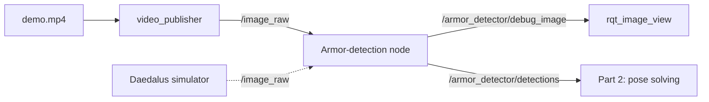

# Stage 3 Assignment

Corresponding lesson: [`tutorial_3.md`](tutorial_3.md) · Algorithm spec reference: [`../tutorial_2/example/opencv/armor_detect.cpp`](../tutorial_2/example/opencv/armor_detect.cpp)

> Grading has no weights and no scores — **every item below must pass individually.**

This stage has two parts, **graded separately**:

| Part   | Content                                                                                | Main things learned                                                        |
| ------- | ----------------------------------------------------------------------------------------- | ------------------------------------------------------------------------------ |
| Part 1  | ROS2 engineering: package the detection algorithm into a node that can run on video and also connect to simulation | Node (节点, jiédiǎn) / topic (话题, huàtí) / package (功能包, gōngnéng bāo) / custom messages / `cv_bridge` |
| Part 2  | Mathematical logic: work backward from the four pixel points to a pose, and compute the commands the gimbal (云台, yúntái) can execute | Coordinate-frame transformation / PnP / whole-vehicle modeling (整车建模, zhěngchē jiànmó) / EKF / ballistics |

---

## Part 1: The ROS2 Armor-Plate Detection Node

### 1.1 The Task

Turn the armor-plate four-point detection (the algorithm written in Stage 2) into a runnable **ROS2 package**, driven by a **video stream** instead of a single image.

Two nodes:

- `video_publisher` — reads `demo.mp4` and publishes it frame by frame to `/image_raw`
- `armor_detector` — subscribes to `/image_raw`, uses classic OpenCV methods to find the armor plate's **four corner points**
  (P0 top-left → P1 top-right → P2 bottom-right → P3 bottom-left), draws the result on the image, and publishes it



**Material**: [`../tutorial_2/example/opencv/demo/demo.mp4`](../tutorial_2/example/opencv/demo/demo.mp4) (544 × 960, 30 fps, ~173 s)

**How it will be graded**: start both nodes at once; `ros2 topic hz` should show a stable frequency, and in
`rqt_image_view` the armor plate's bounding box and P0–P3 should update frame by frame as the video plays.

> **This part is only responsible for "detect + publish."** Working backward from the four points to a pose (solving) is handled in
> Part 2 of this assignment — once the solver is built there, it subscribes directly to `/armor_detector/detections`; the code
> here doesn't need to change.

### 1.2 Requirements

#### 1.2.1 Packages

Two `ament_cmake` packages. For `rm_interfaces`, **use the simulator's own package directly** (see §1.3); this assignment only adds two messages to it:

```
ros2_ws/src/
├── rm_interfaces/                 # the interface package that ships with the simulator
│   ├── package.xml
│   ├── CMakeLists.txt
│   └── msg/
│       ├── Armor.msg              # the original 16, do not change these
│       ├── Point2d.msg
│       ├── GimbalCmd.msg
│       ├── ...
│       ├── ArmorDetection.msg     # ← new in this assignment
│       └── ArmorDetections.msg    # ← new in this assignment
└── armor_detector/                # the two nodes
    ├── package.xml
    ├── CMakeLists.txt
    ├── include/armor_detector/armor_detector.hpp
    └── src/
        ├── armor_detector_node.cpp
        └── video_publisher_node.cpp
```

#### 1.2.2 Message Definitions

```msg
# rm_interfaces/msg/ArmorDetection.msg

# Four corner points, fixed order: P0 top-left → P1 top-right → P2 bottom-right → P3 bottom-left
# Reuse the Point2d already in this package, following the same style as RuneTarget.msg's pts
Point2d[4] pts

# "small" / "big", field name kept consistent with Armor.msg
string type

# pixel distance from the armor plate's center to the image center, field name kept consistent with Armor.msg
float32 distance_to_image_center

# light-bar pairing score — higher is more trustworthy, used for tuning
float32 score
```

```msg
# rm_interfaces/msg/ArmorDetections.msg

std_msgs/Header header
ArmorDetection[] detections
```

#### 1.2.3 Topic Interface

| Node               | Direction | Topic                          | Type                                 |
| -------------------- | ----------- | --------------------------------- | ---------------------------------------- |
| `video_publisher`  | publish   | `/image_raw`                   | `sensor_msgs/msg/Image`              |
| `armor_detector`   | subscribe | `/image_raw`                   | `sensor_msgs/msg/Image`              |
| `armor_detector`   | publish   | `/armor_detector/debug_image`  | `sensor_msgs/msg/Image`              |
| `armor_detector`   | publish   | `/armor_detector/detections`   | `rm_interfaces/msg/ArmorDetections`  |

The topic names and message types need to line up exactly — **this is the only integration contract**; the ballistic
solving in Part 2 of this assignment will subscribe directly to `/armor_detector/detections`.

The name and type of `/image_raw` are kept consistent with the simulator, so that `video_publisher` can be swapped out for the simulator directly.

#### 1.2.4 Item-by-Item Requirements

1. **Separate the algorithm from the node**: wrap the detection logic in an `ArmorDetector` class that exposes only a single `detect(const cv::Mat&)` to the outside. The node's callback (回调, huídiào) should only do "image conversion → call `detect` → assemble the message + draw → publish" — **the algorithm must not be written inside the callback.**
2. **Classic method**: grayscale → binarize → morphology → contours → light-bar filtering → light-bar pairing → output four points. Neural networks are not allowed.
3. **Centralize parameters**: thresholds, aspect-ratio ranges, and the like should live in the `ArmorDetector::Params` struct, not be scattered through the middle of functions.
4. **Image conversion**: convert between `sensor_msgs::msg::Image` and `cv::Mat` using `cv_bridge`. Use `toCvCopy` rather than `toCvShare` — you'll be binarizing and drawing lines afterward, and a shared view would directly modify the data inside the message. A failed conversion must be caught as `cv_bridge::Exception`; it must not crash the node.
5. **Empty detections**: when no armor plate is detected, **publish as usual** an `ArmorDetections` whose `detections` field is empty, and publish `debug_image` as usual too (drawing the raw image, without a box). It must never skip publishing, crash, or draw `NaN` coordinates.
6. **Fill the fields correctly**: `pts` holds **pixel coordinates** (not normalized); `type` is `"small"` / `"big"`, criterion up to you (aspect ratio is the most direct; this set of material should all be small armor plates); `distance_to_image_center` is the pixel distance from the armor plate's center to the image center.
7. **Timestamp**: the published message's `header.stamp` should be the current ROS time (`this->now()`) — don't leave it at 0.
8. **Node layering**: make `armor_detector` as much of a "thin node" (薄节点, báo jiédiǎn) as possible — the node only declares parameters and wires things together, and the algorithm lives in its own class, so the algorithm can be tested standalone without depending on ROS (this is exactly how Stage 2 was done).
9. **Video publishing**: `video_publisher` reads the mp4 with `cv::VideoCapture` and publishes on a timer at the target frame rate. The video path is passed in via a ROS2 parameter (`declare_parameter`) — don't hardcode it.
10. **Terminal output**: print the four corner-point coordinates of every detection, so it's easy to check them against what's shown in `rqt_image_view`. If printing everything at 30 Hz is too noisy, print once every N frames, or only when the result changes.
11. **Robustness**: white digits, cables, and background highlights must not produce false detections; the corner-point order must not scramble even on jittery frames — P0 must **always** be the top-left point.
12. **Build and run**: `colcon build` succeeds; both nodes can be started separately with `ros2 run`; `ros2 topic echo /armor_detector/detections --once` prints meaningful content.

### 1.3 Interfacing with the Daedalus Simulator

What this stage produces is **the same piece of code that can run on video and also connect to simulation.** This relies on two things:

1. `video_publisher` and the simulator **publish the same topic**: `/image_raw`, type `sensor_msgs/msg/Image`. So you can swap out `video_publisher` and launch the simulator directly, and `armor_detector` doesn't need a single line changed.
2. The interface package is the simulator's own **`rm_interfaces`** directly, rather than starting your own package under a different name — if the message types don't match, the two sides can't recognize each other.

#### The Simulator's ROS2 Interface

| Direction            | Topic                                                               | Type                                  |
| ---------------------- | ----------------------------------------------------------------------- | ----------------------------------------- |
| simulator publishes   | `/image_raw`                                                         | `sensor_msgs/msg/Image`               |
| simulator publishes   | `/image_compressed`                                                  | `sensor_msgs/msg/CompressedImage`     |
| simulator publishes   | `/camera_info`                                                       | `sensor_msgs/msg/CameraInfo`          |
| simulator publishes   | `/tf`                                                                 | `tf2_msgs/msg/TFMessage`              |
| simulator publishes   | `/gimbal_pose`, `/odom_pose`, `/muzzle_pose`, `/camera_pose`         | `geometry_msgs/msg/PoseStamped`       |
| simulator publishes   | `/livox/lidar`, `/simulator/marker`, `/simulator/tech_core/state`    | `sensor_msgs` / `visualization_msgs`  |
| simulator subscribes  | `/rm_gimbal/cmd`                                                      | `rm_interfaces/msg/GimbalCmd`         |

> The simulator subscribes to **`/rm_gimbal/cmd`**, with QoS `sensor_data`. The `/armor_solver/cmd_gimbal` name written
> in its README is outdated — go by the code (`src/ros2/topic.rs`).
>
> That topic is the output of Part 2 of this assignment (ballistic solving); for Part 1 it's enough to make sure `/image_raw` lines up.

#### What's Inside `rm_interfaces`

The interface package that ships with the simulator: 16 msg files + 2 srv files, with dependencies limited to `std_msgs` and `geometry_msgs`.
The ones relevant to armor plates:

| Message             | Content                                                                       | Purpose                         |
| --------------------- | --------------------------------------------------------------------------------- | ----------------------------------- |
| `Armor.msg`         | `number` / `type` / `distance_to_image_center` / `geometry_msgs/Pose pose`        | the result after PnP                |
| `Armors.msg`        | `Header` + `Armor[]`                                                              | same as above, as an array          |
| `Measurement.msg`   | `x1 y1 z1 yaw1` + `x2 y2 z2 yaw2`                                                 | the solver's input (two 3D solutions) |
| `RuneTarget.msg`    | `Header` + `Point2d[5] pts` + `is_lost` + `is_big_rune`                          | energy mechanism (能量机关)         |
| `Point2d.msg`       | `float32 x` + `float32 y`                                                        | a basic type                        |
| `GimbalCmd.msg`     | `pitch` / `yaw` / `yaw_diff` / `pitch_diff` / `distance`                         | gimbal command                      |

**There's no message in there for "the armor plate's four pixel corner points."** The `Armor` inside `Armors` carries a 3D `Pose`,
which is the product of solving; `Measurement` is the solver's input, and it's also 3D. So this assignment needs to add two new
messages, `ArmorDetection` / `ArmorDetections`, to `rm_interfaces`, with field names copied from the existing ones wherever possible
(`type` and `distance_to_image_center` both come from `Armor.msg`; the `Point2d[4] pts` style is copied from `RuneTarget.msg`).

#### How to Switch to Simulation During Grading

```bash
# 1. Only run the detector, don't start video_publisher
ros2 run armor_detector armor_detector_node

# 2. Start the simulator — it will publish images to /image_raw on its own
#    (inside the simulator, press F5 to toggle the auto-aim subscription)
```

If the box shows up normally, the integration has succeeded.

### 1.4 Acceptance Checklist

- [ ] `colcon build` succeeds, both packages build
- [ ] Both nodes started at once, `ros2 topic hz /image_raw` and `/armor_detector/debug_image` show a stable frequency
- [ ] The green box and P0–P3 can be seen updating frame by frame in `rqt_image_view`
- [ ] `ros2 topic echo /armor_detector/detections --once` shows `pts` as pixel coordinates and `stamp` not equal to 0
- [ ] The node doesn't crash when the video ends / frames drop / a frame is blank — it keeps publishing empty `detections` as usual
- [ ] After turning off `video_publisher` and starting the simulator, `armor_detector` still produces boxes with no code changes
- [ ] A search through the code finds no case of "the algorithm written inside the callback"; `armor_detector_node.cpp` contains no `cv::threshold` / `cv::findContours`

---

## Part 2: Pose Solving and Ballistic Solving

### 2.1 The Task

> Building on the detection results, complete **target pose solving and ballistic solving**, producing commands that can directly drive the gimbal.

**Input**: the armor plate's four corner points from Part 1's output (pixel coordinates) + camera intrinsics (相机内参, xiàngjī nèicān) + gimbal attitude
**Output**: the gimbal's target yaw/pitch angle + a fire recommendation

### 2.2 Stages to Build

| Stage                      | Input → Output                                                       |
| ----------------------------- | -------------------------------------------------------------------------- |
| Coordinate-frame transformation (坐标系转换) | pixel coordinates → camera frame → gimbal frame → world frame |
| PnP distance solving          | armor-plate four points + camera intrinsics → distance and pose            |
| Solver reconstructs target pose | armor-plate pose → vehicle-center pose (whole-vehicle modeling, 整车建模) |
| EKF prediction                 | historical pose sequence → predicted pose at the next time step            |
| Ballistic solving (弹道解算)   | predicted pose + muzzle velocity (弹速, dànsù) → gimbal yaw/pitch angle    |
| Fire-control system            | gimbal angle → fire recommendation; MPC trajectory planning (optional)     |

### 2.3 Acceptance Points (draft)

> Once "Part 2: Coordinate-Frame Transformation and Pose Solving" and "Part 3: Ballistic Solving and Fire Control" are filled in in `tutorial_3.md`, this will be expanded into an item-by-item acceptance checklist.

- [ ] Able to draw out the full coordinate-transformation chain "pixel → gimbal angle"
- [ ] Distance estimation comes with a reprojection error (重投影误差, chóng tóuyǐng wùchā) at a reasonable magnitude
- [ ] Able to produce lead (a forward offset) for a moving target, and have that lead vary with the target's speed
- [ ] Able to explain the source and calibration method for every parameter (camera intrinsics, extrinsics, muzzle velocity)
- [ ] Able to clearly explain what the EKF's state variables, motion model, and observation model each are

> To be filled in once the lesson material is complete.
