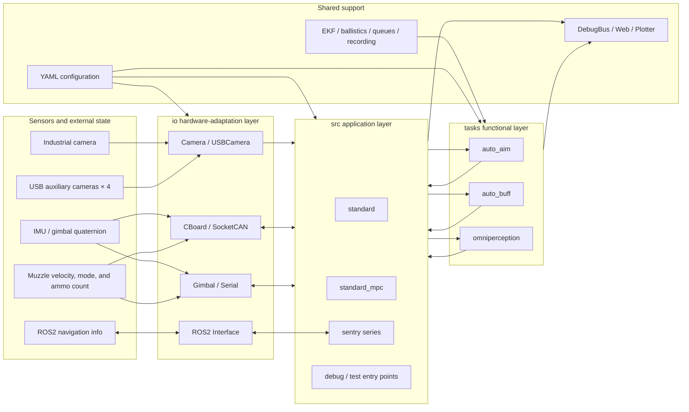

# Stage 3 Training: ROS2 Engineering and the Mathematical Logic of Auto-Aim

| Item              | Content                                                                                                                                       |
| ----------------- | -------------------------------------------------------------------------------------------------------------------------------------------- |
| Teaching goal      | Be able to package the detection algorithm into a ROS2 node and interface it with the simulator; be able to work backward from four pixel points to a target pose, and compute the commands the gimbal can execute |
| Teaching focus     | Node (节点) / topic (话题) / parameter (参数) / packages and custom messages / `cv_bridge`; coordinate-frame transformation, PnP, whole-vehicle modeling, EKF, ballistic solving |
| Teaching difficulty | The engineering habit of "separating the algorithm from the node"; how to convert between coordinate frames, and how to evaluate solving error |
| Assessment method  | Submit the Stage 3 assignment: a ROS2 armor-plate detection node (Part 1) + pose solving and ballistic solving (Part 2)                        |

---

## Accompanying Examples

This stage doesn't add a new algorithm example: the detection algorithm directly reuses Stage 2's
[`tutorial_2/example/opencv/armor_detect.cpp`](../tutorial_2/example/opencv/armor_detect.cpp);
for the ROS2 engineering, build the package yourself following Section 1 below and the assignment requirements.

Runtime environment: Ubuntu 22.04 + ROS2 Humble (installation commands are in the "Development Environment" section of the root-level [`Readme.md`](../Readme.md)).

---

## Overview: the Full Auto-Aim Pipeline



Using this diagram as a map for what this stage covers:

- **The `ROS2 Interface` in the `io` layer**: this stage's Section 1 — how the algorithm talks to the outside world.
- **`auto_aim` in the `tasks` layer**: this stage's Sections 2 and 3 — how four points turn into a gimbal angle.
- Stage 2's results (the `ArmorDetector` class, the `Camera` abstract class) are used here directly as components.

---

## Part 1: ROS2 Engineering

### 1.1 Why Auto-Aim Needs to Run on ROS2

In Stage 2 we already wrote "armor-plate four-point detection" as a class: feed it an image, get four points out.
But once it's on the robot, it's not a standalone program — it's one link in a larger chain:

- **Upstream**: the camera (or simulator) keeps supplying images, along with camera intrinsics, gimbal attitude, and timestamps;
- **Peers**: other nodes are running alongside it (energy-mechanism detection, a radar station...);
- **Downstream**: ballistic solving needs the detection result, and the gimbal driver needs the solving result.

These modules might be written by different people, in different languages, running on different machines — and you need to be
able to swap any one of them out for debugging at any time. What ROS2 provides is exactly this set of conventions for "how modules talk to each other":

| The effect you want                     | The ROS2 concept for it               | The example in auto-aim                                 |
| ------------------------------------------ | ------------------------------------------ | ------------------------------------------------------------ |
| Upstream pushes images to me               | **Topic** (publish / subscribe)            | subscribe to `/image_raw`, publish `/armor_detector/detections` |
| I want someone else to do a task and wait for the result | **Service**                       | manually trigger a calibration / reload parameters           |
| Change a parameter at startup without recompiling | **Parameter**                      | video path, binarization threshold, `kSizeWeight`            |
| Bundle several modules + launch with one command | **Package** + `ros2 launch`        | starting `video_publisher` + `armor_detector` together        |

In one sentence: **ROS2 isn't an algorithm — it's an engineering skeleton.** The algorithm is still the same thing from Stage 2; it's just wrapped in an extra shell.

### 1.2 Nodes, Topics, and Parameters

A **node** is a process with its own name that can send and receive messages. Subscriptions, publishers, and parameters are all created on the node:

```cpp
class ArmorDetectorNode : public rclcpp::Node {
public:
  ArmorDetectorNode() : Node("armor_detector") {
    // 1. Parameter: can be overridden from the command line, no need to change code and recompile
    video_path_ = declare_parameter<std::string>("video_path", "demo.mp4");

    // 2. Subscription: note that the QoS must match the publisher's
    sub_ = create_subscription<sensor_msgs::msg::Image>(
        "/image_raw", rclcpp::SensorDataQoS(),
        [this](sensor_msgs::msg::Image::ConstSharedPtr msg) { onImage(msg); });

    // 3. Publisher
    pub_det_ = create_publisher<rm_interfaces::msg::ArmorDetections>(
        "/armor_detector/detections", 10);
  }
};

int main(int argc, char **argv) {
  rclcpp::init(argc, argv);          // everything starts from init
  rclcpp::spin(std::make_shared<ArmorDetectorNode>());  // blocks, waiting for callbacks
  rclcpp::shutdown();
  return 0;
}
```

Four debugging commands worth memorizing — these will be demonstrated live in class:

```bash
ros2 node list                     # which nodes exist right now
ros2 topic list                    # which topics exist right now
ros2 topic hz /image_raw           # is the frequency right (is the camera actually publishing?)
ros2 topic echo /armor_detector/detections --once   # is the message content right
```

> **QoS is the easiest thing to get tripped up on**: `/image_raw` is an image stream, so it uses `sensor_data` (best effort).
> If the subscriber uses the default `reliable`, you end up with "both nodes are running, but no images are being received."
> Remember: **for video-stream-type topics, both ends should use `rclcpp::SensorDataQoS()`.**

### 1.3 Packages: `ament_cmake` + `package.xml` + Custom Messages

A ROS2 package is "a CMake project that `colcon build` can build," plus two extra things: `package.xml`
(declares dependencies) and a standardized `install` convention.

```bash
ros2 pkg create --build-type ament_cmake armor_detector \
  --dependencies rclcpp sensor_msgs cv_bridge image_transport
```

The key lines in `CMakeLists.txt` are just these (it's the same CMake knowledge from Stage 1):

```cmake
find_package(ament_cmake REQUIRED)
find_package(rclcpp REQUIRED)
find_package(cv_bridge REQUIRED)

add_executable(armor_detector_node src/armor_detector_node.cpp)
ament_target_dependencies(armor_detector_node rclcpp sensor_msgs cv_bridge)

install(TARGETS armor_detector_node DESTINATION lib/${PROJECT_NAME})
ament_package()
```

**Custom messages (`rosidl`)**: each `.msg` file under the `msg/` directory is a message type:

```
# msg/ArmorDetection.msg
Point2d[4] pts
string type
float32 distance_to_image_center
float32 score
```

The basic types usable inside a `.msg` file are `bool int32 float32 string` and so on; to use a type from another
package, write the full name (`std_msgs/Header`, `geometry_msgs/Pose`). For other people to be able to use this
package's messages, `package.xml` must declare:

```xml
<buildtool_depend>rosidl_default_generators</buildtool_depend>
<member_of_group>rosidl_interface_packages</member_of_group>
```

Forget this line, and the message "fails to generate" — but the error points at a completely different file. This is
a classic pitfall everyone hits at least once.

Build and verify:

```bash
colcon build --packages-select armor_detector
source install/setup.bash          # don't forget! every new terminal needs this sourced again
ros2 interface show rm_interfaces/msg/ArmorDetections   # check the message structure is right
```

### 1.4 `cv_bridge`: `sensor_msgs::Image` ↔ `cv::Mat`

ROS2's image type is `sensor_msgs::msg::Image`, and our algorithm consumes `cv::Mat` — `cv_bridge` is what converts between the two:

```cpp
cv_bridge::CvImagePtr cv_ptr;
try {
  // toCvCopy: copies the data out. If you're going to binarize or draw lines afterward, you must use this
  cv_ptr = cv_bridge::toCvCopy(msg, sensor_msgs::image_encodings::BGR8);
} catch (const cv_bridge::Exception &e) {
  RCLCPP_ERROR(get_logger(), "cv_bridge conversion failed: %s", e.what());
  return;   // a failed conversion must not crash the node
}
const cv::Mat &bgr = cv_ptr->image;

// publish the drawn-on image back out
cv_bridge::CvImage out(msg->header, "bgr8", canvas);
pub_dbg_->publish(*out.toImageMsg());
```

> **`toCvCopy` vs. `toCvShare`**: `toCvShare` doesn't copy — the `cv::Mat` and the message share the same block of
> memory. If you then modify it with `threshold` / `line`, you've just modified the original image inside the message
> (and possibly corrupted data someone else is sharing too). Any time you're going to modify the image, use `toCvCopy`.

### 1.5 Thin Nodes: Wrapping Stage 2's Algorithm

**Don't write the algorithm inside the node.** The callback (回调) does exactly four things, and the algorithm itself doesn't change a single line:

```cpp
void onImage(const sensor_msgs::msg::Image::ConstSharedPtr &msg) {
  const cv::Mat bgr = toMat(msg);          // 1. convert
  const auto armors = detector_->detect(bgr);  // 2. call the algorithm written in Stage 2

  rm_interfaces::msg::ArmorDetections out; // 3. assemble the message
  out.header = msg->header;
  for (const auto &a : armors) { out.detections.push_back(toMsg(a)); }
  pub_det_->publish(out);                  // 4. publish (empty detections too)
}
```

Why split it this way? Because this is what lets the algorithm be **tested independently of ROS**: Stage 2's
`armor_detect` runs just by feeding it an image directly, and later on it can be tested directly with GoogleTest too;
a node is full of `rclcpp` machinery, and once the algorithm gets mixed into it, it can never be separated from ROS again.

### 1.6 Interfacing with the Daedalus Simulator

The essence of the integration comes down to two statements:

1. **Publish the same topic**: the simulator publishes `/image_raw` (`sensor_msgs/msg/Image`), so you can swap out your
   own `video_publisher` and launch the simulator directly — the detection node doesn't need a single line changed;
2. **Use the same interface package**: the interface is the simulator's own `rm_interfaces` — don't start your own
   package under a different name, or the message types won't be recognized on both sides.

For the topic table, what's inside `rm_interfaces`, and how to switch to simulation during grading, see
[`homework_3.md`](homework_3.md) §1.3; for the simulator's keyboard shortcuts and the graduation-assessment requirements, see the root-level
[`Readme.md`](../Readme.md).

### 1.7 Common Pitfalls

- **QoS mismatch**: if the two ends don't match, no data gets received (the symptom is "the topic exists but `hz` shows 0").
- **Forgetting to `source install/setup.bash`**: `ros2 run` reports "package not found."
- **Assuming the image encoding**: `msg->encoding` could be `bgr8` / `rgb8` / `mono8` — hardcoding BGR8 will shift the colors.
- **Doing heavy work inside the callback**: `spin` is single-threaded, so if one frame stalls, frames get dropped; if the algorithm is heavy, use a multi-threaded executor.
- **Missing a dependency in `package.xml`**: it compiles fine, but fails to find the library at runtime (`ament_target_dependencies` needs the full list).
- **Hand-building the timestamp**: use `this->now()`, don't construct a `builtin_interfaces::msg::Time` yourself.
- **Not publishing on an empty detection**: downstream will think you've died. If nothing is detected, publish an empty array.

---

## Part 2: Coordinate-Frame Transformation and Pose Solving (under construction)

**Training goal**: work backward from four points in the image to the armor plate's position and orientation in space.

| Module                                          | Content                                                                                      |
| -------------------------------------------------- | -------------------------------------------------------------------------------------------------- |
| Coordinate-frame transformation (坐标系转换)        | pixel coordinates → camera frame → gimbal frame → world frame; intrinsics, extrinsics, hand-eye relationship |
| PnP distance solving                               | `solvePnP` / IPPE, reprojection-error evaluation, distance estimation                               |
| Solver reconstructs target pose                    | whole-vehicle modeling (整车建模): working back from the armor plate's four points to the vehicle center; rotation matrix, quaternion (四元数, sìyuánshù), Euler angles (欧拉角, ōulā jiǎo) |
| EKF prediction                                     | the state variables and motion model, the observation model, the trade-off between prediction and update |

## Part 3: Ballistic Solving and Fire Control (under construction)

| Module             | Content                                                       |
| --------------------- | ------------------------------------------------------------------ |
| Ballistic solving (弹道解算) | gravity compensation, flight-time iteration, muzzle-velocity calibration |
| Fire-control system   | the fire decision; MPC trajectory planning                          |

---

## Part 4: The Stage 3 Assignment

See [`homework_3.md`](homework_3.md):

- **Part 1**: the ROS2 armor-plate detection node (the content of this stage's Section 1)
- **Part 2**: pose solving and ballistic solving

---

## Part 5: References

**ROS2**

- Official tutorials: https://docs.ros.org/en/humble/Tutorials.html
- Topics and QoS: https://docs.ros.org/en/humble/Concepts/Intermediate/About-Quality-of-Service-Settings.html
- Custom messages (`rosidl`): https://docs.ros.org/en/humble/Tutorials/Beginner-Client-Libraries/Custom-ROS2-Interfaces.html
- `cv_bridge` (`vision_opencv`): https://github.com/ros-perception/vision_opencv

**Coordinate Frames and Solving (to be added)**

- OpenCV camera calibration and PnP: https://docs.opencv.org/4.x/d9/d0c/group__calib3d.html

> Note: it's fine to consult AI as a study aid too, but be careful to evaluate the information critically, and don't let AI complete the whole project for you.
