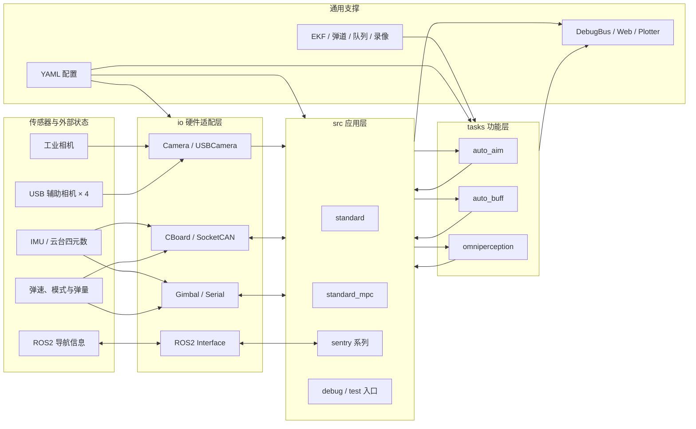

# 第三阶段培训：ROS2 工程化与自瞄的数理逻辑

| 项目     | 内容                                                                                            |
| -------- | ----------------------------------------------------------------------------------------------- |
| 教学目标 | 能把识别算法包成 ROS2 节点、与仿真器对接；能从像素四点反推目标位姿，并算出云台能执行的指令      |
| 教学重点 | 节点 / 话题 / 参数 / 功能包与自定义消息 / `cv_bridge`；坐标系转换、PnP、整车建模、EKF、弹道解算 |
| 教学难点 | 「算法与节点分离」的工程习惯；坐标系之间怎么换、解算误差怎么评估                                |
| 考核方式 | 提交第三阶段作业：ROS2 装甲板识别节点（第一部分）+ 位姿解算与弹道解算（第二部分）               |

---

## 配套实例

本阶段不新增算法示例：识别算法直接复用第二阶段的
[`tutorial_2/example/opencv/armor_detect.cpp`](../tutorial_2/example/opencv/armor_detect.cpp)，
ROS2 工程按下面第一节和作业要求自己搭功能包。

运行环境：Ubuntu 22.04 + ROS2 Humble（安装命令见根目录 [`Readme.md`](../Readme.md) 的「开发环境」一节）。

---

## 总览：自瞄的全部流程



对照这张图看本阶段要学什么：

- **io 层的 `ROS2 Interface`**：本阶段第一节——算法和外界怎么说话。
- **tasks 层的 `auto_aim`**：本阶段第二、三节——四点怎么变成云台角度。
- 第二阶段的成果（`ArmorDetector` 类、`Camera` 抽象类）在这里被当成零件直接调用。

---

## 一、ROS2 工程化

### 1.1 为什么自瞄要跑在 ROS2 上

第二阶段我们已经把「装甲板四点识别」写成了一个类，喂一张图进去、吐四个点出来。
但上车之后它不是孤立的程序，而是整条链路里的一环：

- **上游**：相机（或仿真器）不断给图，还捐带相机内参、云台姿态、时间戳；
- **同级**：还有别的节点在跑（能量机关识别、雷达站…）；
- **下游**：弹道解算要拿识别结果，云台驱动要拿解算结果。

这些模块可能由不同人写、用不同语言写、还在不同机器上跑，还要能随时换掉其中一块去调试。
ROS2 提供的就是这套「模块之间怎么说话」的约定：

| 你想要的效果             | ROS2 里对应的东西                  | 自瞄里的例子                                         |
| ------------------------ | ---------------------------------- | ---------------------------------------------------- |
| 上游把图推给我           | **话题 Topic**（发布 / 订阅）      | 订阅 `/image_raw`、发布 `/armor_detector/detections` |
| 我要别人做一件事并等结果 | **服务 Service**                   | 手动触发一次标定 / 重新加载参数                      |
| 启动时改参数、不重编     | **参数 Parameter**                 | 视频路径、二值化阈值、`kSizeWeight`                  |
| 多个模块打包 + 一键启动  | **功能包 Package** + `ros2 launch` | `video_publisher` + `armor_detector` 一起起          |

一句话：**ROS2 不是算法，是工程骨架。** 算法还是第二阶段那一套，只是外面套一层壳。

### 1.2 节点、话题、参数

**节点（node）**就是一个进程，有自己的名字，能收发消息。订阅、发布、参数都在节点上创建：

```cpp
class ArmorDetectorNode : public rclcpp::Node {
public:
  ArmorDetectorNode() : Node("armor_detector") {
    // 1. 参数：能从命令行覆盖，不用改代码重编
    video_path_ = declare_parameter<std::string>("video_path", "demo.mp4");

    // 2. 订阅：注意 QoS 要和发布方对得上
    sub_ = create_subscription<sensor_msgs::msg::Image>(
        "/image_raw", rclcpp::SensorDataQoS(),
        [this](sensor_msgs::msg::Image::ConstSharedPtr msg) { onImage(msg); });

    // 3. 发布
    pub_det_ = create_publisher<rm_interfaces::msg::ArmorDetections>(
        "/armor_detector/detections", 10);
  }
};

int main(int argc, char **argv) {
  rclcpp::init(argc, argv);          // 一切从 init 开始
  rclcpp::spin(std::make_shared<ArmorDetectorNode>());  // 阻塞，等回调
  rclcpp::shutdown();
  return 0;
}
```

四个必记的调试命令，课上会当场演示：

```bash
ros2 node list                     # 现在有哪些节点
ros2 topic list                    # 现在有哪些话题
ros2 topic hz /image_raw           # 频率对不对（相机是否真的在发）
ros2 topic echo /armor_detector/detections --once   # 消息内容对不对
```

> **QoS 是最容易坎人的地方**：`/image_raw` 是图像流，用的是 `sensor_data`（best effort）。
> 订阅端若用默认的 reliable，就会出现「节点都在跑、就是收不到图」。
> 记住：**视频流类的话题，两端都用 `rclcpp::SensorDataQoS()`。**

### 1.3 功能包：`ament_cmake` + `package.xml` + 自定义消息

一个 ROS2 功能包就是「一个能 `colcon build` 的 CMake 工程」，多两个东西：`package.xml`
（声明依赖）和统一的 `install` 规则。

```bash
ros2 pkg create --build-type ament_cmake armor_detector \
  --dependencies rclcpp sensor_msgs cv_bridge image_transport
```

`CMakeLists.txt` 里关键就这几行（和第一阶段的 CMake 知识是同一套）：

```cmake
find_package(ament_cmake REQUIRED)
find_package(rclcpp REQUIRED)
find_package(cv_bridge REQUIRED)

add_executable(armor_detector_node src/armor_detector_node.cpp)
ament_target_dependencies(armor_detector_node rclcpp sensor_msgs cv_bridge)

install(TARGETS armor_detector_node DESTINATION lib/${PROJECT_NAME})
ament_package()
```

**自定义消息（`rosidl`）**：`msg/` 目录下每个 `.msg` 文件就是一个消息类型：

```
# msg/ArmorDetection.msg
Point2d[4] pts
string type
float32 distance_to_image_center
float32 score
```

`.msg` 里能用的基本类型是 `bool int32 float32 string` 等；想用别的包里的类型，
就写完整名字（`std_msgs/Header`、`geometry_msgs/Pose`）。要让别人能用这个包的消息，
`package.xml` 里必须声明：

```xml
<buildtool_depend>rosidl_default_generators</buildtool_depend>
<member_of_group>rosidl_interface_packages</member_of_group>
```

忘了这一条，消息会「生成不出来」，报错却指向另一个文件，属于必踩的坑。

构建与验证：

```bash
colcon build --packages-select armor_detector
source install/setup.bash          # 别忘了！新开终端每次都要 source
ros2 interface show rm_interfaces/msg/ArmorDetections   # 看消息结构对不对
```

### 1.4 `cv_bridge`：`sensor_msgs::Image` ↔ `cv::Mat`

ROS2 的图是 `sensor_msgs::msg::Image`，我们的算法吃的是 `cv::Mat`，中间靠 `cv_bridge` 转：

```cpp
cv_bridge::CvImagePtr cv_ptr;
try {
  // toCvCopy：把数据拷一份出来。后面要二值化、要画线，必须用这个
  cv_ptr = cv_bridge::toCvCopy(msg, sensor_msgs::image_encodings::BGR8);
} catch (const cv_bridge::Exception &e) {
  RCLCPP_ERROR(get_logger(), "cv_bridge 转换失败：%s", e.what());
  return;   // 转换失败不能让节点挂掉
}
const cv::Mat &bgr = cv_ptr->image;

// 画完的图发回去
cv_bridge::CvImage out(msg->header, "bgr8", canvas);
pub_dbg_->publish(*out.toImageMsg());
```

> **`toCvCopy` vs `toCvShare`**：`toCvShare` 不拷贝，`cv::Mat` 和消息共用一块内存——
> 你后面`threshold` / `line` 一改，就把消息里的原图改了（还可能把别人共享的数据改坏）。
> 只要会改图，就用 `toCvCopy`。

### 1.5 薄节点：把第二阶段的算法包起来

节点里**不写算法**。回调只做四件事，算法本身一行不改：

```cpp
void onImage(const sensor_msgs::msg::Image::ConstSharedPtr &msg) {
  const cv::Mat bgr = toMat(msg);          // 1. 转换
  const auto armors = detector_->detect(bgr);  // 2. 调用第二阶段写好的算法

  rm_interfaces::msg::ArmorDetections out; // 3. 组装消息
  out.header = msg->header;
  for (const auto &a : armors) { out.detections.push_back(toMsg(a)); }
  pub_det_->publish(out);                  // 4. 发布（空检测也要发）
}
```

为什么一定要这么分？因为这样算法才能**脱离 ROS 单独测**：第二阶段的 `armor_detect`
直接喂图就能跑，将来用 GoogleTest 也能直接测；节点里全是 `rclcpp` 的东西，
一旦掺进算法，就再也离不开 ROS 了。

### 1.6 与 Daedalus 模拟器对接

对接的本质只有两句话：

1. **发布同一个话题**：仿真器发 `/image_raw`（`sensor_msgs/msg/Image`），
   那就把自己的 `video_publisher` 换掉、直接启动仿真器，识别节点一行不用改；
2. **用同一个接口包**：接口用仿真器自带的 `rm_interfaces`，不要另起包名，否则消息类型互认不了。

话题表、`rm_interfaces` 里有什么、验收时怎么切到仿真，见
[`homework_3.md`](homework_3.md) §1.3；仿真器快捷键与结业考核要求见根目录
[`Readme.md`](../Readme.md)。

### 1.7 常见坑

- **QoS 不匹配**：两端不一致就收不到数据（现象是「话题存在但 `hz` 为 0」）。
- **忘了 `source install/setup.bash`**：`ros2 run` 报「找不到包」。
- **图像编码想当然**：`msg->encoding` 可能是 `bgr8` / `rgb8` / `mono8`，写死 BGR8 会颜色错位。
- **在回调里干重活**：`spin` 是单线程的，一帧卡住就掉帧；算法重就上多线程 executor。
- **`package.xml` 漏依赖**：编译过了、运行时找不到库（`ament_target_dependencies` 要写全）。
- **时间戳手填**：用 `this->now()`，别自己造 `builtin_interfaces::msg::Time`。
- **空检测不发消息**：下游会以为你死了。没识别到就发一个空数组。

---

## 二、坐标系转换与位姿解算（施工中）

**培训目标**：从图像上的四个点，反推出装甲板在空间里的位置与姿态。

| 模块                | 内容                                                            |
| ------------------- | --------------------------------------------------------------- |
| 坐标系转换          | 像素坐标 → 相机坐标 → 云台坐标 → 世界坐标；内参、外参、手眼关系 |
| PnP 解算距离        | `solvePnP` / IPPE，重投影误差评估，距离估计                     |
| Solver 重构目标位姿 | 整车建模：从装甲板四点反推车体中心；旋转矩阵、四元数、欧拉角    |
| EKF 预测            | 状态量与运动模型、观测模型、预测与更新的权衡                    |

## 三、弹道解算与火控（施工中）

| 模块     | 内容                             |
| -------- | -------------------------------- |
| 弹道解算 | 重力补偿、飞行时间迭代、弹速标定 |
| 火控系统 | 开火决策；MPC 轨迹规划           |

---

## 四、第三阶段作业

见 [`homework_3.md`](homework_3.md)：

- **第一部分**：ROS2 装甲板识别节点（本阶段第一节的内容）
- **第二部分**：位姿解算与弹道解算

---

## 五、参考资料

**ROS2**

- 官方教程：https://docs.ros.org/en/humble/Tutorials.html
- 话题与 QoS：https://docs.ros.org/en/humble/Concepts/Intermediate/About-Quality-of-Service-Settings.html
- 自定义消息（`rosidl`）：https://docs.ros.org/en/humble/Tutorials/Beginner-Client-Libraries/Custom-ROS2-Interfaces.html
- `cv_bridge`（`vision_opencv`）：https://github.com/ros-perception/vision_opencv

**坐标系与解算（待补）**

- OpenCV 相机标定与 PnP：https://docs.opencv.org/4.x/d9/d0c/group__calib3d.html

> 注：也可以适当参考 AI 进行学习，但要注意信息甄别，而且不要只让 AI 全程完成项目。