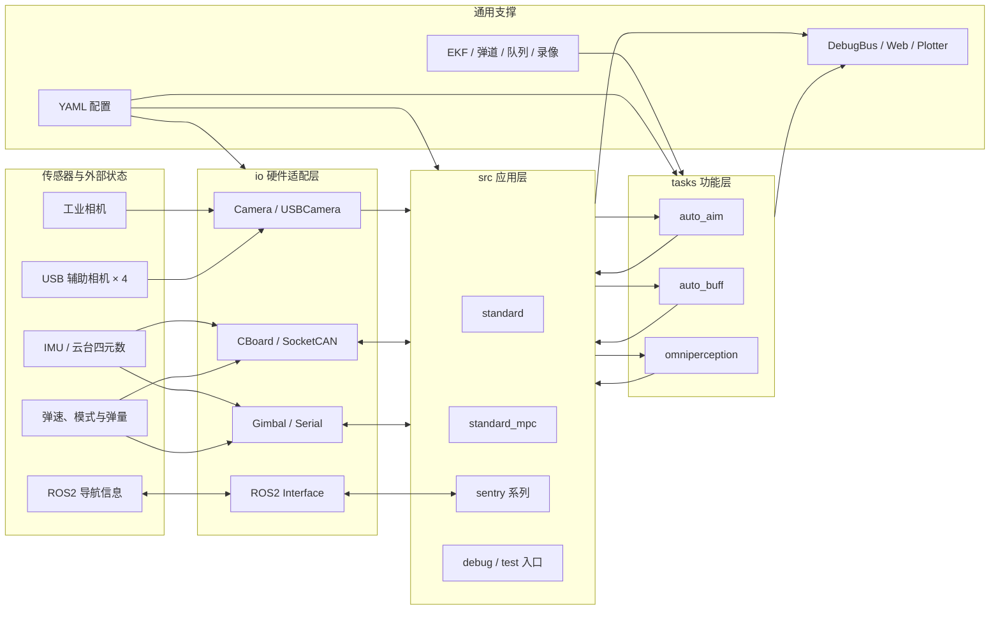
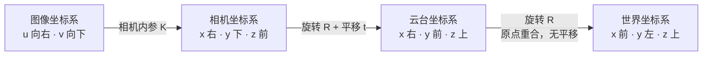

# 第三阶段培训：ROS2 工程化与自瞄的数理逻辑

| 项目     | 内容                                                                                            |
| -------- | ----------------------------------------------------------------------------------------------- |
| 教学目标 | 能把识别算法包成 ROS2 节点、与仿真器对接；能从像素四点反推目标位姿，并算出云台能执行的指令      |
| 教学重点 | 节点 / 话题 / 参数 / 功能包与自定义消息 / `cv_bridge`；坐标系转换、PnP、整车建模、EKF、弹道解算 |
| 教学难点 | 「算法与节点分离」的工程习惯；坐标系之间怎么换、解算误差怎么评估                                |
| 考核方式 | 提交第三阶段作业：ROS2 装甲板识别节点（第一部分）+ 位姿解算与弹道解算（第二部分）               |

---

## 配套实例

本阶段不新增算法示例：识别算法直接复用第二阶段的
[`tutorial_2/example/opencv/armor_detect.cpp`](../tutorial_2/example/opencv/armor_detect.cpp)，
ROS2 工程按下面第一节和作业要求自己搭功能包。

运行环境：Ubuntu 22.04 + ROS2 Humble（安装命令见根目录 [`Readme.md`](../Readme.md) 的「开发环境」一节）。

---

## 总览：自瞄的全部流程


```mermaid
flowchart LR
    subgraph Sensors[传感器与外部状态]
        IC[工业相机]
        UC[USB 辅助相机 × 4]
        IMU[IMU / 云台四元数]
        BS[弹速、模式与弹量]
        NAV[ROS2 导航信息]
    end

    subgraph IO[io 硬件适配层]
        CAM[Camera / USBCamera]
        CB[CBoard / SocketCAN]
        GM[Gimbal / Serial]
        ROS[ROS2 Interface]
    end

    subgraph APP[src 应用层]
        STD[standard]
        MPC[standard_mpc]
        SEN[sentry 系列]
        DBG[debug / test 入口]
    end

    subgraph TASKS[tasks 功能层]
        AA[auto_aim]
        BF[auto_buff]
        OP[omniperception]
    end

    subgraph SUPPORT[通用支撑]
        TL[EKF / 弹道 / 队列 / 录像]
        DB[DebugBus / Web / Plotter]
        CFG[YAML 配置]
    end

    IC --> CAM
    UC --> CAM
    IMU --> CB
    IMU --> GM
    BS --> CB
    BS --> GM
    NAV <--> ROS

    CAM --> APP
    CB <--> APP
    GM <--> APP
    ROS <--> SEN

    APP --> AA
    APP --> BF
    APP --> OP
    AA --> APP
    BF --> APP
    OP --> APP

    TL --> TASKS
    CFG --> IO
    CFG --> APP
    CFG --> TASKS
    APP --> DB
    TASKS --> DB
```

对照这张图看本阶段要学什么：

- **io 层的 `ROS2 Interface`**：本阶段第一节——算法和外界怎么说话。
- **tasks 层的 `auto_aim`**：本阶段第二、三节——四点怎么变成云台角度。
- 第二阶段的成果（`ArmorDetector` 类、`Camera` 抽象类）在这里被当成零件直接调用。

---

## 一、ROS2 工程化

### 1.1 为什么自瞄要跑在 ROS2 上

第二阶段我们已经把「装甲板四点识别」写成了一个类，喂一张图进去、吐四个点出来。
但上车之后它不是孤立的程序，而是整条链路里的一环：

- **上游**：相机（或仿真器）不断给图，还捐带相机内参、云台姿态、时间戳；
- **同级**：还有别的节点在跑（能量机关识别、雷达站…）；
- **下游**：弹道解算要拿识别结果，云台驱动要拿解算结果。

这些模块可能由不同人写、用不同语言写、还在不同机器上跑，还要能随时换掉其中一块去调试。
ROS2 提供的就是这套「模块之间怎么说话」的约定：

| 你想要的效果             | ROS2 里对应的东西                  | 自瞄里的例子                                         |
| ------------------------ | ---------------------------------- | ---------------------------------------------------- |
| 上游把图推给我           | **话题 Topic**（发布 / 订阅）      | 订阅 `/image_raw`、发布 `/armor_detector/detections` |
| 我要别人做一件事并等结果 | **服务 Service**                   | 手动触发一次标定 / 重新加载参数                      |
| 启动时改参数、不重编     | **参数 Parameter**                 | 视频路径、二值化阈值、`kSizeWeight`                  |
| 多个模块打包 + 一键启动  | **功能包 Package** + `ros2 launch` | `video_publisher` + `armor_detector` 一起起          |

一句话：**ROS2 不是算法，是工程骨架。** 算法还是第二阶段那一套，只是外面套一层壳。

### 1.2 节点、话题、参数

**节点（node）**就是一个进程，有自己的名字，能收发消息。订阅、发布、参数都在节点上创建：

```cpp
class ArmorDetectorNode : public rclcpp::Node {
public:
  ArmorDetectorNode() : Node("armor_detector") {
    // 1. 参数：能从命令行覆盖，不用改代码重编
    video_path_ = declare_parameter<std::string>("video_path", "demo.mp4");

    // 2. 订阅：注意 QoS 要和发布方对得上
    sub_ = create_subscription<sensor_msgs::msg::Image>(
        "/image_raw", rclcpp::SensorDataQoS(),
        [this](sensor_msgs::msg::Image::ConstSharedPtr msg) { onImage(msg); });

    // 3. 发布
    pub_det_ = create_publisher<rm_interfaces::msg::ArmorDetections>(
        "/armor_detector/detections", 10);
  }
};

int main(int argc, char **argv) {
  rclcpp::init(argc, argv);          // 一切从 init 开始
  rclcpp::spin(std::make_shared<ArmorDetectorNode>());  // 阻塞，等回调
  rclcpp::shutdown();
  return 0;
}
```

四个必记的调试命令，课上会当场演示：

```bash
ros2 node list                     # 现在有哪些节点
ros2 topic list                    # 现在有哪些话题
ros2 topic hz /image_raw           # 频率对不对（相机是否真的在发）
ros2 topic echo /armor_detector/detections --once   # 消息内容对不对
```

> **QoS 是最容易坎人的地方**：`/image_raw` 是图像流，用的是 `sensor_data`（best effort）。
> 订阅端若用默认的 reliable，就会出现「节点都在跑、就是收不到图」。
> 记住：**视频流类的话题，两端都用 `rclcpp::SensorDataQoS()`。**

### 1.3 功能包：`ament_cmake` + `package.xml` + 自定义消息

一个 ROS2 功能包就是「一个能 `colcon build` 的 CMake 工程」，多两个东西：`package.xml`
（声明依赖）和统一的 `install` 规则。

```bash
ros2 pkg create --build-type ament_cmake armor_detector \
  --dependencies rclcpp sensor_msgs cv_bridge image_transport
```

`CMakeLists.txt` 里关键就这几行（和第一阶段的 CMake 知识是同一套）：

```cmake
find_package(ament_cmake REQUIRED)
find_package(rclcpp REQUIRED)
find_package(cv_bridge REQUIRED)

add_executable(armor_detector_node src/armor_detector_node.cpp)
ament_target_dependencies(armor_detector_node rclcpp sensor_msgs cv_bridge)

install(TARGETS armor_detector_node DESTINATION lib/${PROJECT_NAME})
ament_package()
```

**自定义消息（`rosidl`）**：`msg/` 目录下每个 `.msg` 文件就是一个消息类型：

```
# msg/ArmorDetection.msg
Point2d[4] pts
string type
float32 distance_to_image_center
float32 score
```

`.msg` 里能用的基本类型是 `bool int32 float32 string` 等；想用别的包里的类型，
就写完整名字（`std_msgs/Header`、`geometry_msgs/Pose`）。要让别人能用这个包的消息，
`package.xml` 里必须声明：

```xml
<buildtool_depend>rosidl_default_generators</buildtool_depend>
<member_of_group>rosidl_interface_packages</member_of_group>
```

忘了这一条，消息会「生成不出来」，报错却指向另一个文件，属于必踩的坑。

构建与验证：

```bash
colcon build --packages-select armor_detector
source install/setup.bash          # 别忘了！新开终端每次都要 source
ros2 interface show rm_interfaces/msg/ArmorDetections   # 看消息结构对不对
```

### 1.4 `cv_bridge`：`sensor_msgs::Image` ↔ `cv::Mat`

ROS2 的图是 `sensor_msgs::msg::Image`，我们的算法吃的是 `cv::Mat`，中间靠 `cv_bridge` 转：

```cpp
cv_bridge::CvImagePtr cv_ptr;
try {
  // toCvCopy：把数据拷一份出来。后面要二值化、要画线，必须用这个
  cv_ptr = cv_bridge::toCvCopy(msg, sensor_msgs::image_encodings::BGR8);
} catch (const cv_bridge::Exception &e) {
  RCLCPP_ERROR(get_logger(), "cv_bridge 转换失败：%s", e.what());
  return;   // 转换失败不能让节点挂掉
}
const cv::Mat &bgr = cv_ptr->image;

// 画完的图发回去
cv_bridge::CvImage out(msg->header, "bgr8", canvas);
pub_dbg_->publish(*out.toImageMsg());
```

> **`toCvCopy` vs `toCvShare`**：`toCvShare` 不拷贝，`cv::Mat` 和消息共用一块内存——
> 你后面`threshold` / `line` 一改，就把消息里的原图改了（还可能把别人共享的数据改坏）。
> 只要会改图，就用 `toCvCopy`。

### 1.5 薄节点：把第二阶段的算法包起来

节点里**不写算法**。回调只做四件事，算法本身一行不改：

```cpp
void onImage(const sensor_msgs::msg::Image::ConstSharedPtr &msg) {
  const cv::Mat bgr = toMat(msg);          // 1. 转换
  const auto armors = detector_->detect(bgr);  // 2. 调用第二阶段写好的算法

  rm_interfaces::msg::ArmorDetections out; // 3. 组装消息
  out.header = msg->header;
  for (const auto &a : armors) { out.detections.push_back(toMsg(a)); }
  pub_det_->publish(out);                  // 4. 发布（空检测也要发）
}
```

为什么一定要这么分？因为这样算法才能**脱离 ROS 单独测**：第二阶段的 `armor_detect`
直接喂图就能跑，将来用 GoogleTest 也能直接测；节点里全是 `rclcpp` 的东西，
一旦掺进算法，就再也离不开 ROS 了。

### 1.6 与 Daedalus 模拟器对接

对接的本质只有两句话：

1. **发布同一个话题**：仿真器发 `/image_raw`（`sensor_msgs/msg/Image`），
   那就把自己的 `video_publisher` 换掉、直接启动仿真器，识别节点一行不用改；
2. **用同一个接口包**：接口用仿真器自带的 `rm_interfaces`，不要另起包名，否则消息类型互认不了。

话题表、`rm_interfaces` 里有什么、验收时怎么切到仿真，见
[`homework_3.md`](homework_3.md) §1.3；仿真器快捷键与结业考核要求见根目录
[`Readme.md`](../Readme.md)。

### 1.7 常见坑

- **QoS 不匹配**：两端不一致就收不到数据（现象是「话题存在但 `hz` 为 0」）。
- **忘了 `source install/setup.bash`**：`ros2 run` 报「找不到包」。
- **图像编码想当然**：`msg->encoding` 可能是 `bgr8` / `rgb8` / `mono8`，写死 BGR8 会颜色错位。
- **在回调里干重活**：`spin` 是单线程的，一帧卡住就掉帧；算法重就上多线程 executor。
- **`package.xml` 漏依赖**：编译过了、运行时找不到库（`ament_target_dependencies` 要写全）。
- **时间戳手填**：用 `this->now()`，别自己造 `builtin_interfaces::msg::Time`。
- **空检测不发消息**：下游会以为你死了。没识别到就发一个空数组。

---

## 二、坐标系转换与位姿解算

**培训目标**：从图像上的四个点，反推出装甲板在空间里的位置与姿态。

### 2.1常用坐标系

|坐标系  | 原点固定位置 | x轴指向 | y 轴指向 | z 轴指向 |
| ------- | ------------ | -------- | -------- | -------- |
|图像坐标系 | 图像左上角   | 向右(u)      | 向下(v)       | --(2D) |
| 相机坐标系 | 相机光心     | 向右(x)      | 向下(y)       | 向前-光轴方向(z) |
| 云台坐标系 | 云台 yaw/pitch 旋转轴交点 | 向右(x)      | 向前(y)       | 向上(z) |
| 世界坐标系 | 云台旋转轴交点     | 向前(x)      | 向左(y)       | 向上(z) |


```mermaid
flowchart LR
    UV["图像坐标系<br/>u 向右 · v 向下"]
    CAM["相机坐标系<br/>x 右 · y 下 · z 前"]
    GIM["云台坐标系<br/>x 右 · y 前 · z 上"]
    WLD["世界坐标系<br/>x 前 · y 左 · z 上"]

    UV -->|"相机内参 K"| CAM
    CAM -->|"旋转 R + 平移 t"| GIM
    GIM -->|"旋转 R<br/>原点重合，无平移"| WLD
```

### 2.2刚体变换：两个坐标系之间怎么"翻译"

$$
P_B = R_{A2B}\, P_A + T_{A2B}
$$

其中：

$$
\begin{aligned}
P_A,\; P_B &\in \mathbb{R}^{3 \times 1} && \text{同一点在 A 系、B 系下的坐标} \\
R_{A2B} &\in \mathbb{R}^{3 \times 3} && \text{旋转矩阵，A 系要「扭」多少才能对上 B 系的方向} \\
T_{A2B} &\in \mathbb{R}^{3 \times 1} && \text{平移向量，A 系原点在 B 系中的位置}
\end{aligned}
$$

> 直觉：先把 A 系中的点按 `R` 扭到与 B 系同方向，再把原点偏移 `T`。

> 旋转矩阵 `R` 的一个性质：它是正交矩阵，也就是说 `R^{-1} = R^T`。当你需要反向变换（从 B 到 A）时，直接用转置就行：`P_A = R_A2B^T × (P_B - T_A2B)`。

> 而旋转矩阵本身是怎么来的？最常见的方式是用 欧拉角（yaw, pitch, roll） 来描述。在 RoboMaster 自瞄系统中，这三个角来自云台 IMU，分别表示绕 Z 轴、X 轴、Y 轴的旋转。

### 2.3相机成像模型：从 3D 世界到 2D 图像

相机本质上是一个 3D → 2D 的投影器。最常用的模型是小孔成像（pinhole model）。

相机坐标系下的点

$$
P_{\mathrm{cam}} = \begin{bmatrix} X \\ Y \\ Z \end{bmatrix}
$$

投影到像素坐标 \((u, v)\)：

$$
u = f_x \frac{X}{Z} + c_x, \qquad
v = f_y \frac{Y}{Z} + c_y
$$

写成内参矩阵：

$$
\begin{bmatrix} u \\ v \\ 1 \end{bmatrix}
=
\frac{1}{Z}\,
K
\begin{bmatrix} X \\ Y \\ Z \end{bmatrix},
\qquad
K =
\begin{bmatrix}
f_x & 0 & c_x \\
0 & f_y & c_y \\
0 & 0 & 1
\end{bmatrix}
$$

其中：

$$
\begin{aligned}
f_x,\; f_y &\in \mathbb{R} && \text{焦距，以像素为单位} \\
c_x,\; c_y &\in \mathbb{R} && \text{主点，光轴在图像上的落点，通常接近图像中心} \\
\dfrac{X}{Z},\; \dfrac{Y}{Z} &&& \text{归一化坐标：} Z \text{ 越大，点越靠近图像中心（透视效果）}
\end{aligned}
$$

> 这 4 个数 `(fx, fy, cx, cy)` 和径向畸变系数 `(k1, k2, p1, p2, k3)` 共同构成了相机的 内参（intrinsic parameters）。标定内参的过程，就是确定这些数的过程。

### 2.4 solvePnP

因为本文的核心动作——从 2D 图像角点反推出 3D 装甲板位置——就是上述过程的反向操作：PnP（Perspective-n-Point）。你把 4 个已知 3D 点的相对位置（装甲板模型点）和它们在图像上的投影（神经网络检出的角点）喂给 `solvePnP`，它就能算出装甲板在相机系下的 3D 位置。

PnP（Perspective-n-Point）是 `solvePnP` 背后的算法。它的输入是：

- 4 个 3D 点（装甲板的物理尺寸——小装甲板 13.5cm × 5.6cm）
- 4 个对应的 2D 投影点（图像中检出的角点）
- 相机内参 \(K\) 和畸变系数

产出是在相机坐标系下的 3D 位置和朝向。

```cpp
cv::solvePnP(centers_3d_, centers_2d, camera_matrix, distort_coeffs,
             rvec, tvec,
             false, cv::SOLVEPNP_IPPE);

// 返回为 rvec tvec
cv::Mat rmat;
// 我们需要将旋转向量和平移向量转化为矩阵形式
cv::Rodrigues(rvec, rmat);
Eigen::Matrix3d R_armor2camera;
// 转化为 eigen 形式矩阵
cv::cv2eigen(rmat, R_armor2camera);
```

> 由此实现了对 3D 信息的获取。
> PnP 算法原理，有兴趣可以看看 https://zhuanlan.zhihu.com/p/698620045。

### 2.5 重投影误差与距离估计

`solvePnP` 给出的 `rvec`、`tvec` 还要过两关：这组解靠不靠谱，以及目标离相机有多远。

**距离。** 平移向量 \(\mathbf{t}\) 就是装甲板模型原点在相机系下的坐标。模型原点放在装甲板中心时，它就是中心点的相机坐标：

$$
\mathbf{t} = \begin{bmatrix} t_x \\ t_y \\ t_z \end{bmatrix},
\qquad
d = \|\mathbf{t}\|_2 = \sqrt{t_x^2 + t_y^2 + t_z^2}
$$

\(d\) 的单位和模型点一致：模型用米，距离就是米。\(t_z\) 只是沿光轴的深度；目标不在画面中心时，斜距 \(d\) 比 \(|t_z|\) 大。后面做弹道要用这个三维点，不能只留一个 \(t_z\)。

**重投影误差。** 用求出的 \(R\)、\(\mathbf{t}\) 把模型点变回相机系，再按 2.3 的内参投回像素，和检出的角点比较：

$$
P_{\mathrm{cam}, i} = R\, P_i + \mathbf{t}
$$

$$
e = \frac{1}{n}\sum_{i=1}^{n}
\left\|
\begin{bmatrix} u_i \\ v_i \end{bmatrix}
-
\begin{bmatrix} u'_i \\ v'_i \end{bmatrix}
\right\|_2
$$

\((u_i, v_i)\) 是检出的角点，\((u'_i, v'_i)\) 是投回去的像素，\(e\) 的单位是像素。角点、模型和内参都对的时候，\(e\) 通常是几个像素；到了十几像素，这一帧不要送进后面的滤波。常见原因是四个角点的顺序和模型点对不上、小装甲板用了大装甲板的尺寸，或内参、畸变不对。

IPPE 对共面的四点会给出两组解，`SOLVEPNP_IPPE` 留下重投影误差更小的那组。误差本身仍要自己算，用来丢掉坏检测。`projectPoints` 会把畸变也算进去，和 `solvePnP` 用的是同一组系数。

```cpp
std::vector<cv::Point2f> projected;
cv::projectPoints(centers_3d_, rvec, tvec, camera_matrix, distort_coeffs, projected);

double sum = 0.0;
for (size_t i = 0; i < centers_2d.size(); ++i) {
  sum += cv::norm(centers_2d[i] - projected[i]);
}
const double reproj_err = sum / static_cast<double>(centers_2d.size()); // 像素
const double distance = cv::norm(tvec); // 与模型点同一单位
```

## 三、卡尔曼滤波(Kalman filter)

为什么需要卡尔曼滤波器

在自瞄系统中，你每一帧都能测得目标装甲板的 3D 位置 \((x, y, z)\)。但你有两个问题：

1. 测量值有噪声：神经网络的角点、IMU 的数据都不是完美的，你拿到的 \((x, y, z)\) 会在真实值附近抖动。
2. 你还需要速度：仅仅知道位置不够——你需要知道目标往哪运动、有多快，才能预测它下一步会出现在哪里。

卡尔曼滤波就是同时解决这两个问题的数学工具。它的核心思想只有一句话：

> "我不完全相信测量值，也不完全相信预测值——我根据各自的噪声大小，在两者之间取一个加权平均。"

你可以用更直觉的方式理解：假设你有两个传感器在测同一个温度，一个精度 ±1°C，另一个精度 ±5°C。当你拿到两个读数时，你会更相信第一个传感器的读数，但也不会完全忽略第二个——卡尔曼滤波做的，就是精确算出这个"加权比例"。

在自瞄系统中，卡尔曼滤波用于从观测到的 3D 位置序列中，估计目标的真实位置和速度。它的输入是 PnP 解算出的 `(x, y, z, yaw)`，输出是平滑后的 `(x, vx, y, vy, z, vz, yaw, vyaw)`——每个维度都包含了位置 + 速度。

### 3.1卡尔曼滤波与目标状态估计

目的：从逐帧的 4D 观测值 `(x, y, z, yaw)` 中，平滑噪声并估计速度分量 `(vx, vy, vz, vyaw)`。

状态是 8 维，观测只有位置和 yaw，速度由模型推出来：

$$
\mathbf{x} =
\begin{bmatrix}
x & v_x & y & v_y & z & v_z & \mathrm{yaw} & v_{\mathrm{yaw}}
\end{bmatrix}^{\mathsf{T}},
\qquad
\mathbf{z} =
\begin{bmatrix}
x & y & z & \mathrm{yaw}
\end{bmatrix}^{\mathsf{T}}
$$

匀速模型里，每一对「位置–速度」用同一块 \(F_2\) 向前推 \(\Delta t\)，整条状态的转移矩阵由四块拼成：

$$
F_2 = \begin{bmatrix} 1 & \Delta t \\ 0 & 1 \end{bmatrix},
\qquad
F =
\begin{bmatrix}
F_2 & 0 & 0 & 0 \\
0 & F_2 & 0 & 0 \\
0 & 0 & F_2 & 0 \\
0 & 0 & 0 & F_2
\end{bmatrix}
$$

观测矩阵只挑出 \(x, y, z, \mathrm{yaw}\)，速度所在的列是 0：

$$
H =
\begin{bmatrix}
1 & 0 & 0 & 0 & 0 & 0 & 0 & 0 \\
0 & 0 & 1 & 0 & 0 & 0 & 0 & 0 \\
0 & 0 & 0 & 0 & 1 & 0 & 0 & 0 \\
0 & 0 & 0 & 0 & 0 & 0 & 1 & 0
\end{bmatrix},
\qquad
\mathbf{z} = H\mathbf{x}
$$

\(P\) 是状态协方差（\(8\times 8\)）。\(Q\) 表示匀速模型本身有多不准，按加速度白噪声离散化，每个轴一块：

$$
Q_p = \sigma_p^2
\begin{bmatrix}
\Delta t^4 / 4 & \Delta t^3 / 2 \\
\Delta t^3 / 2 & \Delta t^2
\end{bmatrix},
\qquad
Q = \mathrm{blkdiag}(Q_x, Q_y, Q_z, Q_{\mathrm{yaw}})
$$

\(R\) 是 PnP 观测的噪声（\(4\times 4\)）：

$$
R = \mathrm{diag}(\sigma_x^2,\; \sigma_y^2,\; \sigma_z^2,\; \sigma_{\mathrm{yaw}}^2)
$$

**预测**（把上一帧推到这一帧，还没有新观测）：

$$
\hat{\mathbf{x}}_{k|k-1} = F\, \hat{\mathbf{x}}_{k-1|k-1}
$$

$$
P_{k|k-1} = F\, P_{k-1|k-1}\, F^{\mathsf{T}} + Q
$$

**更新**（来了这一帧的 \(\mathbf{z}_k\)，按噪声大小和预测折中）：

$$
\mathbf{y}_k = \mathbf{z}_k - H\, \hat{\mathbf{x}}_{k|k-1}
$$

$$
S_k = H\, P_{k|k-1}\, H^{\mathsf{T}} + R,
\qquad
K_k = P_{k|k-1}\, H^{\mathsf{T}}\, S_k^{-1}
$$

$$
\hat{\mathbf{x}}_{k|k} = \hat{\mathbf{x}}_{k|k-1} + K_k\, \mathbf{y}_k
$$

$$
P_{k|k} = (I - K_k H)\, P_{k|k-1}
$$

\(K_k\) 就是前面说的加权比例。\(R\) 小、观测更准时，\(K_k\) 更大，残差收得更多；预测协方差小、模型更可信时，\(K_k\) 更小，结果更靠近预测。

第一帧没有速度，把 \(\mathbf{z}\) 填进 \(x, y, z, \mathrm{yaw}\)，四个速度置 0。要打提前量时，用预测式再往前推一个飞行时间，这一步不再做更新。

> yaw 的残差要先折进 \((-\pi, \pi]\)。差一个 \(2\pi\) 时，滤波会把目标当成转了一整圈。

### 3.2 从位姿观测到稳定跟踪

3.1 跟的是装甲板中心。车体一转，朝向你的板换成下一块，观测到的 \(x\)、\(y\)、\(\mathrm{yaw}\) 会跳变，速度被拉飞。要跟的是车体中心：它接近匀速，装甲板只是中心外面、半径 \(r\) 处的一个点。观测和状态不再是同一组量，观测函数变成非线性的，滤波从卡尔曼换成扩展卡尔曼（EKF）。

**状态与运动模型。** 11 维。前 8 维是中心的位置、速度和当前这块板的朝向；后 3 维是几何量，两对装甲板可以不一样：

$$
\mathbf{x} =
\begin{bmatrix}
x & v_x & y & v_y & z & v_z & a & w & r & l & h
\end{bmatrix}^{\mathsf{T}}
$$

| 符号 | 含义 |
| --- | --- |
| \(x, y\) | 旋转中心的水平位置 |
| \(z\) | 当前这对装甲板的高度 |
| \(a\) | 当前这块板的 yaw，从世界 \(x\) 轴转向 \(y\) 轴为正 |
| \(w\) | yaw 角速度 |
| \(r\) | 当前这对板（\(a\) 与 \(a+\pi\)）到中心的水平半径 |
| \(l\) | 另一对板（\(a\pm\pi/2\)）到中心的水平半径 |
| \(h\) | 另一对板相对当前高度的差，另一对的高度是 \(z+h\) |

中心匀速，\(a\) 按匀角速度转，\(r, l, h\) 视为不变：

$$
F = \mathrm{blkdiag}(F_2, F_2, F_2, F_2, 1, 1, 1),
\qquad
F_2 = \begin{bmatrix} 1 & \Delta t \\ 0 & 1 \end{bmatrix}
$$

预测式和 3.1 相同，\(\hat{\mathbf{x}}_{k|k-1} = F\hat{\mathbf{x}}\)，\(P_{k|k-1} = FPF^{\mathsf{T}} + Q\)。

**观测模型。** PnP 给的是当前这块装甲板。法向取 \((\cos a,\; \sin a)\)，板心在中心沿法向外偏 \(r\)。观测函数记作 \(h(\mathbf{x})\)，和状态里的高度差 \(h\) 不是同一个量：

$$
h(\mathbf{x}) =
\begin{bmatrix}
x + r\cos a \\
y + r\sin a \\
z \\
a
\end{bmatrix}
$$

当前这块板只用 \(r\) 和 \(z\)。\(l\) 和高度差 \(h\) 要等跳到另一对板、把它们换进 \(r\) 和 \(z\) 之后才会被更新。雅可比 \(H = \partial h / \partial \mathbf{x}\) 是 \(4\times 11\)，列顺序与状态相同，\(l\) 和高度差这两列是 0：

$$
H =
\begin{bmatrix}
1 & 0 & 0 & 0 & 0 & 0 & -r\sin a & 0 & \cos a & 0 & 0 \\
0 & 0 & 1 & 0 & 0 & 0 & r\cos a & 0 & \sin a & 0 & 0 \\
0 & 0 & 0 & 0 & 1 & 0 & 0 & 0 & 0 & 0 & 0 \\
0 & 0 & 0 & 0 & 0 & 0 & 1 & 0 & 0 & 0 & 0
\end{bmatrix}
$$

更新时残差用非线性的 \(h\)，增益用这个 \(H\)（在 \(\hat{\mathbf{x}}_{k|k-1}\) 处取值）：

$$
\mathbf{y}_k = \mathbf{z}_k - h(\hat{\mathbf{x}}_{k|k-1})
$$

$$
S_k = H P_{k|k-1} H^{\mathsf{T}} + R,
\qquad
K_k = P_{k|k-1} H^{\mathsf{T}} S_k^{-1}
$$

$$
\hat{\mathbf{x}}_{k|k} = \hat{\mathbf{x}}_{k|k-1} + K_k \mathbf{y}_k,
\qquad
P_{k|k} = (I - K_k H)\, P_{k|k-1}
$$

\(a\) 那一维的残差仍然先折进 \((-\pi, \pi]\)。

四块板先在状态的一份拷贝上试跳板 \(\delta\)，再拿跳完之后的状态算 \(h(\mathbf{x})\) 和 \(H\)。选中之后才写回状态，中心的 \(x, y\) 不跳。

| \(\delta\) | 写回前怎么改 |
| --- | --- |
| \(0\) | 仍是当前这块板 |
| \(\pi\) | \(a \leftarrow a+\pi\)。对面板，同一对，\(r, l, z, h\) 都不动 |
| \(\pm\pi/2\) | 换到另一对：\(a \leftarrow a+\delta\)，\(z \leftarrow z+h\)，\(h \leftarrow -h\)，\(r\) 与 \(l\) 互换 |

**马氏距离匹配。** 一帧里可能有多块板、多个车，还要在跳板假设里挑一个。用残差和创新协方差 \(S_k\) 做马氏距离：

$$
d_M^2 = \mathbf{y}_k^{\mathsf{T}} S_k^{-1} \mathbf{y}_k
$$

\(S_k\) 大（刚初始化、跟丢了一阵，或目标很远、观测很吵）时，同样的米制误差 \(d_M^2\) 更小，门更宽；锁紧之后门自动变窄。4 维观测、95% 的卡方门限是 \(9.49\)。对每个检测、每个 \(\delta\) 算一次 \(d_M^2\)，取得过门限的最小值。一个都没过，这一帧只预测、不更新；连续多帧不过就删掉这条航迹。

**噪声。** \(Q\) 仍按 3.1 的加速度白噪声来离散化，按通道分开给：

| 通道 | 怎么给 |
| --- | --- |
| \(v_x, v_y, v_z\) | 地面车加速度不大，\(\sigma\) 给小 |
| \(w\) | 小陀螺会突然起转，\(\sigma_w\) 要比平移大，否则 yaw 跟不住 |
| \(r, l, h\) | 几何量几乎不变，过程噪声给得很小，只让它们慢慢收敛 |

\(R\) 随距离变。像素误差 \(\sigma_{\mathrm{pix}}\) 投到物方：横向大约正比于深度，沿光轴的深度误差还多一个「板宽 \(L\)」：

$$
\sigma_{xy} \approx \frac{z}{f_x}\sigma_{\mathrm{pix}},
\qquad
\sigma_z \approx \frac{z^2}{f_x L}\sigma_{\mathrm{pix}}
$$

\(f_x\) 用像素，\(z\) 和 \(L\) 用同一长度单位。近处 \(R\) 小、更信观测；远处 \(R\) 大、更信预测。马氏距离用的就是这个 \(R\) 加进 \(S_k\) 之后的门，所以远距离不会因为固定的米制阈值被误删。

\(r\) 和 \(l\) 的初值都用车体半径的大致尺寸（零点几米），高度差 \(h\) 初值取 0。第一帧把装甲板位置减去 \(r(\cos a,\; \sin a)\) 得到中心，速度和 \(w\) 置 0。

| 模块                | 内容                                                            |
| ------------------- | --------------------------------------------------------------- |
| 坐标系转换          | 像素坐标 → 相机坐标 → 云台坐标 → 世界坐标；内参、外参、手眼关系 |
| PnP 解算距离        | `solvePnP` / IPPE，重投影误差评估，距离估计                     |
| Solver 重构目标位姿 | 整车建模：从装甲板四点反推车体中心；旋转矩阵、四元数、欧拉角    |
| EKF 预测            | 状态量与运动模型、观测模型、预测与更新的权衡                    |

## 三、弹道解算与火控（施工中）

| 模块     | 内容                             |
| -------- | -------------------------------- |
| 弹道解算 | 重力补偿、飞行时间迭代、弹速标定 |
| 火控系统 | 开火决策；MPC 轨迹规划           |

---

## 四、第三阶段作业

见 [`homework_3.md`](homework_3.md)：

- **第一部分**：ROS2 装甲板识别节点（本阶段第一节的内容）
- **第二部分**：位姿解算与弹道解算

---

## 五、参考资料

**ROS2**

- 官方教程：https://docs.ros.org/en/humble/Tutorials.html
- 话题与 QoS：https://docs.ros.org/en/humble/Concepts/Intermediate/About-Quality-of-Service-Settings.html
- 自定义消息（`rosidl`）：https://docs.ros.org/en/humble/Tutorials/Beginner-Client-Libraries/Custom-ROS2-Interfaces.html
- `cv_bridge`（`vision_opencv`）：https://github.com/ros-perception/vision_opencv

**坐标系与解算（待补）**

- OpenCV 相机标定与 PnP：https://docs.opencv.org/4.x/d9/d0c/group__calib3d.html

> 注：也可以适当参考 AI 进行学习，但要注意信息甄别，而且不要只让 AI 全程完成项目。